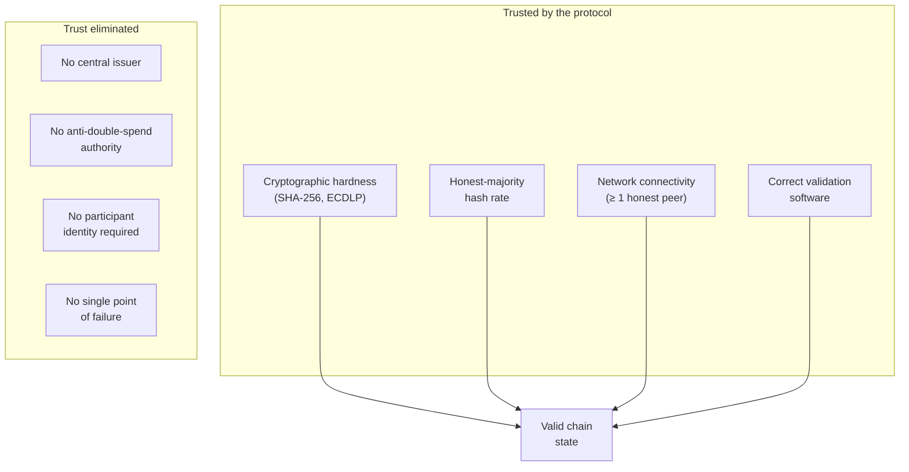
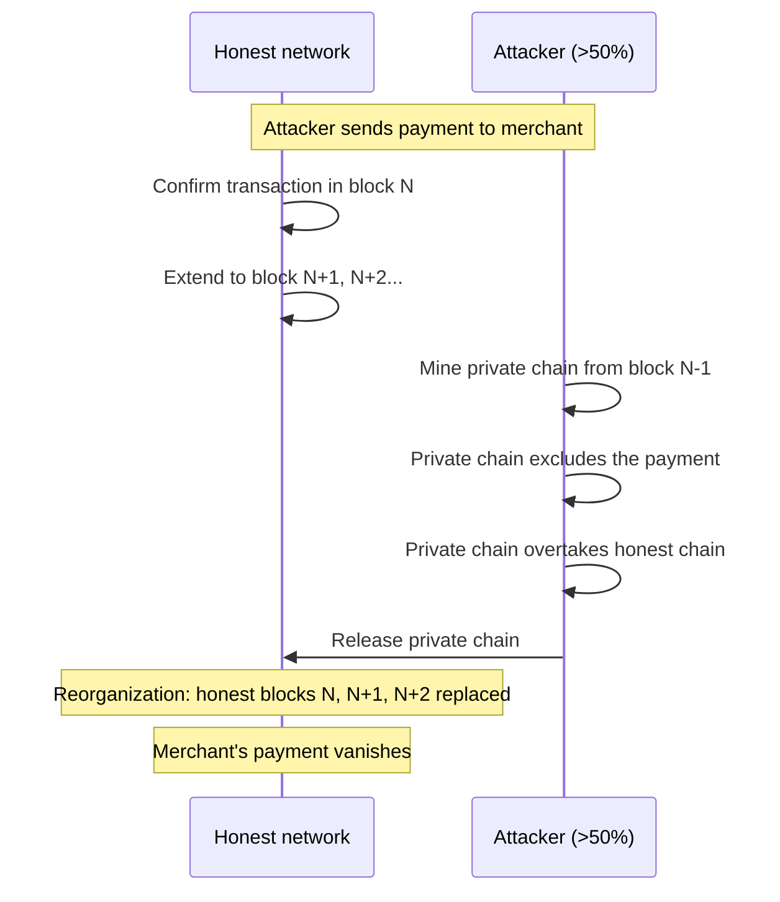
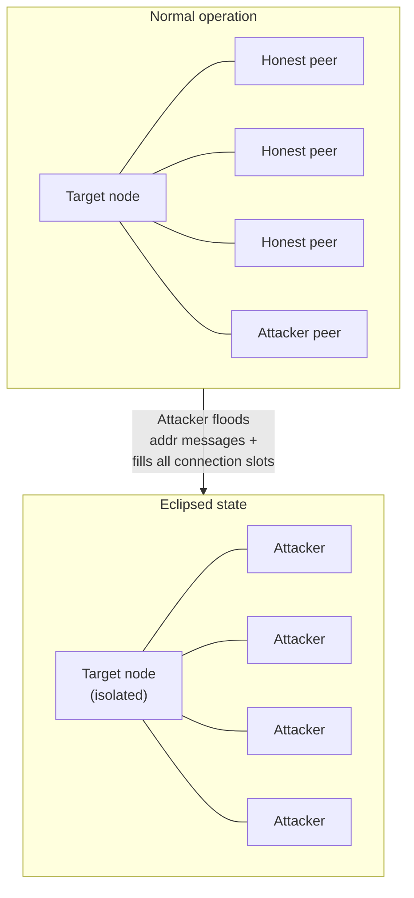
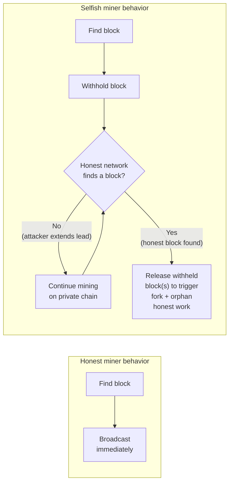
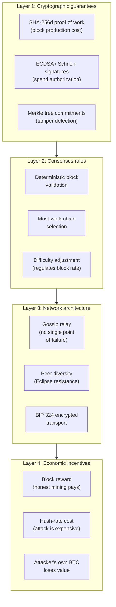
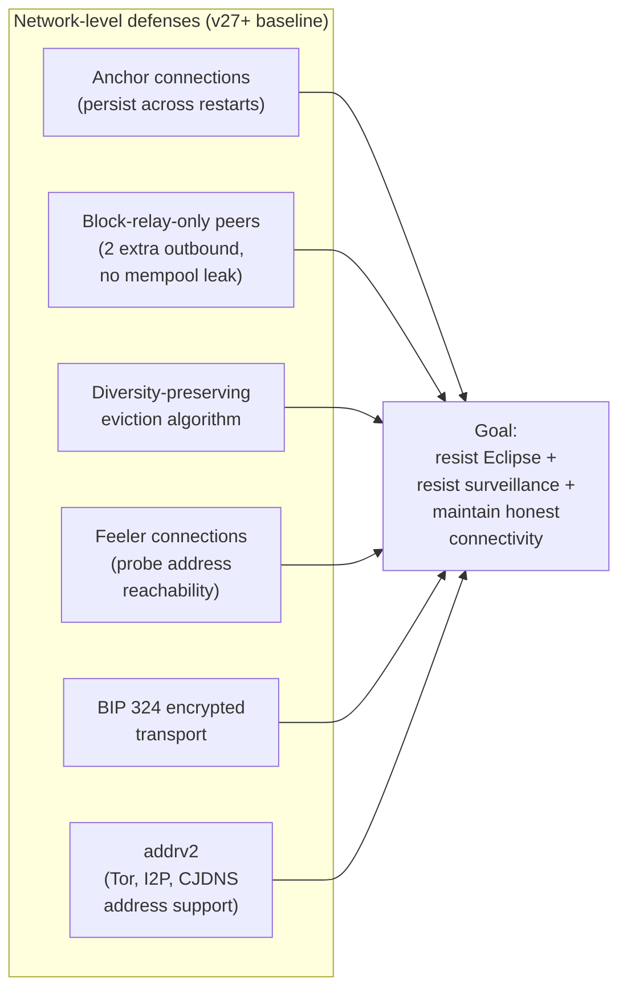
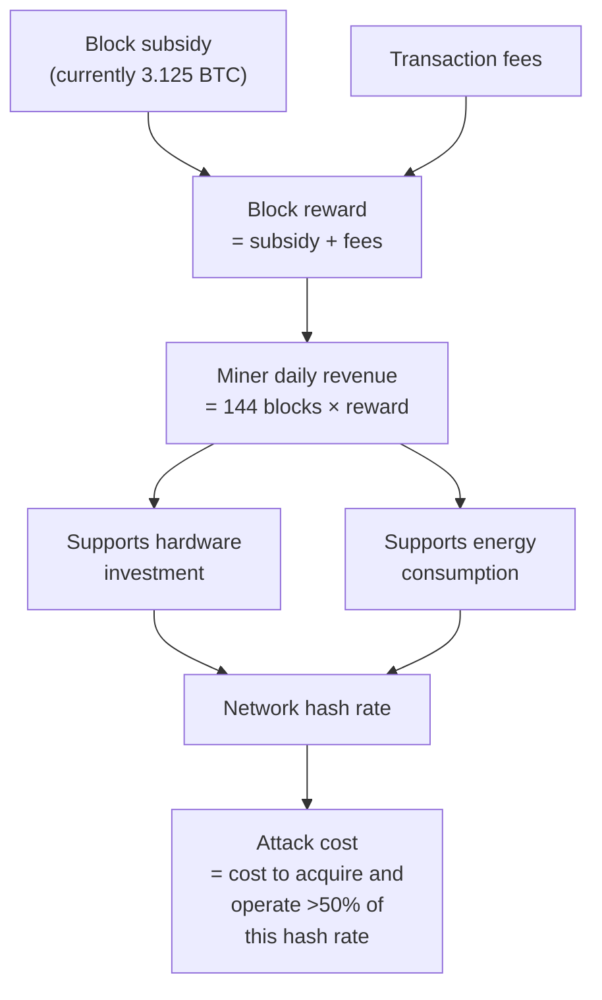
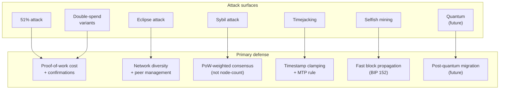

## Introduction

This page is **L2 #11 — Security model** in the [design-document series](/BitcoinArchive/entries/design/2009-01-03-bitcoin-system-design-overview/) — the second of three L2 cross-cutting deep dives. Where the L1 domain pages describe how each subsystem works, this page asks what can go wrong — and what stops it.

Bitcoin's security rests not on any single mechanism but on the interaction of cryptography, economic incentives, and network architecture. A full-node operator trusts mathematics and energy expenditure rather than institutions or identities. This page maps the trust boundary, catalogs the known attack surfaces, traces the defense layers that address each one, and identifies the open risks that remain.

Where behavior differs between the Satoshi-era implementation (v0.1, January 2009) and modern Bitcoin Core (v27+ baseline), both are noted.

## 1. Trust model

Bitcoin eliminates some categories of trust entirely and replaces others with verifiable computation. The table below separates what the protocol trusts from what it does not.

### What Bitcoin trusts

| Assumption | Why it is necessary |
|---|---|
| **SHA-256 preimage resistance** | If an attacker could invert SHA-256, proof of work would be forgeable. The entire chain selection mechanism depends on hash inversion being computationally infeasible. |
| **ECDLP hardness (secp256k1)** | Ownership of funds is defined by possession of a private key. If the elliptic-curve discrete logarithm problem became tractable, any exposed public key would leak its private key. |
| **Honest-majority hash rate** | The most-work chain is assumed to be produced by honest miners. If a single entity controls >50% of hash rate, it can rewrite history — the security model degrades to probabilistic resistance. |
| **Network connectivity** | A node must be able to reach at least one honest peer. Total network isolation (successful Eclipse attack) allows an attacker to feed the node a fabricated chain. |
| **Correct software** | A node trusts that its own validation code is correct. A consensus bug in the software is indistinguishable from a valid chain — the node cannot detect what it cannot check. |

### What Bitcoin does not trust

| Traditional trust requirement | How Bitcoin eliminates it |
|---|---|
| **Central authority for issuance** | Issuance follows a deterministic halving schedule enforced by every node; no entity can create coins outside the rules |
| **Bank to prevent double-spending** | Every node independently validates that each input is unspent before accepting a transaction |
| **Identity of participants** | Miners are anonymous; their work is verified by its SHA-256d hash, not by who produced it |
| **Honesty of any single peer** | Nodes validate everything they receive; a lying peer is detected and penalized, not trusted |
| **Uptime of any single server** | The gossip network has no single point of failure; the protocol continues as long as any subset of nodes remains connected |

### Trust boundary diagram

## 2. Attack taxonomy

The following attacks represent the known threat surface of the Bitcoin protocol. Each operates at a different layer — consensus, network, or cryptographic — and carries different cost and impact profiles.

### 2.1 Majority hash-rate attack (51% attack)

An attacker who controls more than 50% of total network hash rate can mine a private chain faster than the honest network and release it to trigger a reorganization, reversing previously confirmed transactions.

**Cost model.** The attacker must sustain hash rate exceeding 50% of the network for the duration of the attack. At 2024-era difficulty levels, this requires capital expenditure measured in billions of dollars for hardware alone, plus ongoing energy costs of tens of millions of dollars per day. The attack also destroys the value of the attacker's own mining investment by undermining confidence in the network.

**Mitigation.** High cumulative proof of work makes reorganization depth-limited in practice. Merchants and exchanges wait for multiple confirmations (6 is conventional; high-value settlements may require more). The economic self-interest of large miners — who hold significant BTC-denominated assets — acts as a deterrent beyond the raw hash-rate cost.

### 2.2 Double-spend attack

A double-spend is any attack that causes a recipient to accept a payment that is later reversed. The 51% attack is the most powerful form, but lower-cost variants exist.

| Variant | Required hash rate | Mechanism |
|---|---|---|
| **Race attack** | Any (0-conf) | Attacker broadcasts two conflicting transactions simultaneously; the merchant accepts the first to arrive but the second is mined |
| **Finney attack** | Miner (any %) | Attacker pre-mines a block containing a conflicting transaction, then spends at a merchant and immediately releases the pre-mined block |
| **Vector76 attack** | Miner (any %) | Combines race and Finney techniques: attacker connects directly to the victim, delivers one transaction, and releases a pre-mined block containing the other to the rest of the network |
| **Majority attack** | >50% | Mine a private chain that excludes the target transaction, then release it to trigger a reorganization |

**Mitigation.** Do not accept unconfirmed (0-conf) transactions for irreversible goods. Each additional confirmation exponentially reduces the probability of a successful double-spend, as shown in the [consensus design page's finality analysis](/BitcoinArchive/entries/design/2009-01-03-bitcoin-consensus-design/).

### 2.3 Eclipse attack

An Eclipse attack isolates a target node from the honest network by monopolizing all of its peer connections with attacker-controlled nodes. The isolated node sees only the attacker's view of the blockchain.

**Impact.** The eclipsed node can be fed a lower-work chain, used to double-spend against that node specifically, or prevented from seeing newly mined blocks — causing it to fall behind the honest chain tip.

**Mitigation (v27+ baseline).** Outbound peer diversity (random selection across IP ranges), anchor connections preserved across restarts, block-relay-only peers (2 additional outbound connections that do not reveal mempool information), inbound eviction that preserves network-group diversity, and BIP 324 encrypted transport that makes traffic harder to identify and intercept.

### 2.4 Sybil attack

A Sybil attack creates a large number of fake node identities to gain disproportionate influence over the network. Unlike an Eclipse attack (which targets one node), a Sybil attack aims to influence the network's view globally.

**Impact.** A Sybil attacker can bias peer discovery, slow transaction propagation, or increase the success probability of Eclipse attacks against multiple nodes simultaneously.

**Mitigation.** Bitcoin's consensus does not weight by node count — it weights by proof of work. A million Sybil nodes with zero hash rate cannot produce a single valid block. Proof of work is Bitcoin's fundamental Sybil resistance mechanism, as Satoshi described in [Section 5 of the whitepaper](/BitcoinArchive/entries/emails/cryptography/2008-10-31-bitcoin-whitepaper-final/): nodes vote with CPU power, not IP addresses. At the network layer, peer selection algorithms diversify across IP ranges and autonomous systems, limiting the attacker's ability to cluster connections.

### 2.5 Timejacking

A timejacking attack manipulates the timestamps reported by an attacker's peers to skew a target node's perception of network time. Bitcoin nodes calculate "network time" as the median offset of their connected peers' reported times.

**Impact.** A successful timejack can cause the target node to reject valid blocks (whose timestamps appear too far in the future) or accept invalid blocks (whose timestamps appear valid relative to the skewed clock). In extreme cases, it can be combined with a majority-hash-rate attack to exploit the difficulty adjustment's timestamp-based calculation.

**Mitigation.** Bitcoin Core clamps the network time offset to a maximum of 70 minutes from the node's local system clock. If the median peer offset exceeds this threshold, the node falls back to its own clock. Accurate NTP synchronization on the host system further limits exposure.

### 2.6 Selfish mining

A selfish miner withholds discovered blocks instead of broadcasting them immediately. By strategically timing the release of withheld blocks, the attacker can cause honest miners to waste work on blocks that will become stale, gaining a disproportionate share of block rewards relative to their hash-rate fraction.

**Threshold.** The theoretical analysis by Eyal and Sirer (2014) showed that selfish mining becomes profitable above approximately 25–33% of network hash rate, depending on the attacker's network connectivity (the ability to reach a large fraction of nodes before the competing honest block propagates). Below this threshold, the attacker loses revenue compared to honest mining.

**Mitigation.** Faster block propagation (compact blocks, BIP 152) reduces the attacker's advantage by narrowing the window during which a withheld block can orphan honest work. No consensus-level fix has been deployed, though proposals exist to bias tie-breaking in favor of the first-seen block.

## 3. Defense layers

Bitcoin's security is not a single wall but a series of concentric layers. An attacker must breach multiple independent defenses to achieve a meaningful outcome.

| Layer | What it protects | What it cannot protect against |
|---|---|---|
| **Cryptographic** | Forged transactions (signatures), forged blocks (proof of work), tampered history (Merkle commitments) | Quantum computers breaking ECDLP; implementation bugs in cryptographic libraries |
| **Consensus** | Invalid blocks, conflicting chains, rule violations | A >50% attacker who produces valid blocks that follow all rules but rewrite history |
| **Network** | Eclipse attacks, Sybil influence, traffic surveillance | A state-level adversary who controls the physical network infrastructure |
| **Economic** | Rational-attacker deterrence (attack costs more than the gain) | Irrational or state-sponsored attackers with non-economic motivations |

## 4. Cryptographic assumptions

Bitcoin's security rests on three specific computational hardness assumptions. None are proven to be hard in a mathematical sense — they are empirical assumptions based on decades of cryptanalytic effort.

| Assumption | Primitive | What breaks if the assumption fails |
|---|---|---|
| **Preimage resistance of SHA-256** | Proof of work, transaction IDs, Merkle trees | An attacker could forge proof of work without energy expenditure, undermining the entire chain selection mechanism |
| **Collision resistance of SHA-256** | Merkle tree binding, commitment schemes | An attacker could construct two different transaction sets that produce the same Merkle root, allowing hidden substitution of transactions within a valid block header |
| **Elliptic-curve discrete logarithm hardness (secp256k1)** | ECDSA, Schnorr signatures | An attacker could derive private keys from public keys and spend any funds whose public key has been revealed on-chain |

**Depth of defense.** Bitcoin's address scheme (Hash160: RIPEMD-160 of SHA-256 of the public key) provides a second barrier for unspent outputs. Even if ECDLP fell, funds behind an unrevealed public-key hash would require breaking the hash function as well — a distinct and independent computational problem. This defense applies only to addresses that have never spent; once a transaction reveals the public key in its witness or scriptSig, the hash barrier is gone.

## 5. Network-level defenses

The [P2P network design page](/BitcoinArchive/entries/design/2009-01-03-bitcoin-p2p-network-design/) covers the network layer in detail. This section summarizes the security-relevant mechanisms.

| Defense | Introduced | What it counters |
|---|---|---|
| **Random outbound peer selection** | v0.1 (improved iteratively) | Eclipse attacks via predictable peer choice |
| **Anchor connections** | v0.21 | Eclipse attacks on node restart (attacker floods `peers.dat` then waits for reboot) |
| **Block-relay-only peers** | v0.19 | Eclipse attacks that require controlling all block sources; also prevents mempool-timing deanonymization |
| **Diversity-preserving eviction** | v0.12+ (iteratively improved) | Sybil-based inbound flooding (attacker fills all inbound slots) |
| **Feeler connections** | v0.14 | Stale or unreachable addresses accumulating in the peer database |
| **BIP 324 encrypted transport** | v26.0 (default in v27+) | Passive traffic surveillance, targeted censorship, man-in-the-middle block delay |
| **addrv2 (BIP 155)** | v22.0 | Single-network-layer censorship (Tor, I2P, and CJDNS provide routing diversity) |

## 6. Economic security

The security budget is the total economic cost an attacker must bear to compromise the network. It has two components: the capital cost of acquiring hash rate and the ongoing energy cost of operating it.

### Hash-rate cost model

| Parameter | Approximate value (2024) | Significance |
|---|---|---|
| **Network hash rate** | ~600 EH/s (as of mid-2024) | The total computational power that an attacker must exceed |
| **Daily miner revenue** | ~$30–40 M (subsidy + fees at typical prices) | The economic flow that sustains the current hash rate |
| **ASIC unit cost** | ~$15–30 per TH/s (latest generation) | Capital expenditure for the attacker's hardware |
| **Energy cost** | ~$0.05/kWh (industry average) | Ongoing operational expenditure |
| **Estimated 51% attack cost (1 hour)** | Tens of millions of dollars | Hardware amortization + energy for sustained majority hash rate over ~6 blocks |

**The halving problem.** As the block subsidy halves every 210,000 blocks, the security budget increasingly depends on transaction fees. If fee revenue does not grow to compensate for falling subsidies, the economic cost of a 51% attack declines — potentially making the network less secure in purchasing-power terms even as the protocol rules remain unchanged. This transition is analyzed in detail in the [mining reward exhaustion analysis](/BitcoinArchive/entries/analysis/2026-05-18-mining-reward-exhaustion-fee-only-future/).

**Economic deterrence vs physical security.** The cost model above assumes a rational attacker who weighs expected gain against expected cost. A state-level adversary with non-economic motivations (censorship, disruption) may be willing to bear costs that exceed any direct financial return. Bitcoin's defense against this class of attacker is not economic but structural: the network is geographically distributed, mining hardware is physically dispersed, and the protocol continues operating as long as any subset of honest participants remains connected.

## 7. Quantum threat

Quantum computing represents a potential future threat to Bitcoin's cryptographic layer. The full analysis is in the [quantum threat analysis](/BitcoinArchive/entries/analysis/2026-05-18-bitcoin-quantum-threat/); this section summarizes the security-model implications.

| Primitive | Classical security | Quantum attack | Post-quantum status |
|---|---|---|---|
| **ECDSA / Schnorr (secp256k1)** | ~128 bits | Shor's algorithm solves ECDLP in polynomial time | Broken when a cryptographically relevant quantum computer exists |
| **SHA-256 (proof of work)** | 256-bit preimage | Grover's algorithm: 2²⁵⁶ → 2¹²⁸ effective resistance | 128 bits remains well above practical threat thresholds |
| **RIPEMD-160 (address hash)** | 160-bit preimage | Grover's algorithm: 2¹⁶⁰ → 2⁸⁰ | Marginal — 2⁸⁰ is below comfortable long-term margins |
| **HMAC-SHA512 (HD derivation)** | 256-bit key | Grover halves to ~128 bits | No practical threat |

**Exposure window.** Funds are only vulnerable to a quantum ECDLP attack when the public key is exposed on-chain. Unspent outputs behind a never-revealed public-key hash (addresses that have received but never sent) are protected by the hash function, not the signature scheme. Spent-from addresses — and Pay-to-Public-Key (P2PK) outputs from the early Satoshi era — have their public keys permanently visible on-chain and would be the first targets.

**Migration path.** BIP 360 (P2MR / QuBit) proposes a post-quantum address type. Any migration requires a network-wide soft fork and a transition period during which users move funds from quantum-vulnerable to quantum-resistant addresses. The timeline depends on advances in quantum hardware — estimates range from 20 to 40 years for a cryptographically relevant quantum computer (Adam Back, November 2025) — but the protocol must design the migration mechanism well before the threat materializes.

## 8. Attack vs defense comparison

| Attack | Layer | Required resources | Primary defense | Mitigation status |
|---|---|---|---|---|
| **51% attack** | Consensus | >50% of network hash rate | Cumulative proof-of-work cost; confirmation depth | Economically prohibitive at current hash rates; no protocol-level prevention |
| **Double-spend (0-conf)** | Transaction | Minimal (two conflicting transactions) | Wait for confirmations; do not accept 0-conf for irreversible goods | Fully mitigated by policy (1+ confirmations) |
| **Double-spend (confirmed)** | Consensus | Hash rate proportional to confirmation depth | Exponentially increasing reversal cost per confirmation | Probabilistic; security grows with depth |
| **Eclipse attack** | Network | Control of all peer connections | Anchor peers, block-relay-only peers, diverse eviction, BIP 324 | Significantly hardened in v27+; residual risk for poorly connected nodes |
| **Sybil attack** | Network | Large number of fake node identities | Proof of work as Sybil resistance; IP-range diversification | Consensus-layer immune; network layer progressively hardened |
| **Timejacking** | Network / Consensus | Control of multiple peer connections | 70-minute offset clamp; NTP synchronization | Mitigated by clamping; edge cases remain at extreme clock skew |
| **Selfish mining** | Consensus | ~25–33% of hash rate (depends on connectivity) | Compact block relay (BIP 152) reduces propagation advantage | Partially mitigated; no consensus-level fix deployed |
| **Quantum (ECDLP)** | Cryptographic | Cryptographically relevant quantum computer | Post-quantum signature migration (BIP 360 / P2MR proposal) | Not yet mitigated; threat timeline estimated at 20–40 years (Adam Back, November 2025) |

## 9. Limits of this page

This page covers the security model as a cross-cutting analysis. The following topics are addressed in their respective domain pages within the [design-document series](/BitcoinArchive/entries/design/2009-01-03-bitcoin-system-design-overview/):

- **Transaction malleability** — the pre-SegWit malleability vector and how BIP 141 resolved it. Covered in the [transaction design](/BitcoinArchive/entries/design/2009-01-03-bitcoin-transaction-design/) page.
- **Proof-of-work mechanics** — the SHA-256d hash puzzle, difficulty adjustment algorithm, and off-by-one / timewarp bugs. Covered in the [consensus design](/BitcoinArchive/entries/design/2009-01-03-bitcoin-consensus-design/) page.
- **Cryptographic primitive details** — key generation, signature schemes, hash constructions, and HD derivation. Covered in the [cryptography design](/BitcoinArchive/entries/design/2009-01-03-bitcoin-cryptography-design/) page.
- **Network architecture** — peer discovery, connection management, message protocol, and transport encryption. Covered in the [P2P network design](/BitcoinArchive/entries/design/2009-01-03-bitcoin-p2p-network-design/) page.
- **Fee-only security budget** — the long-term transition from subsidy-dominated to fee-dominated miner revenue and its implications for chain security. Covered in the [mining reward exhaustion analysis](/BitcoinArchive/entries/analysis/2026-05-18-mining-reward-exhaustion-fee-only-future/).
- **Quantum threat deep dive** — timeline estimates, vulnerable UTXO census, BIP 360 mechanics, and comparison with post-quantum migration in other systems. Covered in the [quantum threat analysis](/BitcoinArchive/entries/analysis/2026-05-18-bitcoin-quantum-threat/).

This security-model deep dive is treated by [the consensus design](/BitcoinArchive/entries/design/2009-01-03-bitcoin-consensus-design/) as the cross-cutting L2 reading that defers proof-of-work mechanics back to consensus design while elaborating the 51% attack economics, selfish-mining game theory, and the full threat model the consensus entry defers here.
