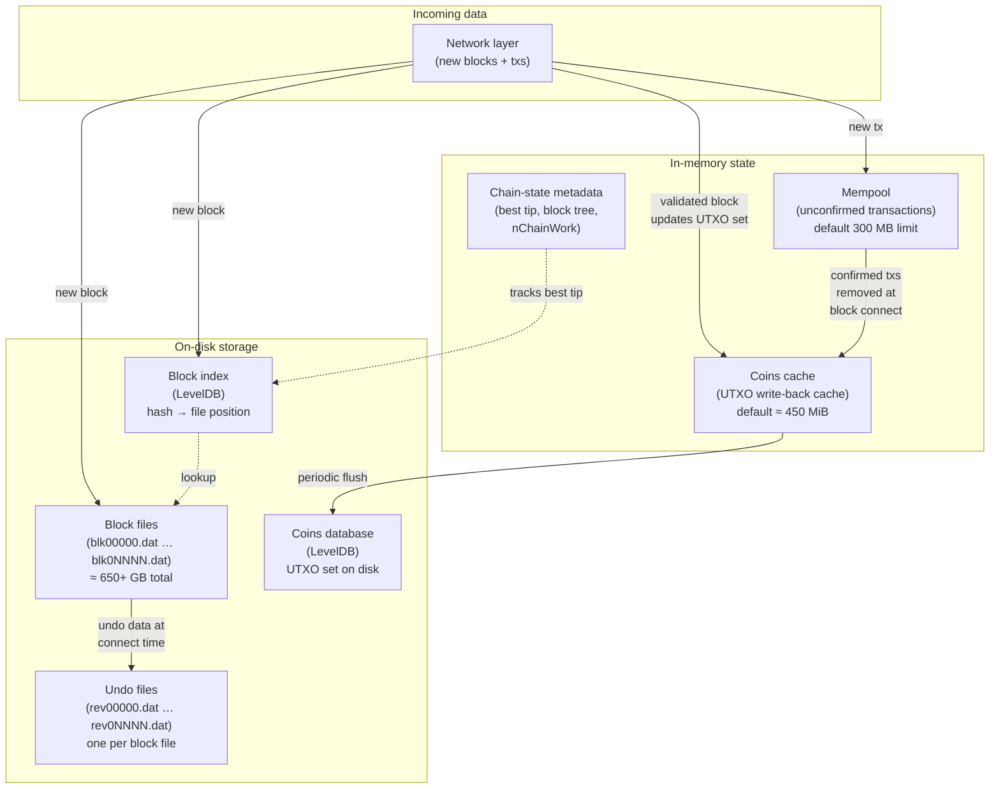
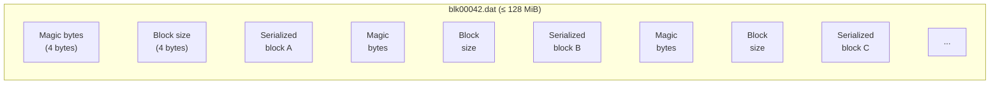
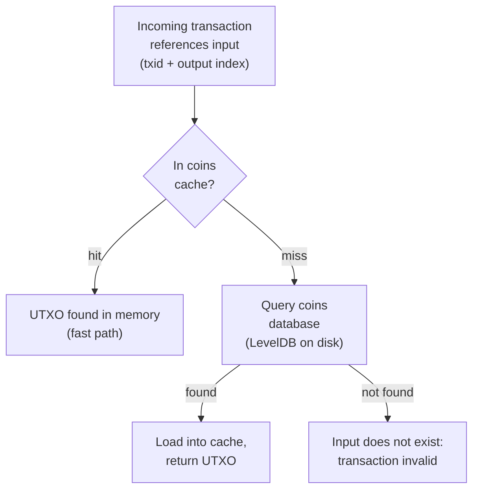
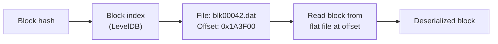
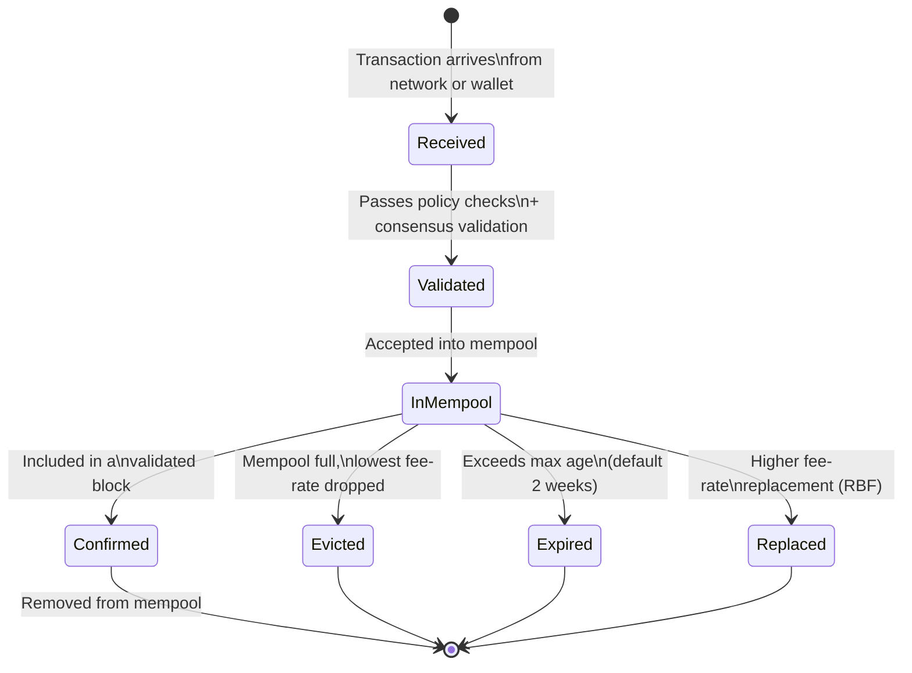
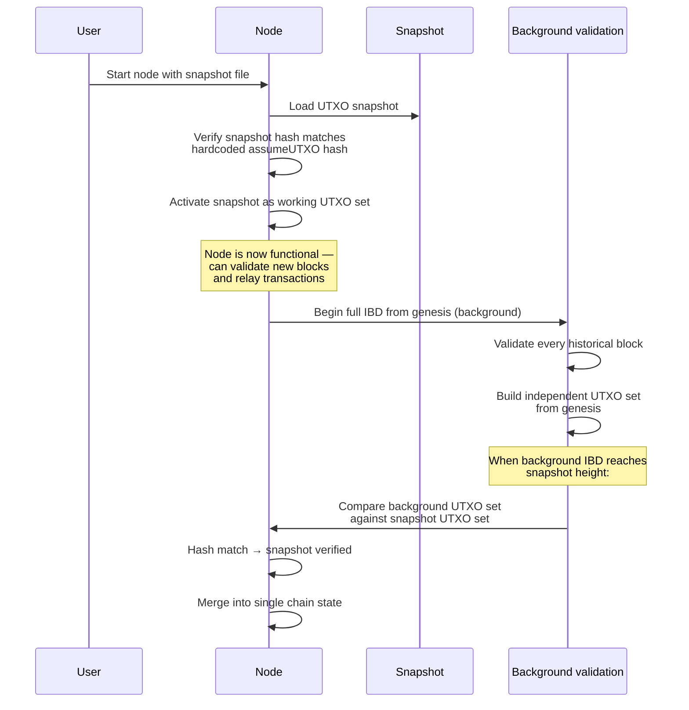

## Introduction

This page is **L1 #7 — Storage design** in the [design-document series](/BitcoinArchive/entries/design/2009-01-03-bitcoin-system-design-overview/). It covers the storage layer: how a Bitcoin Core node persists validated data to disk, how it tracks spendable coins in memory and on disk, and how it recovers or bootstraps state.

The [transaction design](/BitcoinArchive/entries/design/2009-01-03-bitcoin-transaction-design/) page described what a UTXO is. The [block and chain design](/BitcoinArchive/entries/design/2009-01-03-bitcoin-block-chain-design/) page described how blocks link into a chain. This page moves one level down: the on-disk and in-memory structures that make those abstractions durable and queryable.

Four questions organize the material:

1. **Where do blocks go?** Into flat files (`blk*.dat`) on disk, with companion undo files (`rev*.dat`) that enable reorganizations.
2. **Where is the UTXO set?** In a LevelDB database (the coins database), with a write-back cache in memory for performance.
3. **How does the node find a block quickly?** Through a LevelDB block index that maps block hashes to file positions.
4. **How does the node avoid storing everything forever?** Through pruning (discard old block files) and assumeUTXO (bootstrap from a trusted UTXO snapshot).

Where behavior differs between the Satoshi-era implementation (v0.1, January 2009) and modern Bitcoin Core (v27+ baseline), both are noted.

## 1. Storage architecture overview

The diagram below shows every persistent data store inside a full node and the data flow between them.

| Store | Engine | Contents | Approximate size (2025) |
|---|---|---|---|
| **Block files** | Flat binary files | Raw serialized blocks, append-only | ~650 GB |
| **Undo files** | Flat binary files | Previous coin state for each spent input (one file per block file) | ~100 GB |
| **Coins database** | LevelDB | All unspent transaction outputs (UTXO set) | ~7 GB |
| **Block index** | LevelDB | Block header metadata and file-position pointers | ~500 MB |
| **Coins cache** | In-memory hash map | Write-back cache for the coins database | Configurable (default ~450 MiB via `-dbcache`) |
| **Mempool** | In-memory data structures | Unconfirmed transactions awaiting block inclusion | Configurable (default 300 MB via `-maxmempool`) |

## 2. Block files

Validated blocks are written sequentially to a series of flat binary files named `blk00000.dat`, `blk00001.dat`, and so on, stored in the `blocks/` subdirectory of the data directory. Each file holds up to approximately 128 MiB of raw block data before a new file is opened.

### Block file layout

Each block entry in the file begins with a 4-byte network magic number (which identifies the network — mainnet, testnet, etc.) followed by a 4-byte little-endian size field, then the full serialized block (header + transactions + witness data).

### Undo files (rev*.dat)

For every block file `blk0NNNN.dat`, there is a corresponding `rev0NNNN.dat`. The undo file stores the **previous state** of every UTXO consumed by every transaction in the corresponding blocks. This data is essential for **disconnecting** a block during a chain reorganization: the node must restore the UTXOs that were spent and remove the UTXOs that were created.

| File pair | Purpose |
|---|---|
| `blk0NNNN.dat` | Forward data: the raw block as it was received and validated |
| `rev0NNNN.dat` | Reverse data: the coin state needed to undo the block's effects on the UTXO set |

Without undo data, a reorganization would require re-validating the entire chain from genesis — an operation that takes hours even on modern hardware.

## 3. UTXO set (coins database)

The UTXO set is the most performance-critical data structure in Bitcoin Core. Every transaction validation requires looking up whether the referenced inputs exist and are unspent. The coins database stores the complete set of unspent transaction outputs in a LevelDB key-value store located in the `chainstate/` subdirectory.

### UTXO lookup flow

### Key-value structure

Each entry in the coins database is keyed by an **outpoint** (transaction hash + output index) and stores the coin's value in satoshis, the block height at which it was created, whether it is a coinbase output, and the output's locking script.

### Coins cache

Reading from LevelDB on disk for every transaction input would be too slow. Bitcoin Core maintains an in-memory write-back cache (the coins cache) that absorbs reads and batches writes. When a block is connected, spent coins are marked as consumed in the cache, and new coins are added. Periodically — or when the cache reaches its size limit — the accumulated changes are flushed to the on-disk LevelDB in a single batch write.

| Parameter | Default | Effect |
|---|---|---|
| `-dbcache` | 450 MiB | Size of the in-memory coins cache. Larger values reduce disk I/O during initial block download. |
| Flush trigger | Cache full or shutdown | Dirty entries are batch-written to LevelDB. |

**Initial block download (IBD) performance.** During IBD, the node processes hundreds of thousands of blocks in rapid succession. A larger `-dbcache` (e.g., 4096 MiB or more) dramatically reduces IBD time by keeping more of the UTXO set in memory, minimizing disk reads and batch-write frequency.

## 4. Block index

The block index is a separate LevelDB database (stored in `blocks/index/`) that acts as a catalog of every block header the node has ever seen — including headers on stale branches. For each block hash, the index stores:

| Field | Purpose |
|---|---|
| Block header fields | Version, previous hash, Merkle root, timestamp, nBits, nonce |
| File position | Which `blk*.dat` file contains this block, and at what byte offset |
| Block height | Position in the chain |
| Chain work | Cumulative proof-of-work up to and including this block (`nChainWork`) |
| Validation status | Whether the block has been fully validated, only header-validated, or marked invalid |

### Block retrieval path

The block index enables the node to locate any block by hash without scanning the flat files. It also provides the data needed for chain selection: the node can compare `nChainWork` values across branch tips to determine the most-work chain without loading full blocks from disk.

## 5. Mempool storage

The mempool is an in-memory pool of unconfirmed transactions that have passed validation and policy checks but have not yet been included in a block. It is not persisted to the consensus database — it is a local, ephemeral structure that each node maintains independently.

### Mempool lifecycle

| Property | Value (v27+ baseline) |
|---|---|
| **Maximum size** | 300 MB (configurable via `-maxmempool`) |
| **Eviction policy** | Lowest fee-rate transactions are evicted first when the pool reaches capacity |
| **Expiry** | Transactions older than 336 hours (~2 weeks) are removed |
| **Persistence** | Saved to `mempool.dat` on clean shutdown; loaded on next startup |
| **Replace-by-Fee** | Full RBF is the default mempool policy (v28.0+) |

**Mempool vs consensus.** The mempool is a policy-level construct, not a consensus-level one. Two nodes can have entirely different mempools and still agree on which blocks are valid. A transaction's presence in the mempool does not guarantee its inclusion in a block; it only means the local node considers it valid and is willing to relay it.

## 6. Pruning

A full archival node stores every block ever produced — over 650 GB as of 2025 and growing at roughly 50–80 GB per year. **Pruning** allows a node to discard old block and undo files while retaining the full UTXO set and the ability to validate new blocks.

| Aspect | Archival node | Pruned node |
|---|---|---|
| **Block data** | All blocks from genesis to tip | Only the most recent N MiB (minimum 550 MiB) |
| **UTXO set** | Complete | Complete (identical to archival) |
| **Block index** | Complete (all headers) | Complete (all headers) |
| **New-block validation** | Full | Full (identical to archival) |
| **Serve historical blocks** | Yes — can serve any block to peers | No — can only serve blocks within the retention window |
| **Disk usage (2025)** | ~650+ GB | As low as ~10 GB |

**Key point.** A pruned node is a full-validating node. It applies every consensus rule to every new block, exactly as an archival node does. The only capability it loses is the ability to serve old blocks to peers performing initial block download. Pruning is configured with `-prune=<MiB>` (minimum 550).

## 7. assumeUTXO

Initial block download (IBD) — validating every block from the genesis block to the current tip — takes several hours to over a day, depending on hardware and network speed. **assumeUTXO** (`loadtxoutset` RPC introduced in v26.0; mainnet snapshot parameters at height 840,000 added in v28.0) provides an alternative bootstrap path: the node loads a pre-computed UTXO snapshot, immediately begins validating new blocks from the snapshot height, and verifies the full historical chain in the background.

### assumeUTXO bootstrap process

### Trust model

| Phase | Validation level | Trust assumption |
|---|---|---|
| **Snapshot loaded, background IBD not yet complete** | New blocks are fully validated against the snapshot UTXO set | The node trusts the hardcoded snapshot hash (compiled into the binary by Bitcoin Core developers). If the snapshot were malicious, the node could accept invalid transactions until background verification catches the discrepancy. |
| **Background IBD complete, hashes match** | Full validation of every block from genesis to tip | Zero additional trust — the node has independently verified the entire chain history, identical to a traditional IBD node. |

assumeUTXO does not change the consensus rules. It changes the **order** in which validation occurs: new blocks first (immediately useful), historical blocks second (background verification). The end state is identical to a node that performed traditional IBD.

## 8. Two-era comparison

| Feature | Satoshi era (v0.1, Jan 2009) | Modern Bitcoin Core, v27+ baseline |
|---|---|---|
| **Primary database** | Berkeley DB (BDB) for the transaction index and block index; raw block data was flat files (`blk*.dat`) even in v0.1 | LevelDB for UTXO set and block index; flat files for blocks |
| **UTXO storage** | Entire transaction stored in BDB; all outputs (spent and unspent) retained | Only unspent outputs stored in LevelDB; spent outputs discarded |
| **UTXO representation** | Transaction-indexed: full transaction with a spent-flag vector per output | Outpoint-indexed: each UTXO keyed by (txid, output index) with compact serialization |
| **Coins cache** | No separate cache layer; BDB handled all reads and writes | Dedicated in-memory write-back cache (`-dbcache`, default 450 MiB) |
| **Block storage** | Sequential flat files (`blk0001.dat`, `blk0002.dat`, …), rotated near a ~2 GB FAT32-safe limit | Sequential flat files (`blk*.dat`), ~128 MiB each |
| **Undo data** | Not stored; reorganizations required re-validation from the fork point | Dedicated `rev*.dat` files store previous coin state for fast rollback |
| **Block index** | BDB-based index | LevelDB-based index with `nChainWork` tracking |
| **Pruning** | Not available; every node stored the full chain | Available since v0.11 (2015); minimum retention 550 MiB |
| **assumeUTXO** | Not available | Snapshot-based bootstrap with background verification (introduced v26; mainnet parameters v28) |
| **Mempool persistence** | Not persisted across restarts | Saved to `mempool.dat` on shutdown; reloaded on startup |
| **Database migration** | N/A | BDB → LevelDB migration in v0.8 (2013); the single largest storage-layer change in Bitcoin Core's history |
| **Initial block download** | Minutes (few blocks existed) | Hours to >1 day without assumeUTXO; minutes with assumeUTXO snapshot |
| **On-disk size** | Negligible (chain was tiny) | ~650+ GB archival; ~10 GB pruned; ~7 GB coins database |

**The BDB → LevelDB migration (v0.8, March 2013).** Satoshi's original implementation stored the transaction index and UTXO state — but not raw block data, which was flat files (`blk*.dat`) from the start — in a single Berkeley DB database, a choice [he explained directly to an early user in January 2009](/BitcoinArchive/entries/aftermath/2009-01-16-satoshi-to-trammell-wallet-location/) as "a transactional database DBM, so it should be safe from loss if there's a crash or power failure." As the chain grew, BDB's lock limits and memory characteristics became bottlenecks. The v0.8 release replaced BDB with LevelDB for the UTXO set and block index. Block data remained in the flat-file format that had been in use since v0.1. This migration was not without incident: a consensus-splitting fork occurred on March 11, 2013, when nodes running v0.7 (BDB) and v0.8 (LevelDB) disagreed on block validity due to a BDB lock-count limit that LevelDB did not share. The fork was resolved by coordinated miner action to abandon the longer v0.8 chain — one of the few deliberate chain reorganizations in Bitcoin's history.

## 9. Limits of this page

This page covers the storage layer in isolation. The following topics are out of scope and addressed in their respective domain pages within the [design-document series](/BitcoinArchive/entries/design/2009-01-03-bitcoin-system-design-overview/):

- **Transaction structure and UTXO model** — how UTXOs are created, spent, and validated. Covered in the [transaction design page](/BitcoinArchive/entries/design/2009-01-03-bitcoin-transaction-design/).
- **Block structure and chain selection** — how blocks are structured and how the most-work chain is selected. Covered in the [block and chain design page](/BitcoinArchive/entries/design/2009-01-03-bitcoin-block-chain-design/).
- **Consensus rules** — the validation rules that determine whether a block is accepted before it reaches the storage layer.
- **Network-layer block relay** — how blocks are transmitted between nodes before being written to disk.
- **Wallet storage** — key derivation, descriptor databases, and wallet backup, which use a separate storage path from the consensus data described here.
