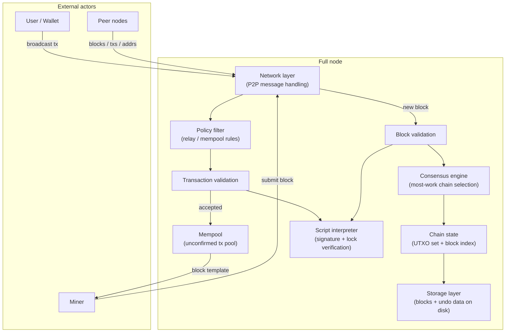
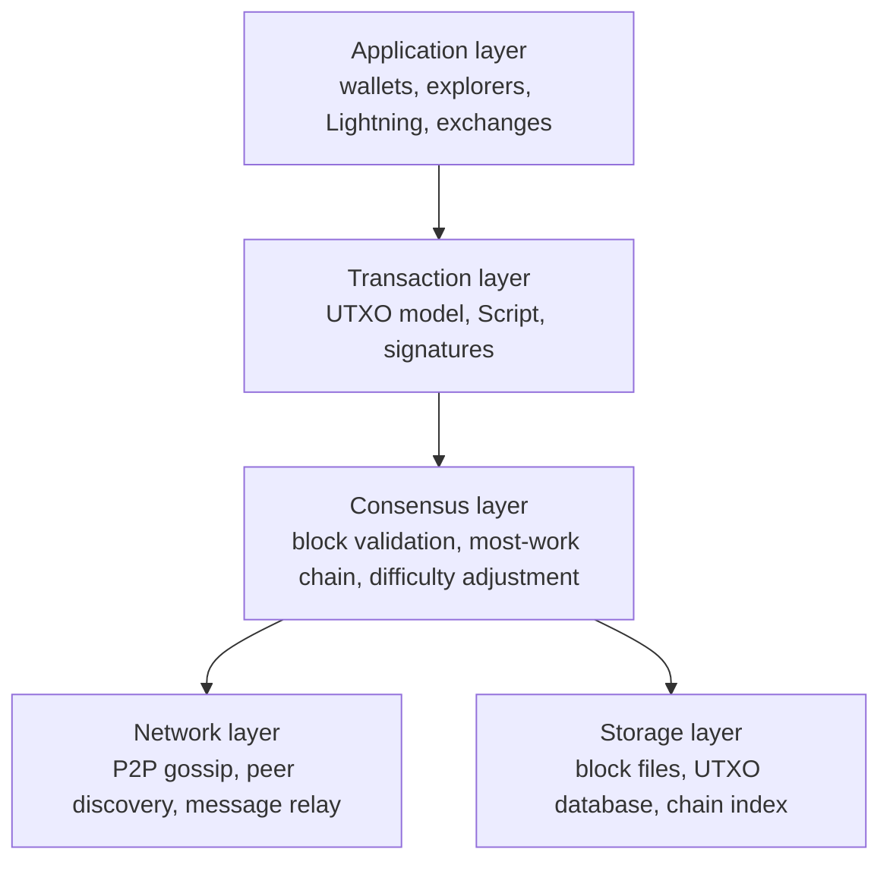
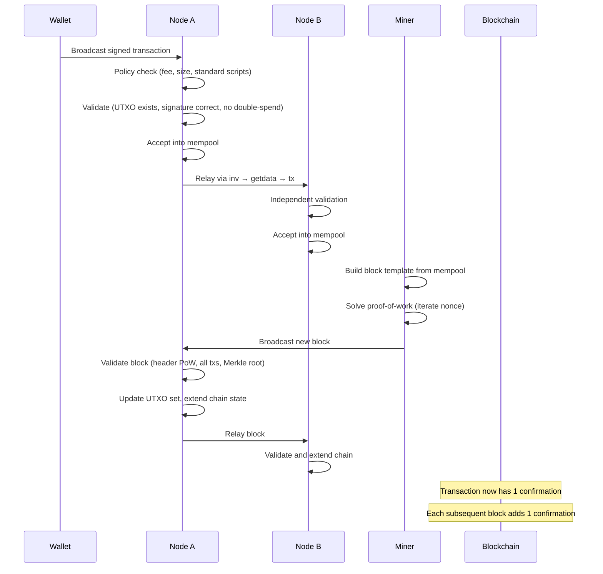
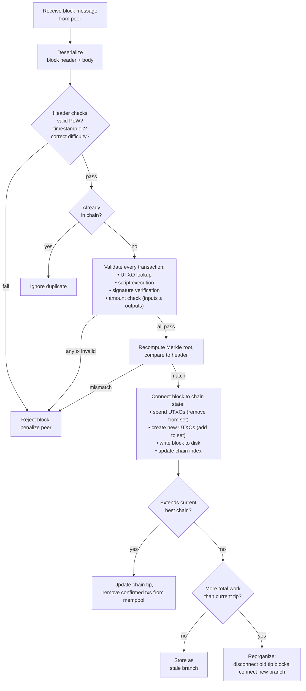
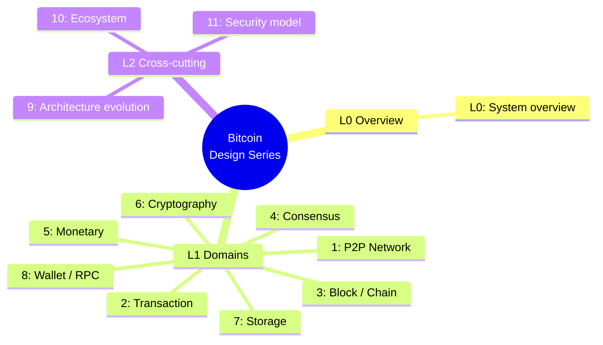

## What this document series is

This is an editorial design reading of Bitcoin — a set of twelve pages written by Bitcoin Institute that decompose the system into its constituent parts and explain how they fit together. The series is not a protocol specification and does not carry normative authority. It is an analytical companion to the [whitepaper](/BitcoinArchive/entries/emails/cryptography/2008-10-31-bitcoin-whitepaper-final/), the [visual glossary](/BitcoinArchive/entries/analysis/2026-05-23-how-bitcoin-works-visual-glossary/), and the reference implementation source code.

**Baseline.** Unless stated otherwise, "modern Bitcoin Core" means the v27+ codebase. Satoshi-era descriptions refer to v0.1 (January 2009). Where behavior differs between the two, both are noted.

**Scope.** The series covers the Bitcoin protocol and its reference implementation. Layer-2 systems (Lightning Network, sidechains) and application-layer software (wallets, exchanges, indexers) are mentioned at interface boundaries but not decomposed in detail.

This page is **L0 — System design overview** in the design-document series. It provides the system-wide picture and links to each domain page.

## 1. System architecture

The diagram below shows every major subsystem and the data paths between them. Each box maps to one or more pages deeper in the series.

| Subsystem | Role | Design page |
|---|---|---|
| Network layer | P2P gossip, peer management, message serialization | [L1 #1 P2P](/BitcoinArchive/entries/design/2009-01-03-bitcoin-p2p-network-design/) |
| Transaction layer | UTXO model, Script, inputs/outputs, signatures | [L1 #2 Transaction](/BitcoinArchive/entries/design/2009-01-03-bitcoin-transaction-design/) |
| Block / chain layer | Header, Merkle tree, chain structure, coinbase | [L1 #3 Block/Chain](/BitcoinArchive/entries/design/2009-01-03-bitcoin-block-chain-design/) |
| Consensus engine | PoW, difficulty adjustment, fork handling, validation | [L1 #4 Consensus](/BitcoinArchive/entries/design/2009-01-03-bitcoin-consensus-design/) |
| Monetary layer | Issuance schedule, fee market, miner incentives | [L1 #5 Monetary](/BitcoinArchive/entries/design/2009-01-03-bitcoin-monetary-design/) |
| Cryptography layer | Keys, signatures, hashes, address derivation | [L1 #6 Cryptography](/BitcoinArchive/entries/design/2009-01-03-bitcoin-cryptography-design/) |
| Storage layer | Block files, UTXO database, chain state on disk | [L1 #7 Storage](/BitcoinArchive/entries/design/2009-01-03-bitcoin-storage-design/) |
| Wallet / interface | Key management, coin selection, PSBT, RPC | [L1 #8 Wallet](/BitcoinArchive/entries/design/2009-01-03-bitcoin-wallet-design/) |

## 2. Layer model

Bitcoin's design stacks into five layers. Each layer depends only on the layers below it.

| Layer | What it decides | Key data structures |
|---|---|---|
| **Application** | User-facing behavior: address generation, coin selection, fee estimation, payment channels | HD key trees (BIP 32/44/84), PSBT |
| **Transaction** | What a valid spend looks like: inputs, outputs, lock scripts, witness data | `CTxIn`, `CTxOut`, `CScript`, witness stack |
| **Consensus** | Which blocks are accepted and which chain tip wins | Block header, Merkle tree, difficulty target, `nChainWork` |
| **Network** | How nodes find each other and exchange data | `version`, `inv`, `getdata`, `block`, `tx` messages |
| **Storage** | How validated data persists to disk and how it is retrieved | LevelDB (UTXO set), `blk*.dat` / `rev*.dat` flat files |

## 3. Data flow: transaction to blockchain

The sequence below traces a single transaction from the moment a user signs it to the moment it is buried under confirmations.

**Key design properties visible in this flow:**

- **No central checkpoint.** Every node validates independently — there is no authority a transaction must pass through.
- **Two-phase acceptance.** A transaction is first accepted into the mempool (unconfirmed), then accepted into a block (confirmed). The mempool is local and non-binding; only block inclusion is consensus-level.
- **Most-work chain wins.** If two miners find blocks at nearly the same time, the network temporarily forks. Nodes follow whichever chain accumulates the most total proof-of-work. The losing block becomes stale (orphaned); its transactions return to the mempool.

## 4. Component interaction map

The flowchart below shows how the major code-level components interact when a node receives a new block from the network.

## 5. Two-era comparison

The table below gives a brief structural comparison between the Satoshi-era v0.1 implementation and modern Bitcoin Core (v27+ baseline). Each row is explored in depth in the domain pages listed in [§ 7](#7-design-document-index).

| Aspect | Satoshi v0.1 (Jan 2009) | Modern Bitcoin Core, v27+ baseline |
|---|---|---|
| **Consensus rule enforcement** | Single `CheckBlock` / `CheckTransaction` path | Separated into consensus, policy, and validation layers |
| **Chain selection** | Longest chain (block-height comparison, `nBestHeight`) | Most-work chain (`nChainWork`), since v0.3.3 |
| **Script system** | Full opcode set including `OP_CAT`, `OP_MUL`, etc. | Many opcodes disabled (2010); SegWit witness versioning added (2017) |
| **Transaction format** | Version 1, no witness | SegWit witness field (BIP 141), version 2 (BIP 68 / 112 / 113) |
| **Block size** | No explicit limit in v0.1 (1 MB added in 2010) | 4 MWU weight limit (BIP 141), ~1.5–2 MB observed |
| **Network protocol** | 12 message types | 27+ message types; compact blocks (BIP 152), addr v2 (BIP 155) |
| **Peer discovery** | Hardcoded IRC channel + `addr` messages | DNS seeds, `addrv2`, Tor/I2P/CJDNS support |
| **Storage** | BDB for indexes and wallet; raw blocks in flat files (`blk*.dat`) | LevelDB (UTXO set), flat block files (`blk*.dat`), undo files (`rev*.dat`) |
| **Mining** | CPU only, internal miner in client | External via `getblocktemplate` (BIP 22/23); Stratum v2 in ecosystem |
| **Wallet** | Integrated in node binary, random keys | Descriptor wallets (BIP 380+), logical separation (experimental multiprocess in progress) |
| **Cryptography** | OpenSSL for ECDSA; bundled Crypto++ for the mining SHA-256 | libsecp256k1 (custom ECDSA/Schnorr), internal SHA-256 |

*[Context: This table is deliberately terse. The detailed comparison with primary-source evidence for each evolution appears in the L2 page on historical evolution (§ 7, item 9).]*

## 6. Reading guide

Different readers benefit from different paths through the series.

| Audience | Suggested reading order |
|---|---|
| **New to Bitcoin** | Start with the [visual glossary](/BitcoinArchive/entries/analysis/2026-05-23-how-bitcoin-works-visual-glossary/), then return here, then L1 #2 (transaction) → #3 (block) → #4 (consensus) |
| **Developer** | This overview → L1 #2 (transaction) → #3 (block) → #4 (consensus) → #1 (P2P) → #7 (storage) |
| **Researcher / economist** | This overview → L1 #5 (monetary) → #4 (consensus) → #2 (transaction) → L2 #9 (architecture evolution) |
| **Security auditor** | L1 #2 (transaction) → #4 (consensus) → #1 (P2P) → #6 (cryptography) → L2 #11 (security model) |

## 7. Design-document index

The series is organized into three levels:

- **L0** — this page (system overview)
- **L1** — eight domain pages, each covering one subsystem end-to-end
- **L2** — three deep-dive pages on cross-cutting topics

### L1 — Domain pages

| # | Page | Scope |
|---|---|---|
| 1 | [**P2P network**](/BitcoinArchive/entries/design/2009-01-03-bitcoin-p2p-network-design/) | Peer discovery, connection lifecycle, message format, gossip relay, compact blocks, BIP 324 transport |
| 2 | [**Transaction**](/BitcoinArchive/entries/design/2009-01-03-bitcoin-transaction-design/) | UTXO lifecycle, transaction structure, Script evaluation, signatures (ECDSA/Schnorr), SegWit, Taproot |
| 3 | [**Block / chain**](/BitcoinArchive/entries/design/2009-01-03-bitcoin-block-chain-design/) | Header fields, Merkle tree, chain structure, most-work chain selection, block weight, coinbase |
| 4 | [**Consensus**](/BitcoinArchive/entries/design/2009-01-03-bitcoin-consensus-design/) | PoW mechanics, difficulty adjustment, block validation, fork types, activation mechanisms, finality model |
| 5 | [**Monetary**](/BitcoinArchive/entries/design/2009-01-03-bitcoin-monetary-design/) | 21M cap arithmetic, halving schedule, fee market, miner incentives, fee-only future |
| 6 | [**Cryptography**](/BitcoinArchive/entries/design/2009-01-03-bitcoin-cryptography-design/) | secp256k1, ECDSA/Schnorr, SHA-256d, address derivation, HD wallets, quantum considerations |
| 7 | [**Storage**](/BitcoinArchive/entries/design/2009-01-03-bitcoin-storage-design/) | Block files, UTXO database (LevelDB), chain state, mempool, pruning, assumeUTXO |
| 8 | [**Wallet / RPC**](/BitcoinArchive/entries/design/2009-01-03-bitcoin-wallet-design/) | Descriptor wallets, coin selection, PSBT, fee estimation, RPC/REST/ZMQ interfaces |

### L2 — Cross-cutting deep dives

| # | Page | Scope |
|---|---|---|
| 9 | [**Architecture evolution**](/BitcoinArchive/entries/design/2009-01-03-bitcoin-architecture-evolution/) | Side-by-side v0.1 vs v27+ comparison across all 8 domains |
| 10 | [**Ecosystem**](/BitcoinArchive/entries/design/2009-01-03-bitcoin-ecosystem-design/) | Lightning Network, sidechains (Liquid), L1 extensions (Ordinals), mining pools |
| 11 | [**Security model**](/BitcoinArchive/entries/design/2009-01-03-bitcoin-security-model/) | Trust assumptions, attack taxonomy, defense layers, economic security, quantum threat |
