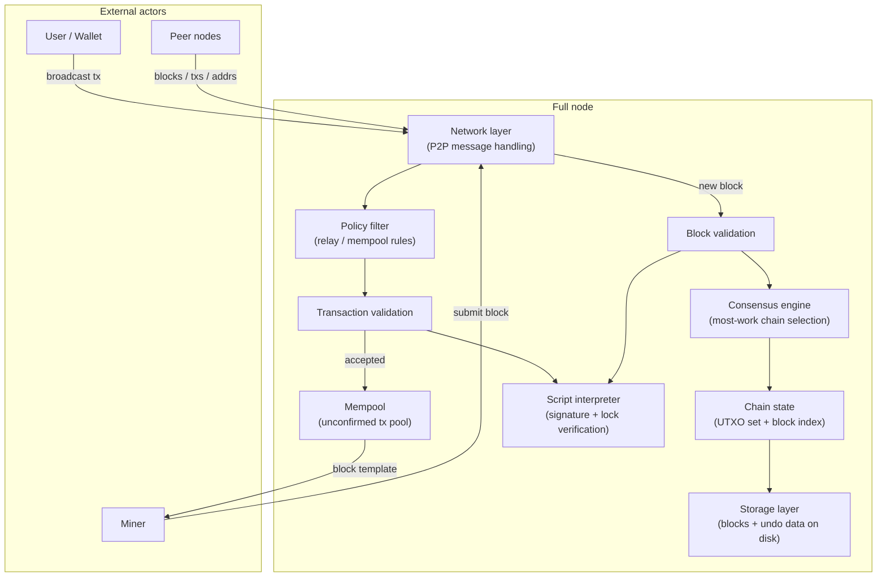
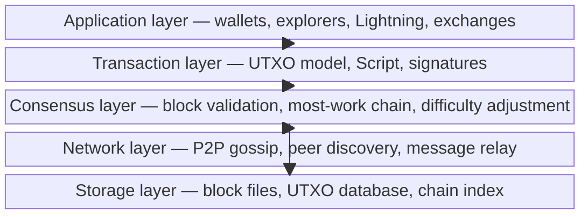
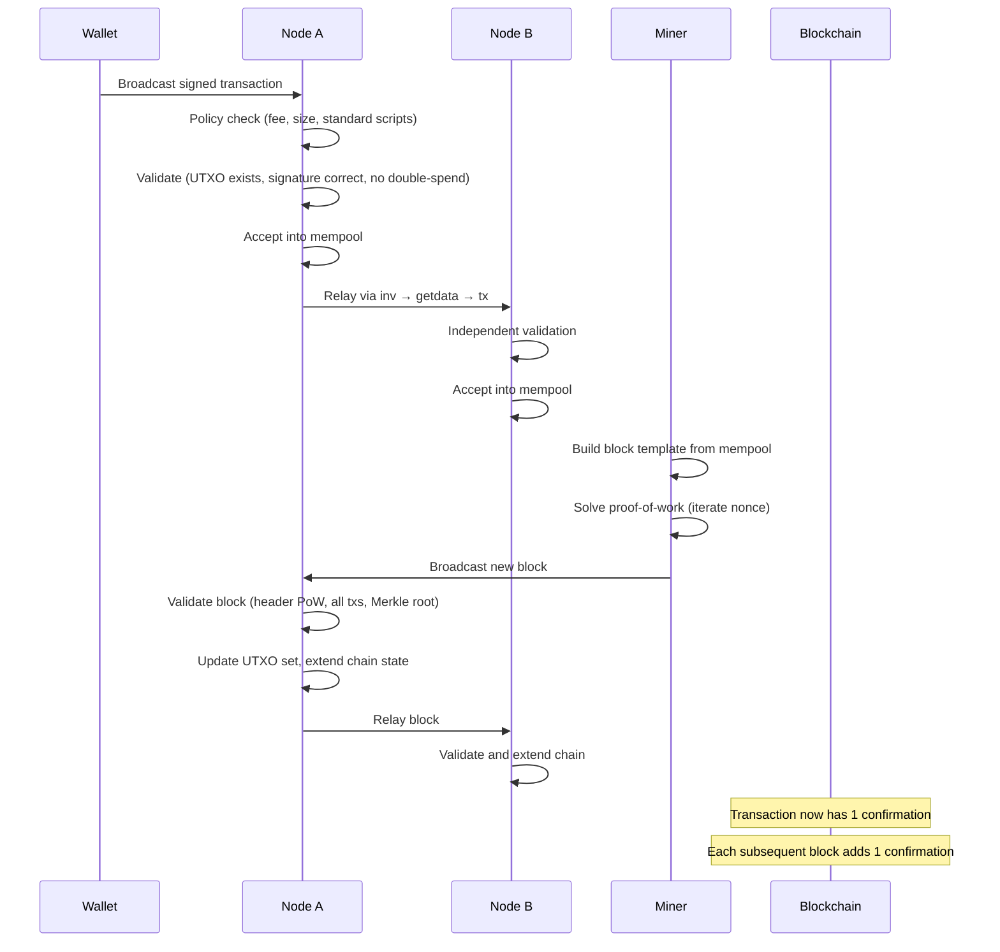
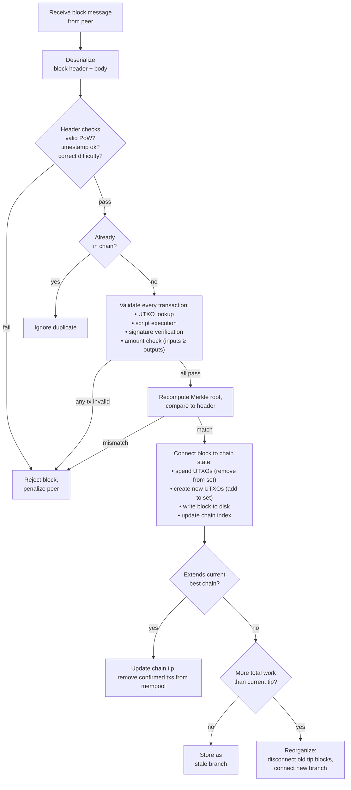
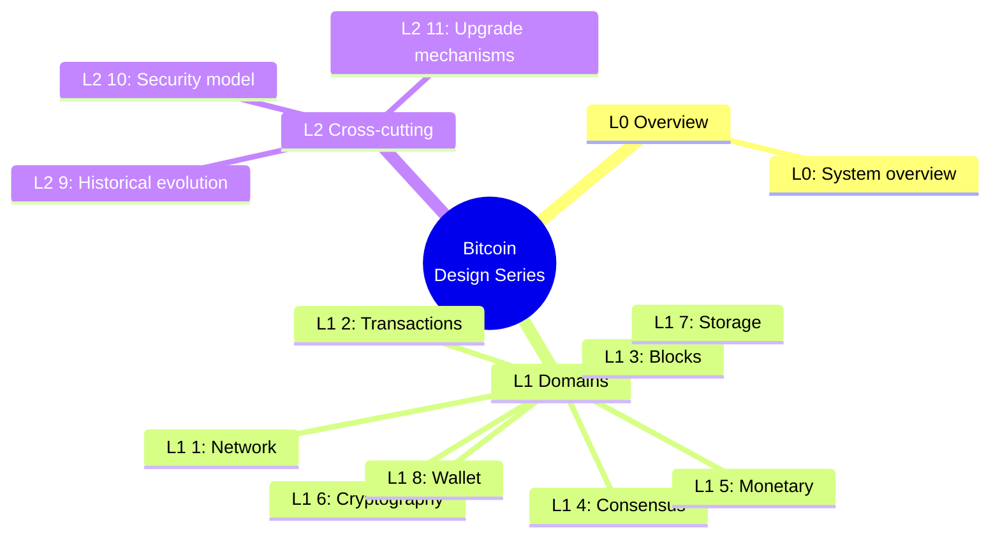

## What this document series is

This is an editorial design reading of Bitcoin — a set of twelve pages written by Bitcoin Institute that decompose the system into its constituent parts and explain how they fit together. The series is not a protocol specification and does not carry normative authority. It is an analytical companion to the [whitepaper](/BitcoinArchive/entries/emails/cryptography/2008-10-31-bitcoin-whitepaper-final/), the [visual glossary](/BitcoinArchive/entries/analysis/2026-05-23-how-bitcoin-works-visual-glossary/), and the reference implementation source code.

**Baseline.** Unless stated otherwise, "modern Bitcoin Core" means the v27+ codebase. Satoshi-era descriptions refer to v0.1 (January 2009). Where behavior differs between the two, both are noted.

**Scope.** The series covers the Bitcoin protocol and its reference implementation. Layer-2 systems (Lightning Network, sidechains) and application-layer software (wallets, exchanges, indexers) are mentioned at interface boundaries but not decomposed in detail.

This overview page — the L0 entry point — provides the system-wide picture and links to each domain page.

## 1. System architecture

The diagram below shows every major subsystem and the data paths between them. Each box maps to one or more pages deeper in the series.

| Subsystem | Role | Design page |
|---|---|---|
| Network layer | P2P gossip, peer management, message serialization | [L1 #1](#7-design-document-index) |
| Consensus engine | Most-work chain selection, fork resolution | [L1 #2](#7-design-document-index) |
| Transaction model | UTXO structure, inputs/outputs, fee calculation | [L1 #3](#7-design-document-index) |
| Script system | Stack-based lock/unlock language, signature verification | [L1 #4](#7-design-document-index) |
| Block structure | Header, Merkle root, coinbase, weight/size limits | [L1 #5](#7-design-document-index) |
| Mining and PoW | Hash puzzle, difficulty adjustment, block template | [L1 #6](#7-design-document-index) |
| Storage and indexing | Block files, UTXO database, chain state on disk | [L1 #7](#7-design-document-index) |
| Wallet and key management | Key derivation, address types, coin selection | [L1 #8](#7-design-document-index) |

## 2. Layer model

Bitcoin's design stacks into five layers. Each layer depends only on the layers below it.

| Layer | What it decides | Key data structures |
|---|---|---|
| **Application** | User-facing behavior: address generation, coin selection, fee estimation, payment channels | HD key trees (BIP 32/44/84), PSBT |
| **Transaction** | What a valid spend looks like: inputs, outputs, lock scripts, witness data | `CTxIn`, `CTxOut`, `CScript`, witness stack |
| **Consensus** | Which blocks are accepted and which chain tip wins | Block header, Merkle tree, difficulty target, `nChainWork` |
| **Network** | How nodes find each other and exchange data | `version`, `inv`, `getdata`, `block`, `tx` messages |
| **Storage** | How validated data persists to disk and how it is retrieved | LevelDB (UTXO set), `blk*.dat` / `rev*.dat` flat files |

## 3. Data flow: transaction to blockchain

The sequence below traces a single transaction from the moment a user signs it to the moment it is buried under confirmations.

**Key design properties visible in this flow:**

- **No central checkpoint.** Every node validates independently — there is no authority a transaction must pass through.
- **Two-phase acceptance.** A transaction is first accepted into the mempool (unconfirmed), then accepted into a block (confirmed). The mempool is local and non-binding; only block inclusion is consensus-level.
- **Most-work chain wins.** If two miners find blocks at nearly the same time, the network temporarily forks. Nodes follow whichever chain accumulates the most total proof-of-work. The losing block becomes stale (orphaned); its transactions return to the mempool.

## 4. Component interaction map

The flowchart below shows how the major code-level components interact when a node receives a new block from the network.

## 5. Two-era comparison

The table below gives a brief structural comparison between the Satoshi-era v0.1 implementation and modern Bitcoin Core (v27+ baseline). Each row is explored in depth in the domain pages listed in [§ 7](#7-design-document-index).

| Aspect | Satoshi v0.1 (Jan 2009) | Modern Bitcoin Core, v27+ baseline |
|---|---|---|
| **Consensus rule enforcement** | Single `CheckBlock` / `CheckTransaction` path | Separated into consensus, policy, and validation layers |
| **Chain selection** | Most-work chain (measured by cumulative difficulty) | Same rule; implementation hardened with `nChainWork` tracking |
| **Script system** | Full opcode set including `OP_CAT`, `OP_MUL`, etc. | Many opcodes disabled (2010); SegWit witness versioning added (2017) |
| **Transaction format** | Version 1, no witness | SegWit witness field (BIP 141), version 2 (BIP 68 / 112 / 113) |
| **Block size** | No explicit limit in v0.1 (1 MB added in 2010) | 4 MWU weight limit (BIP 141), ~1.5–2 MB observed |
| **Network protocol** | 7 message types | 27+ message types; compact blocks (BIP 152), addr v2 (BIP 155) |
| **Peer discovery** | Hardcoded IRC channel + `addr` messages | DNS seeds, `addrv2`, Tor/I2P/CJDNS support |
| **Storage** | Berkeley DB for all state | LevelDB (UTXO set), flat files (blocks), memory-mapped (v0.8+) |
| **Mining** | CPU only, internal miner in client | External via `getblocktemplate` (BIP 22/23); Stratum v2 in ecosystem |
| **Wallet** | Integrated in node binary, random keys | Descriptor wallets (BIP 380+), optional separate process |
| **Cryptography** | OpenSSL for ECDSA + SHA-256 | libsecp256k1 (custom ECDSA/Schnorr), internal SHA-256 |

*[Context: This table is deliberately terse. The detailed comparison with primary-source evidence for each evolution appears in the L2 page on historical evolution (§ 7, item 9).]*

## 6. Reading guide

Different readers benefit from different paths through the series.

| Audience | Suggested reading order |
|---|---|
| **New to Bitcoin** | Start with the [visual glossary](/BitcoinArchive/entries/analysis/2026-05-23-how-bitcoin-works-visual-glossary/), then return here, then L1 pages 1 → 3 → 5 → 6 → 2 |
| **Developer** | This overview → L1 #3 (transactions) → #4 (script) → #2 (consensus) → #1 (network) → #7 (storage) |
| **Researcher / economist** | This overview → L1 #6 (mining / issuance) → #2 (consensus) → #3 (transactions) → L2 #9 (historical evolution) |
| **Security auditor** | L1 #4 (script) → #2 (consensus) → #1 (network) → #5 (block structure) → this overview for context |

## 7. Design-document index

The series is organized into three levels:

- **L0** — this page (system overview)
- **L1** — eight domain pages, each covering one subsystem end-to-end
- **L2** — three deep-dive pages on cross-cutting topics

### L1 — Domain pages

| # | Page | Scope |
|---|---|---|
| 1 | **Network and P2P protocol** | Peer discovery, connection lifecycle, message format, gossip relay, compact blocks, Eclipse/Sybil resistance |
| 2 | **Consensus rules** | Block validity rules, most-work chain selection, fork resolution, soft fork activation (BIP 9/8), the consensus–policy boundary |
| 3 | **Transaction model and UTXO** | UTXO lifecycle, transaction structure (pre-SegWit and SegWit), fee calculation, Replace-by-Fee, CPFP, coin selection |
| 4 | **Script system** | Stack machine, standard script types (P2PKH → P2TR), signature hashing, Taproot/Tapscript, opcode reference |
| 5 | **Block structure** | Header fields, Merkle tree construction, coinbase transaction, witness commitment, weight and sigop limits |
| 6 | **Mining and proof-of-work** | Hash puzzle mechanics, difficulty adjustment algorithm, block template construction, mining pool protocols, issuance schedule |
| 7 | **Storage and chain state** | UTXO database (LevelDB), block file layout, undo data, reindex, pruning, assumeUTXO |
| 8 | **Wallet and key management** | Key derivation (BIP 32/44/49/84/86), descriptor wallets, address types, PSBT workflow, backup and recovery |

### L2 — Cross-cutting deep dives

| # | Page | Scope |
|---|---|---|
| 9 | **Historical evolution: v0.1 → v27+** | Detailed before/after for every subsystem, mapped to the BIPs and commits that introduced each change |
| 10 | **Security model** | Threat model, 51% attack economics, Eclipse attacks, transaction malleability (pre- and post-SegWit), time-warp, selfish mining |
| 11 | **Upgrade mechanisms** | Soft forks vs hard forks, activation methods (flag day, BIP 9/8, UASF), the backward-compatibility contract |
