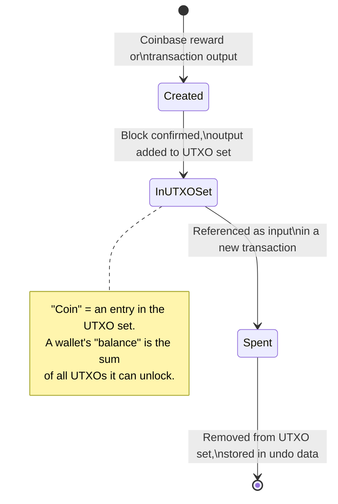
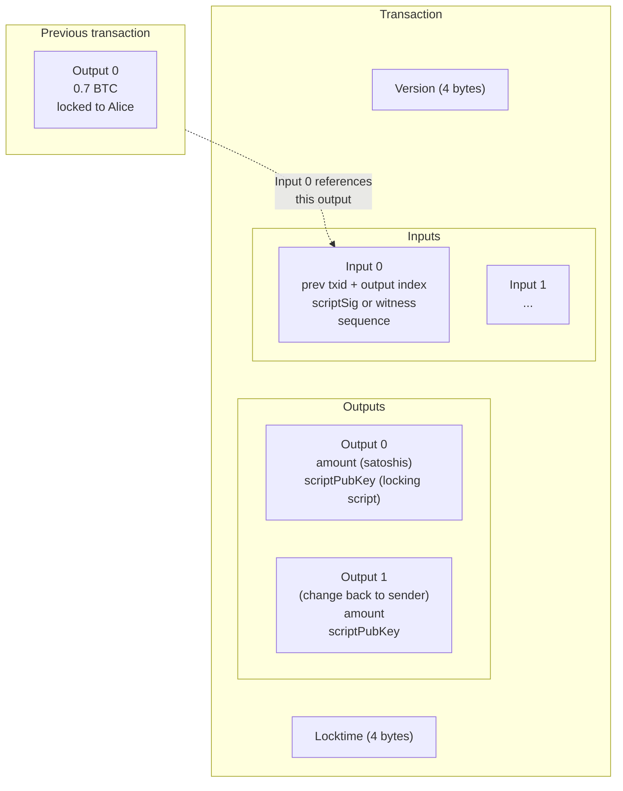
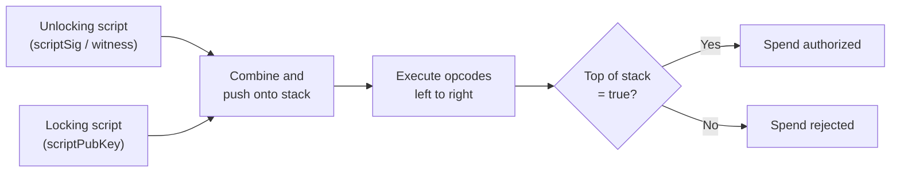
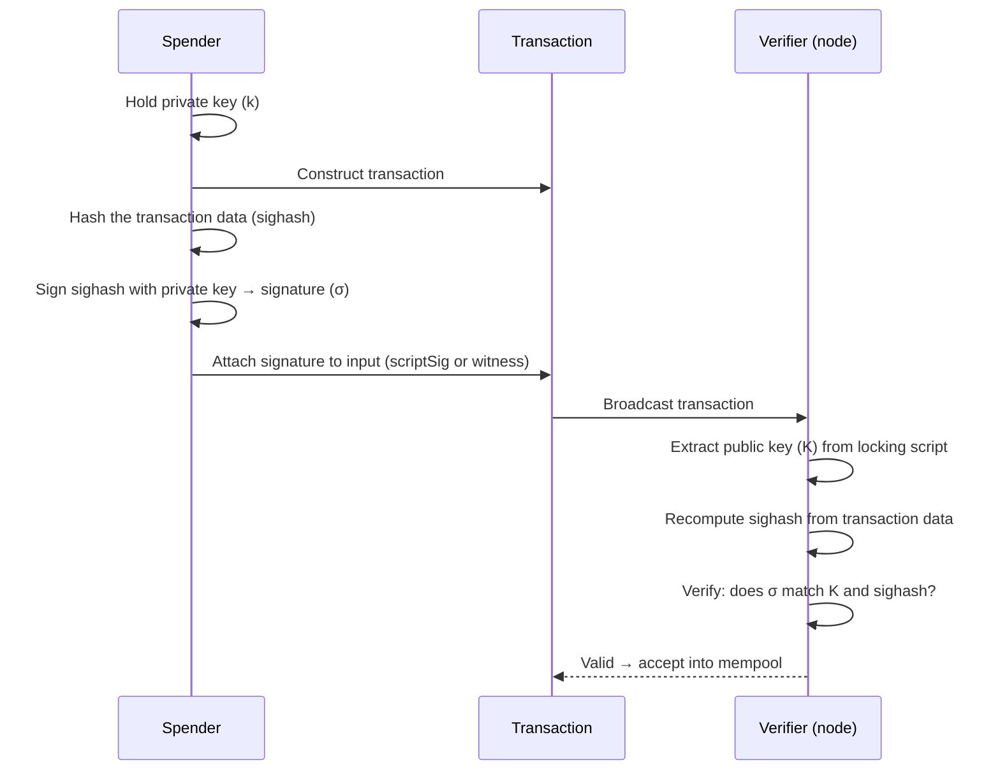
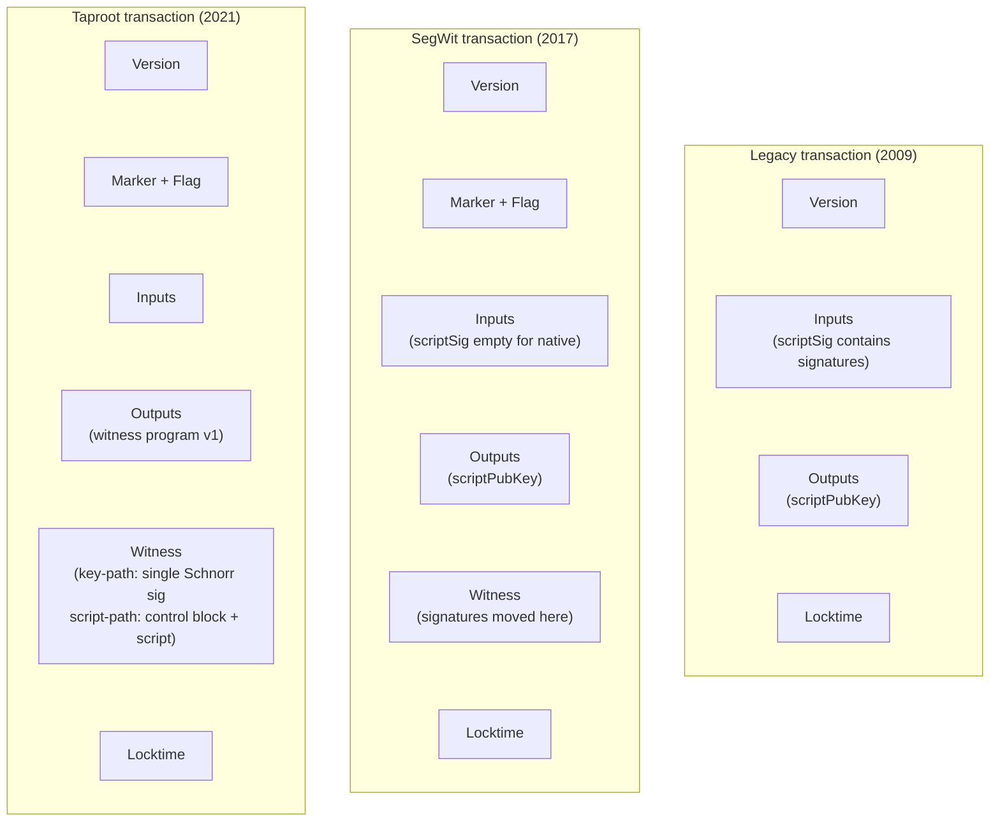

## Introduction

This page is the second in the [design-document series](/BitcoinArchive/entries/design/2009-01-03-bitcoin-system-design-overview/) and covers the transaction layer end-to-end: how value is represented, transferred, locked, and unlocked. Everything in Bitcoin — mining incentives, block weight, fee markets, wallet UX — rests on the structures described here.

The transaction layer answers three questions:

1. **What is a coin?** An unspent transaction output (UTXO) — not an account balance.
2. **What does a valid spend look like?** A transaction that consumes existing UTXOs, proves authorization via cryptographic signatures, and creates new UTXOs.
3. **How is authorization expressed?** Through Bitcoin Script — a stack-based language that evaluates locking and unlocking conditions.

Where behavior differs between the Satoshi-era implementation (v0.1, January 2009) and modern Bitcoin Core (v27+ baseline), both are noted.

## 1. The UTXO model

Bitcoin does not track balances. Instead, every transaction creates one or more discrete outputs, each carrying a specific amount and a locking condition. An output that has not yet been consumed by a later transaction is an **unspent transaction output** (UTXO). The set of all UTXOs at any moment is the complete picture of who can spend what.

### UTXO lifecycle

### UTXO model vs account model

| Property | UTXO model (Bitcoin) | Account model (Ethereum) |
|---|---|---|
| **State representation** | Set of discrete unspent outputs | Map of addresses to balances |
| **Spending** | Consume entire UTXOs, create new ones (including change) | Debit sender balance, credit receiver balance |
| **Privacy** | Each transaction can use fresh addresses; outputs are unlinkable by default | Addresses accumulate history; balance visible per account |
| **Parallel validation** | Inputs reference distinct UTXOs — transactions touching different UTXOs validate independently | Nonce ordering per account creates serial dependency |
| **Double-spend detection** | Check that referenced UTXO exists and is unspent | Check that sender nonce is correct and balance sufficient |
| **State size** | Grows with unspent outputs (~180 M UTXOs as of 2025) | Grows with accounts and contract storage |
| **Change outputs** | Required when input total exceeds payment amount | Not needed; balance is adjusted in place |

## 2. Transaction structure

A transaction is a signed message that consumes one or more existing UTXOs (inputs) and creates one or more new UTXOs (outputs). The difference between total input value and total output value is the transaction fee, collected by the miner who includes the transaction in a block.

### Transaction anatomy

### Field-by-field breakdown

| Field | Size | Description |
|---|---|---|
| **Version** | 4 bytes | Transaction format version. v1 is standard; v2 enables BIP 68 relative timelocks. |
| **Marker + Flag** | 2 bytes | SegWit indicator (`0x00 0x01`). Absent in legacy transactions. |
| **Input count** | varint | Number of inputs. |
| **Inputs** | variable | Each input: previous txid (32 bytes) + output index (4 bytes) + scriptSig (variable) + sequence (4 bytes). |
| **Output count** | varint | Number of outputs. |
| **Outputs** | variable | Each output: value in satoshis (8 bytes) + scriptPubKey (variable). |
| **Witness** | variable | Per-input witness stacks. Present only in SegWit transactions. |
| **Locktime** | 4 bytes | Earliest time or block height at which the transaction may be included. |

### Satoshi era vs v27+ baseline: transaction format

| Aspect | Satoshi era (v0.1) | Modern Bitcoin Core, v27+ baseline |
|---|---|---|
| **Format** | Legacy: version + inputs + outputs + locktime | SegWit: version + marker/flag + inputs + outputs + witness + locktime |
| **Witness data** | Does not exist; signatures embedded in scriptSig | Segregated into the witness field (BIP 141) |
| **Transaction ID** | SHA-256d of the entire serialized transaction | `txid` excludes witness data; `wtxid` includes it |
| **Malleability** | Possible — third parties can alter scriptSig without invalidating the transaction | Fixed — witness is excluded from txid computation |
| **Version** | Always 1 | v1 or v2; v2 enables relative timelocks (BIP 68) |

## 3. Bitcoin Script

Bitcoin transactions are not locked to public keys directly. Instead, each output carries a small program called a **locking script** (`scriptPubKey`), and each input provides an **unlocking script** (`scriptSig` or witness data) that satisfies the locking condition. Bitcoin Script is the stack-based language in which these programs are written.

### Script evaluation flow

The interpreter processes opcodes sequentially. It pushes data items onto the stack, then executes operations that consume and produce stack elements. If the stack's top element is nonzero (true) after all opcodes have been processed, the spend is valid.

### Common script patterns

| Pattern | Introduced | Locking mechanism | Typical use |
|---|---|---|---|
| **P2PKH** (Pay-to-Public-Key-Hash) | v0.1 (2009) | Hash of public key; spender provides key + ECDSA signature | Legacy addresses starting with `1` |
| **P2SH** (Pay-to-Script-Hash) | BIP 16 (2012) | Hash of a redeem script; spender provides the script + data satisfying it | Multisig, wrapped SegWit; addresses starting with `3` |
| **P2WPKH** (Pay-to-Witness-Public-Key-Hash) | BIP 141 (2017) | Witness program v0 with 20-byte key hash; signature in witness | Native SegWit addresses starting with `bc1q` |
| **P2WSH** (Pay-to-Witness-Script-Hash) | BIP 141 (2017) | Witness program v0 with 32-byte script hash; witness provides script + data | Native SegWit multisig and complex scripts |
| **P2TR** (Pay-to-Taproot) | BIP 341 (2021) | Witness program v1 with 32-byte tweaked public key; key-path or script-path spend | Taproot addresses starting with `bc1p` |

### Script evolution: v0.1 to v27+

| Aspect | Satoshi era (v0.1) | Modern Bitcoin Core, v27+ baseline |
|---|---|---|
| **Available opcodes** | Full set including `OP_CAT`, `OP_MUL`, `OP_LSHIFT`, etc. | Many disabled (2010 security patch); subset re-enabled via tapscript (BIP 342) |
| **Script types** | P2PK and P2PKH only | P2PKH, P2SH, P2WPKH, P2WSH, P2TR |
| **Execution model** | scriptSig + scriptPubKey concatenated and executed | Separated evaluation; witness programs have their own validation rules |
| **Size limits** | 10,000 byte script, 201 opcode limit | Same base limits; tapscript relaxes sigop counting |

## 4. Signature schemes

Cryptographic signatures are the mechanism by which a spender proves they control the private key associated with a UTXO's locking condition. Bitcoin has used two signature schemes across its history.

### ECDSA vs Schnorr

| Property | ECDSA (secp256k1) | Schnorr (BIP 340) |
|---|---|---|
| **Introduced** | v0.1 (2009) | Taproot activation (2021) |
| **Curve** | secp256k1 | secp256k1 (same curve) |
| **Signature size** | 70-72 bytes (DER-encoded) | 64 bytes (fixed) |
| **Verification** | One equation per signature | One equation per signature; batch-verifiable |
| **Key aggregation** | Not natively supported | MuSig2 enables n-of-n aggregation into a single key and signature |
| **Linearity** | Non-linear — aggregation requires complex protocols | Linear — `s₁ + s₂` is a valid signature for the combined key |
| **Provable security** | Relies on additional assumptions beyond DLP | Provably secure under the discrete logarithm assumption in the random oracle model |
| **Library** | Originally OpenSSL; migrated to libsecp256k1 | libsecp256k1 (same library, Schnorr module) |

### Signing and verification flow

## 5. SegWit and Taproot

SegWit (Segregated Witness, 2017) and Taproot (2021) are the two major structural changes to Bitcoin's transaction format since its creation. Both are backward-compatible soft forks.

### Structural comparison

### Key innovations

| Innovation | Mechanism | Benefit |
|---|---|---|
| **Witness discount** | Witness bytes are counted at 1/4 weight (1 WU instead of 4 WU) | Reduces effective fee for signature-heavy transactions; incentivizes moving data to the witness |
| **Transaction malleability fix** | Witness excluded from txid computation | Enables reliable transaction chains (prerequisite for Lightning Network) |
| **Script versioning** | Witness version field allows new script rules via soft fork | Future upgrades (Taproot itself uses witness v1) without breaking existing nodes |
| **Key-path spend** | Single Schnorr signature validates against the output key directly | Multisig, timelocks, and complex conditions all look like a single-key spend on chain — maximum privacy |
| **Script-path spend (MAST)** | Merkle tree of alternative scripts; only the executed branch is revealed | Complex contracts expose only the path used; unused branches remain private |
| **Batch verification potential** | Schnorr signatures are linearly aggregatable | Nodes can verify multiple signatures faster than checking each individually |

## 6. Coin selection

When a wallet builds a transaction, it must choose which UTXOs to spend as inputs. This is the **coin selection** problem. The choice affects transaction size (and therefore fees), privacy (which UTXOs become linked on chain), and the future shape of the wallet's UTXO pool.

| Strategy | Approach | Trade-off |
|---|---|---|
| **Largest-first** | Pick the biggest UTXO that covers the payment | Simple; tends to consolidate. Creates large change outputs that reveal wallet balance. |
| **Branch-and-bound** (BnB) | Search for an exact-match combination (no change output needed) | Eliminates change output, saving ~34 bytes. Fails if no exact match exists. |
| **Knapsack** | Random selection targeting the payment amount + minimum change | Fallback when BnB fails. May produce dust change. |
| **Coin control** | User manually selects which UTXOs to spend | Maximum privacy control. Requires user expertise. |
| **Waste metric** (v27+) | Score candidates by current-vs-long-term fee cost and change cost | Balances immediate fee against future cost of spending the change UTXO later. |

Modern Bitcoin Core (v27+ baseline) uses a multi-strategy pipeline: attempt BnB first (changeless transaction), fall back to knapsack, and score all candidates using the waste metric to pick the lowest-cost option. Satoshi's v0.1 used a simpler largest-first approach.

## 7. Two-era comparison

| Feature | Satoshi era (v0.1, Jan 2009) | Modern Bitcoin Core, v27+ baseline |
|---|---|---|
| **Value representation** | UTXOs (unspent transaction outputs) | Same |
| **Transaction format** | Legacy (version + inputs + outputs + locktime) | SegWit (+ marker/flag + witness) |
| **Transaction ID** | SHA-256d of full serialized transaction | `txid` (excludes witness) + `wtxid` (includes witness) |
| **Script types** | P2PK, P2PKH | P2PKH, P2SH, P2WPKH, P2WSH, P2TR |
| **Signature scheme** | ECDSA via OpenSSL | ECDSA + Schnorr via libsecp256k1 |
| **Signature size** | 70-72 bytes (DER) | ECDSA: 70-72 bytes; Schnorr: 64 bytes (fixed) |
| **Key aggregation** | Not available | MuSig2 (n-of-n Schnorr aggregation) |
| **Opcode availability** | Full set (including later-disabled opcodes) | Reduced set; tapscript re-enables selected opcodes |
| **Malleability** | Vulnerable — scriptSig can be modified by third parties | Fixed — witness is excluded from txid |
| **Weight / size limit** | No per-transaction weight; block size limit added in 2010 | 400,000 WU max standard transaction weight |
| **Timelocks** | Absolute locktime only (block height or Unix time) | Absolute (locktime) + relative (BIP 68 sequence) + script-level (`OP_CLTV`, `OP_CSV`) |
| **Replace-by-Fee** | Not implemented; first-seen policy | Full RBF (BIP 125; default since v24.0, mandatory mempool policy in v28.0) |
| **Fee estimation** | None (transactions were free in practice) | `estimatesmartfee` — bucket-based mempool fee estimation |
| **Coin selection** | Simple largest-first | BnB + knapsack + waste metric pipeline |
| **Cryptography library** | OpenSSL | libsecp256k1 (constant-time, formally audited) |
| **UTXO storage** | Berkeley DB | LevelDB with in-memory cache (coins cache) |

## 8. Limits of this page

This page covers the transaction layer in isolation. The following topics are out of scope and addressed in their respective domain pages within the [design-document series](/BitcoinArchive/entries/design/2009-01-03-bitcoin-system-design-overview/):

- **Block structure and Merkle trees** — how transactions are batched into blocks and committed via Merkle roots.
- **Mining and proof-of-work** — the incentive mechanism that selects which transactions enter the blockchain.
- **Mempool policy** — relay rules, fee-rate floors, and package relay that govern transaction propagation before confirmation.
- **Network-layer transaction relay** — how `inv`, `getdata`, and `tx` messages propagate transactions across the P2P network.
- **Lightning Network and payment channels** — layer-2 constructions that build on the transaction primitives described here.
- **Wallet key derivation** — BIP 32/44/84/86 HD key trees and descriptor wallets that generate the addresses used in locking scripts.
