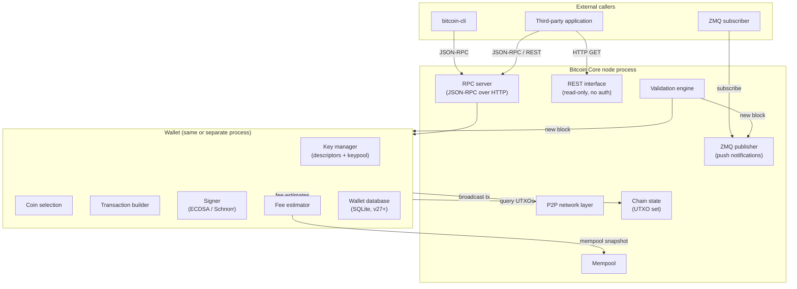
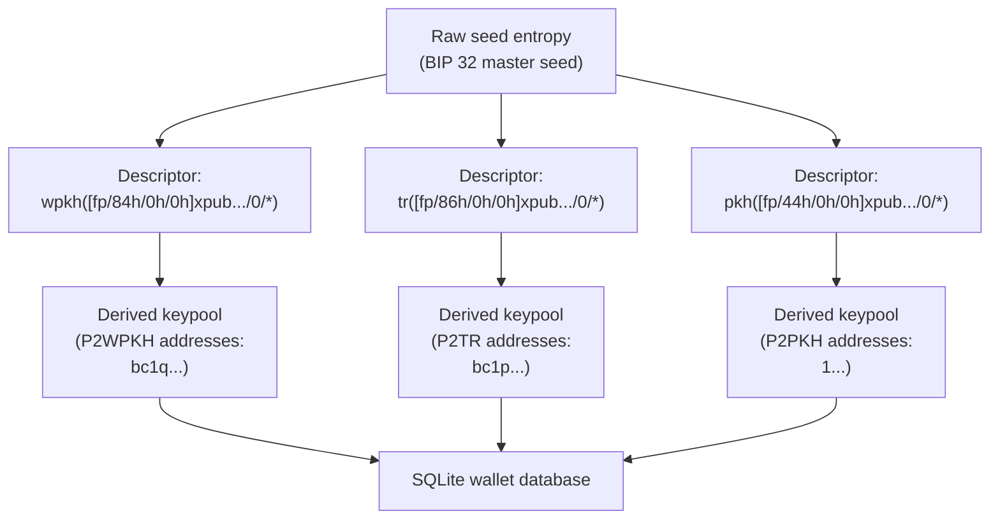
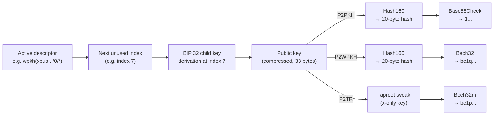
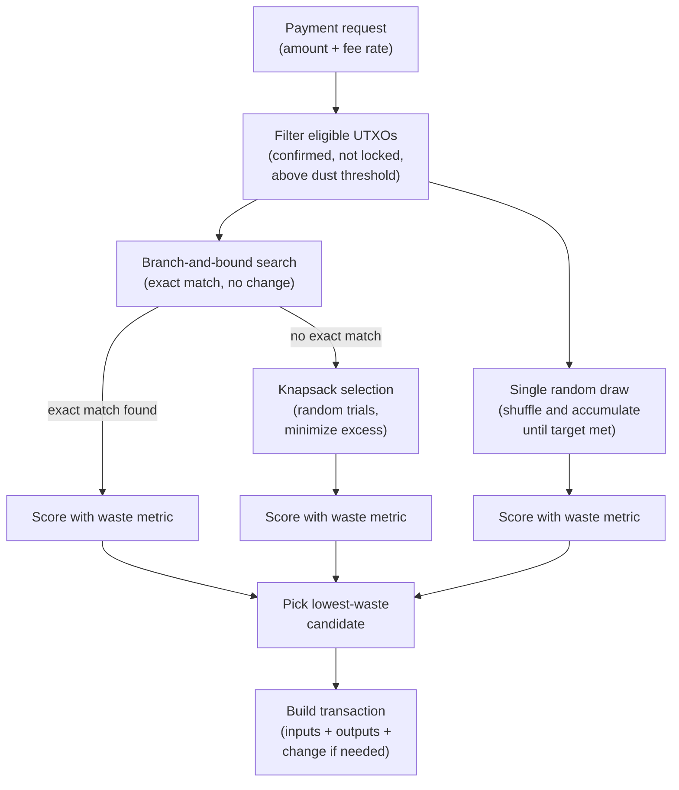
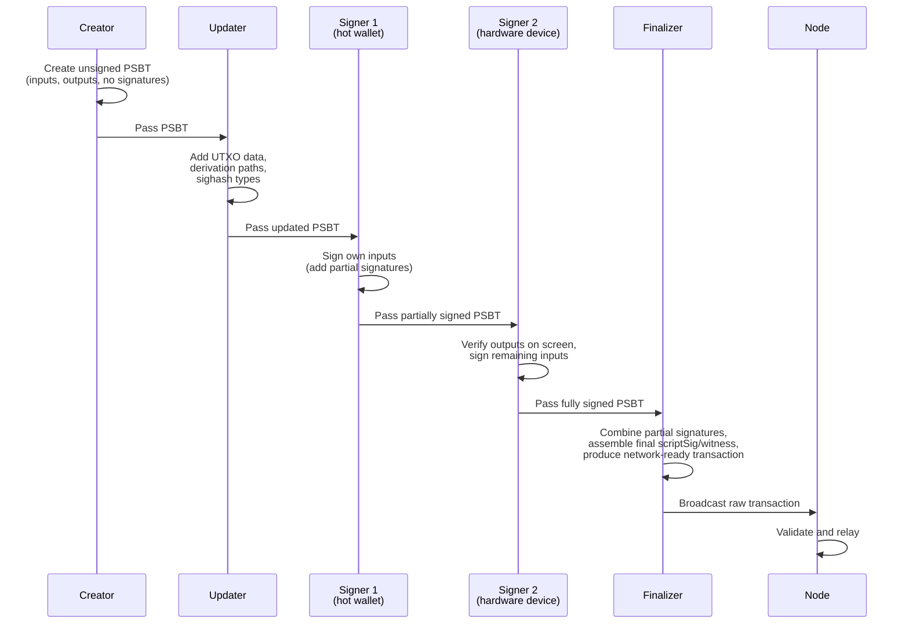
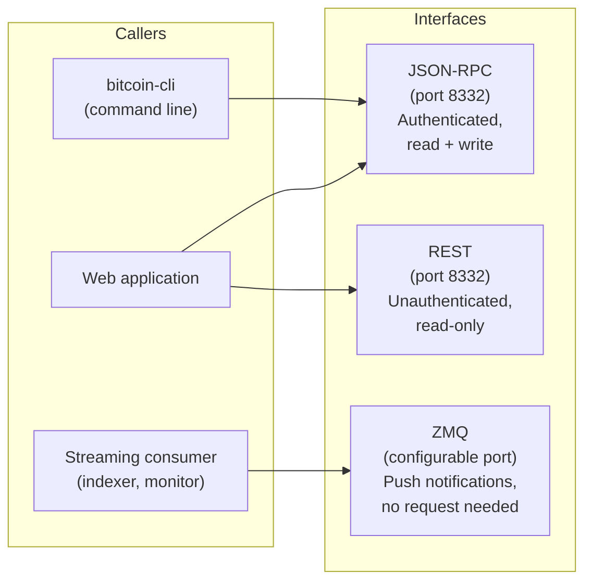
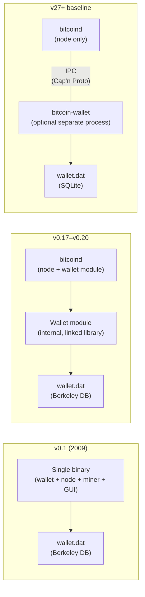

## Introduction

This page is **L1 #8 — Wallet design** in the [design-document series](/BitcoinArchive/entries/design/2009-01-03-bitcoin-system-design-overview/). It covers the application layer of Bitcoin Core: how the software manages keys, derives addresses, selects coins, constructs and signs transactions, estimates fees, and exposes its functionality to external callers. It depends on the [transaction design page](/BitcoinArchive/entries/design/2009-01-03-bitcoin-transaction-design/) for the UTXO model and script types, and on the [cryptography design page](/BitcoinArchive/entries/design/2009-01-03-bitcoin-cryptography-design/) for key derivation and signature primitives.

The wallet is the only subsystem in Bitcoin that touches private keys. Every other component — validation, relay, storage, consensus — operates exclusively on public data. This asymmetry has driven the wallet's evolution from a tightly coupled module inside the node binary to a logically (and increasingly physically) separated process.

Where behavior differs between the Satoshi-era implementation (v0.1, January 2009) and modern Bitcoin Core (v27+ baseline), both are noted.

## 1. Wallet architecture overview

The diagram below shows the wallet's position within the Bitcoin Core process and the interfaces it communicates through. In v27+ the wallet can optionally run as a separate process connected to the node via IPC.

### Satoshi-era architecture

In v0.1, the wallet was embedded in the node binary with no interface boundary. The GUI, the key store, the miner, and the validation engine all shared a single process and a single Berkeley DB file (`wallet.dat`). There was no RPC server at initial release; JSON-RPC was added within the first weeks of operation.

## 2. Key management

Key management is the wallet's most critical responsibility. Losing a private key means losing the funds it controls — permanently, with no recovery authority to appeal to.

### Legacy key pool (v0.1–v0.20)

Satoshi's v0.1 wallet generated keys independently: each private key was a fresh random number stored in `wallet.dat`. A pre-generated pool of 100 keys (the "keypool") provided lookahead so that a backup taken today could cover addresses generated in the near future. But any key created after the last backup was lost if the wallet file was destroyed.

### Descriptor wallets (v0.21+, default in v23+)

Modern Bitcoin Core replaces the legacy key model with **output descriptors** (BIP 380–386): composable expressions that fully specify how the wallet derives addresses and recognizes its own outputs.

| Property | Legacy wallet | Descriptor wallet (v27+) |
|---|---|---|
| **Key source** | Independent random keys | Deterministic derivation from descriptors |
| **Backup model** | Export `wallet.dat` after every new key | One-time seed backup covers all future keys |
| **Script type awareness** | Wallet infers type from key context | Descriptor explicitly declares the script type |
| **Watch-only support** | Separate watch-only wallet import | Any descriptor with an `xpub` (no private key) becomes watch-only |
| **Multi-script support** | Implicit (BIP 44/49/84/86 conventions) | Explicit — each descriptor is a distinct derivation rule |
| **Storage backend** | Berkeley DB (`wallet.dat`) | SQLite (`wallet.dat` in new format) |
| **Migration path** | — | `migratewallet` RPC converts legacy → descriptor |

## 3. Address generation

A Bitcoin address is a user-facing encoding of a locking-script payload. The wallet generates addresses from its active descriptors, cycling through the keypool as addresses are handed out.

The wallet maintains a **gap limit** — the number of consecutive unused addresses it derives ahead of the last used one. When a transaction is detected that uses address at index `n`, the wallet extends the keypool so that there are always unused addresses available. This ensures that restoring from a seed phrase can rediscover all funded addresses by scanning forward until the gap limit is reached without finding any transactions.

The cryptographic details of key derivation (BIP 32 HMAC-SHA512, hardened vs normal paths, secp256k1 scalar multiplication) and the encoding formats (Base58Check, Bech32, Bech32m) are covered in the [cryptography design page](/BitcoinArchive/entries/design/2009-01-03-bitcoin-cryptography-design/).

## 4. Coin selection

When a wallet builds a transaction, it must choose which UTXOs to spend as inputs. The coin selection problem sits at the intersection of fee optimization, privacy, and UTXO pool health. The [transaction design page](/BitcoinArchive/entries/design/2009-01-03-bitcoin-transaction-design/) introduces the strategies; this section details the modern selection pipeline.

### Selection pipeline (v27+)

### Waste metric

The waste metric scores each candidate selection by comparing the cost of spending the chosen UTXOs now versus spending them at a hypothetical long-term fee rate. It penalizes unnecessary change outputs and rewards exact-match (changeless) solutions. The formula balances three components:

| Component | What it measures | Effect |
|---|---|---|
| **Input cost** | Weight of selected inputs × (current fee rate − long-term fee rate) | Positive when overpaying relative to the long-term rate; negative when current fees are low (good time to consolidate) |
| **Change cost** | Cost to create and later spend the change output | Always positive — change is an additional output now and an additional input later |
| **Excess** | Value above the target that would be lost as fee in a changeless transaction | Applies only to BnB solutions where the slight overshoot is donated to fees instead of creating change |

A lower waste score is better. The wallet evaluates all candidate selections from different strategies and picks the one with the lowest waste.

## 5. PSBT workflow

Partially Signed Bitcoin Transactions (BIP 174 / BIP 370) separate transaction construction from signing. A PSBT carries all the metadata a signer needs — UTXO data, derivation paths, redeem scripts — so that signing can happen on a device that has no access to the blockchain.

### PSBT roles

| Role | What it does | Who typically fills it |
|---|---|---|
| **Creator** | Defines inputs and outputs; produces an unsigned PSBT | Wallet software, `createpsbt` RPC |
| **Updater** | Attaches UTXO details, derivation info, scripts | Same wallet or a coordinator; `walletprocesspsbt` RPC |
| **Signer** | Adds a partial signature for the inputs it controls | Hardware wallet, air-gapped machine, or `walletprocesspsbt` |
| **Combiner** | Merges partial signatures from multiple signers into one PSBT | `combinepsbt` RPC |
| **Finalizer** | Assembles the final scriptSig / witness from all signatures | `finalizepsbt` RPC |
| **Extractor** | Pulls the complete, network-ready transaction from the finalized PSBT | `finalizepsbt` (returns both PSBT and raw hex) |

**Why PSBT matters.** Before BIP 174, multi-device signing required ad-hoc formats and vendor-specific protocols. PSBT provides a single, portable, self-describing container that any compliant wallet can produce, update, sign, and finalize. It is the foundation for hardware-wallet integration, multisig workflows, CoinJoin coordination, and any scenario where the device constructing the transaction is not the device holding the keys.

## 6. Fee estimation

Bitcoin transactions compete for limited block space. The wallet must estimate what fee rate (satoshis per virtual byte) is likely to confirm a transaction within a target number of blocks.

### Estimation mechanism

Bitcoin Core's `estimatesmartfee` tracks the fee rates of transactions as they enter the mempool and records how many blocks each waited before confirmation. Transactions are bucketed by fee rate, and for each bucket the estimator maintains a success rate: what fraction of transactions at that fee rate confirmed within `n` blocks. The estimate for a given confirmation target is the lowest fee-rate bucket whose success rate exceeds a threshold (85% for economical mode, 95% for conservative mode).

| Mode | Threshold | Behavior | Typical use |
|---|---|---|---|
| **Economical** | 85% success rate | Lower fees, slightly longer confirmation risk | Non-urgent payments |
| **Conservative** | 95% success rate | Higher fees, more reliable confirmation | Time-sensitive payments |

### Fee estimation evolution

| Aspect | Satoshi era (v0.1) | Modern Bitcoin Core, v27+ baseline |
|---|---|---|
| **Fee requirement** | Transactions were free; fee was optional | Mandatory; unpaid transactions are rejected by mempool policy |
| **Estimation** | None — no fee market existed | Bucket-based mempool tracking (`estimatesmartfee`) |
| **Fee bumping** | Not available | RBF (`bumpfee` RPC), CPFP (spend the low-fee output with a high-fee child) |
| **Minimum relay fee** | 0.01 BTC (later reduced) | 1 sat/vB default (`minrelaytxfee`) |

## 7. RPC, REST, and ZMQ interfaces

Bitcoin Core exposes three interfaces for external callers. Each serves a different access pattern.

### RPC command categories

| Category | Example commands | What they do |
|---|---|---|
| **Blockchain** | `getblockchaininfo`, `getblock`, `gettxoutsetinfo` | Query chain state, block data, UTXO set statistics |
| **Wallet** | `getnewaddress`, `sendtoaddress`, `listunspent`, `walletprocesspsbt` | Key management, transaction construction, coin selection |
| **Transaction** | `getrawtransaction`, `decoderawtransaction`, `sendrawtransaction` | Inspect, create, and broadcast raw transactions |
| **Mining** | `getblocktemplate`, `submitblock`, `getmininginfo` | Block template construction and submission (pool operators) |
| **Network** | `getpeerinfo`, `addnode`, `getnetworkinfo` | Peer management, connection status, bandwidth stats |
| **Control** | `stop`, `uptime`, `logging`, `getmemoryinfo` | Node lifecycle and diagnostics |
| **Fee** | `estimatesmartfee` | Fee-rate estimation for a target confirmation window |
| **PSBT** | `createpsbt`, `walletprocesspsbt`, `combinepsbt`, `finalizepsbt` | Full PSBT workflow without touching private keys directly |

### Interface comparison

| Property | JSON-RPC | REST | ZMQ |
|---|---|---|---|
| **Protocol** | HTTP POST (JSON body) | HTTP GET (URL path) | TCP push (pub/sub) |
| **Authentication** | Cookie or username/password (`rpcauth`) | None (read-only by design) | None (local network assumed) |
| **Direction** | Request → response | Request → response | Server pushes to subscribers |
| **Write access** | Yes (send transactions, manage wallet) | No | No (notification only) |
| **Data format** | JSON | JSON, binary, or hex (caller's choice) | Raw binary (block hash, tx hash, or full serialized block/tx) |
| **Typical caller** | `bitcoin-cli`, wallet apps, exchange backends | Block explorers, lightweight monitors | Indexers, real-time dashboards, Lightning nodes |
| **ZMQ topics** | — | — | `hashblock`, `hashtx`, `rawblock`, `rawtx`, `sequence` |

## 8. Wallet separation from node

Satoshi's v0.1 compiled the wallet, the miner, the GUI, and the validation engine into a single binary. Modern Bitcoin Core has progressively decoupled the wallet from the node.

| Milestone | Version | Change |
|---|---|---|
| **Wallet interface defined** | v0.17 (2018) | Internal `interfaces::Wallet` abstraction separates wallet logic from node logic |
| **`-disablewallet` option** | v0.8 (2013) | Node can run without loading any wallet |
| **Multiple wallet support** | v0.17 (2018) | A single node loads and manages multiple wallet files simultaneously |
| **Descriptor wallets** | v0.21 (2021) | New wallet format; default for new wallets from v23 |
| **Berkeley DB deprecated** | v26 (2023) | New wallets use SQLite exclusively; legacy BDB wallets can be migrated but BDB support is not yet fully removed |
| **Multiprocess work (experimental)** | v27+ (2024) | Experimental `bitcoin-node` / `bitcoin-wallet` process separation via IPC (Cap'n Proto). The `bitcoin-wallet` CLI tool handles offline wallet operations; full IPC-based runtime separation is in progress, not yet the default |

**Why separation matters.** The wallet handles private keys — the most sensitive data in the system. Logical separation (already achieved) and eventual physical process separation allow the key-holding component to operate in a restricted environment while the node handles publicly verifiable chain data.

## 9. Two-era comparison

| Feature | Satoshi era (v0.1, Jan 2009) | Modern Bitcoin Core, v27+ baseline |
|---|---|---|
| **Architecture** | Wallet embedded in single-binary node | Logically separated; experimental multiprocess separation in progress |
| **Key generation** | Random key pool (100 independent keys) | Descriptor wallets: deterministic derivation from master seed |
| **Key storage** | Berkeley DB (`wallet.dat`) | SQLite (`wallet.dat` in new format) |
| **Backup model** | Export file after every new key; new keys after backup are unrecoverable | Descriptor backup covers all derived keys (raw BIP 32 seed, not BIP 39) |
| **Address types** | P2PK, P2PKH only | P2PKH, P2SH, P2WPKH, P2WSH, P2TR |
| **Address encoding** | Base58Check | Base58Check (legacy), Bech32, Bech32m |
| **Coin selection** | Simple largest-first | BnB + knapsack + single-random-draw; waste metric scoring |
| **Transaction signing** | Internal, same process | Internal, PSBT (BIP 174/370), or hardware wallet via HWI |
| **Multi-device signing** | Not supported | PSBT workflow: create → update → sign → combine → finalize |
| **Fee estimation** | None (most transactions were free) | Bucket-based mempool tracking; economical and conservative modes |
| **Fee bumping** | Not available | Replace-by-Fee (`bumpfee`), CPFP |
| **Interfaces** | None at launch; basic JSON-RPC added shortly after | JSON-RPC (full), REST (read-only), ZMQ (push notifications) |
| **Multi-wallet** | One wallet per node | Multiple wallets loaded simultaneously; `loadwallet` / `unloadwallet` |
| **Encryption** | Not available | `encryptwallet` — AES-256-CBC encryption of private keys at rest |
| **Watch-only** | Not supported | Any descriptor with `xpub` only (no private key) |
| **Process model** | Monolithic (wallet + node + miner + GUI) | Modular: `bitcoind` (node), `bitcoin-wallet` (wallet), `bitcoin-qt` (GUI) |

## 10. Limits of this page

This page covers the wallet and interface layer of Bitcoin Core. The following topics are out of scope and addressed in their respective pages within the [design-document series](/BitcoinArchive/entries/design/2009-01-03-bitcoin-system-design-overview/):

- **Transaction structure and Script** — how inputs, outputs, and locking scripts work at the protocol level. Covered in the [transaction design page](/BitcoinArchive/entries/design/2009-01-03-bitcoin-transaction-design/).
- **Cryptographic primitives** — elliptic-curve math, hash functions, HD derivation internals (BIP 32 HMAC-SHA512), and signature algorithms. Covered in the [cryptography design page](/BitcoinArchive/entries/design/2009-01-03-bitcoin-cryptography-design/).
- **Mempool policy** — relay rules, fee-rate floors, package relay, and Replace-by-Fee enforcement. Covered in the [network design page](/BitcoinArchive/entries/design/2009-01-03-bitcoin-p2p-network-design/).
- **Mining and block template** — how miners select transactions from the mempool and construct candidate blocks. Covered in the [consensus design page](/BitcoinArchive/entries/design/2009-01-03-bitcoin-consensus-design/).
- **Third-party wallets** — Electrum, Sparrow, hardware wallets, and mobile wallets are application-layer software outside the Bitcoin Core reference implementation.
- **Lightning Network** — layer-2 payment channels that build on the transaction and PSBT primitives described here but operate under a separate protocol.
