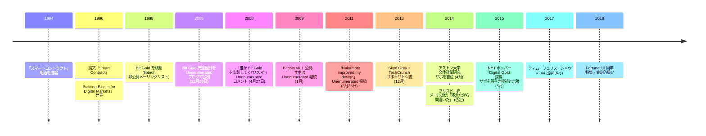

1994 年、ニック・サボは「スマートコントラクト」 という用語を提唱した。1998 年に Bit Gold —— プルーフ・オブ・ワークに基づく分散型デジタル通貨 —— を構想し、2005 年 12 月 29 日にブログ Unenumerated で完全な設計を公開した。2008 年 4 月 27 日、[自身のブログのコメント欄](/BitcoinArchive/ja/entries/aftermath/2008-04-27-nick-szabo-bit-gold-implementation-request/)でこう書いた:

> 「ビットゴールドはデモがあれば大いに役立つのだが。実験的な市場を作りたい。誰かコードを書いてくれないか？」

4 か月後、2008 年 8 月 20 日に[サトシ・ナカモト](/BitcoinArchive/ja/participants/satoshi-nakamoto/)はビットコインとなるものについての最初の既知のメールを送った。Bitcoin v0.1 は 2009 年 1 月 9 日に公開された。2011 年 5 月、[サボは Unenumerated に書いた](/BitcoinArchive/ja/entries/aftermath/2011-05-28-nick-szabo-bitcoin-what-took-ye-so-long/):

> 「ナカモトは、私の設計にあった重大なセキュリティ上の欠陥を改善したのだ。ビザンチン耐性を持つP2Pシステムでノードになるためにプルーフ・オブ・ワークを要求することで、信頼できない当事者がノードの過半数を制御する脅威を軽減したのだ。」

サボはコンピューター科学者・法学者・暗号学者で、経歴の詳細は非公開のまま。Bit Gold とビットコインの深い概念的類似性、2008 年 4 月の「コードを書いてくれないか」 要請とサトシの 2008 年 8 月初メールの近接性、2007〜2008 年の Unenumerated での旺盛な執筆活動 —— これらの組み合わせから、サボはサトシ正体候補として繰り返し議論されてきた。詳細は[専用の正体仮説エントリ](/BitcoinArchive/ja/entries/analysis/2013-12-05-szabo-satoshi-identity-hypothesis/)。主要な裏付け論考として[スカイ・グレイ / TechCrunch 2013 文体計量分析](/BitcoinArchive/ja/entries/aftermath/2013-12-05-techcrunch-skye-grey-szabo-stylometric/)、[アストン大学 2014 研究](/BitcoinArchive/ja/entries/aftermath/2014-04-16-aston-university-szabo-stylometric-study/)、[ポッパー / NYT 2015 『Digital Gold』 抜粋](/BitcoinArchive/ja/entries/aftermath/2015-05-15-popper-nyt-szabo-satoshi-investigation/)がある。反証としてはサボ自身の一貫した否定（例: 2014 年ドミニク・フリスビー宛「残念ながら間違いだ」 の返信）が立つ。

### スマートコントラクト
1994年、サボは「スマートコントラクト」という用語を提唱した——契約条件がコードに直接記述された自己実行型の契約である。この概念は時代を数十年先取りしており、後に[イーサリアム](/BitcoinArchive/ja/entries/forum/bitcointalk/topic-428589/2014-01-23-vbuterin-ethereum-welcome-to-the-beginning/)などのプラットフォームの基盤となった。

### Bit Gold
1998年、サボはプルーフ・オブ・ワークに基づく分散型デジタル通貨システム、Bit Gold を構想した。2005年12月29日、ブログ「Unenumerated」で完全な設計を公開した。Bit Gold は、信頼できる第三者なしにデジタル希少性を実現するという根本的な問題——ビットコインが後に解決するのと同じ問題——に取り組んだ。サボは後に振り返っている。「この一般的なアイデアを聞いたほとんど全員が、非常に悪いアイデアだと思ったのだ」。

Bit Gold はビットコインと重要な概念を共有していた——プルーフ・オブ・ワーク、連鎖するパズル、分散型検証——しかし重大なセキュリティ上の弱点があった。単一の主体がノードの過半数を支配することを防ぐ問題を解決していなかった。[サトシ・ナカモト](/BitcoinArchive/ja/participants/satoshi-nakamoto/)はこの設計を改良した。

### ビットコインとの関係

[ハル・フィニー](/BitcoinArchive/ja/participants/hal-finney/)は、2008 年 11 月 7 日に暗号学メーリングリストでサトシのホワイトペーパー告知に[応答した際](/BitcoinArchive/ja/entries/emails/cryptography/bitcoin-p2p-e-cash-paper/2008-11-07-re-bitcoin-p2p-e-cash-paper-finney/)、ビットコインはサボの Bit Gold 構想の「実装と言える」 と指摘した —— この系譜が公的に最初に提示された瞬間である。サトシ自身がいつ Bit Gold を知ったかは、本アーカイブの一次資料では直接的に証言されていない。ホワイトペーパーの引用文献は b-money を挙げるが Bit Gold は挙げていない。
