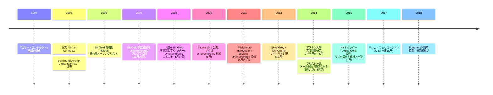

ニック・サボは、デジタル通貨とスマートコントラクトの先駆的研究で知られるコンピューター科学者・法学者・暗号学者である。彼の経歴の詳細は非公開のままである。

### スマートコントラクト
1994年、サボは「スマートコントラクト」という用語を提唱した——契約条件がコードに直接記述された自己実行型の契約である。この概念は時代を数十年先取りしており、後にイーサリアムなどのプラットフォームの基盤となった。

### Bit Gold
1998年、サボはプルーフ・オブ・ワークに基づく分散型デジタル通貨システム、Bit Goldを構想した。2005年12月29日、ブログ「Unenumerated」で完全な設計を公開した。Bit Goldは、信頼できる第三者なしにデジタル希少性を実現するという根本的な問題——ビットコインが後に解決するのと同じ問題——に取り組んだ。サボは後に振り返っている。「この一般的なアイデアを聞いたほとんど全員が、非常に悪いアイデアだと思ったのだ」。

Bit Goldはビットコインと重要な概念を共有していた——プルーフ・オブ・ワーク、連鎖するパズル、分散型検証——しかし重大なセキュリティ上の弱点があった。単一の主体がノードの過半数を支配することを防ぐ問題を解決していなかった。[サトシ・ナカモト](/BitcoinArchive/ja/participants/satoshi-nakamoto/)はこの設計を改良した。

### ビットコインとの関係
サボは[2011年のブログ記事](/BitcoinArchive/ja/entries/aftermath/2011-05-28-nick-szabo-bitcoin-what-took-ye-so-long/)でサトシの改良を認めている。「ナカモトは、私の設計にあった重大なセキュリティ上の欠陥を改善したのだ。すなわち、プルーフ・オブ・ワークをビザンチン耐性のあるピアツーピアシステムのノードとなるために要求することで、信頼できない主体がノードの過半数を支配する脅威を大幅に軽減したというわけだ」。

[ハル・フィニー](/BitcoinArchive/ja/participants/hal-finney/)は、ビットコインに関する初期のメールのやり取りの中で、ビットコインとサボのBit Goldの類似性に言及した。サトシは、[ウェイ・ダイ](/BitcoinArchive/ja/participants/wei-dai/)を通じてサボの研究を知った。ダイは自身の[b-money](/BitcoinArchive/ja/entries/aftermath/1998-11-26-wei-dai-pipenet-b-money-announcement/)の概念と合わせてBit Goldのレビューを提案した。

### サトシ推測
Bit Goldとビットコインの深い概念的類似性から、サボがサトシ・ナカモトではないかと推測する者もいる。サボはこれを否定している。サボとサトシの間の確認された直接的な通信は公開されていない。
