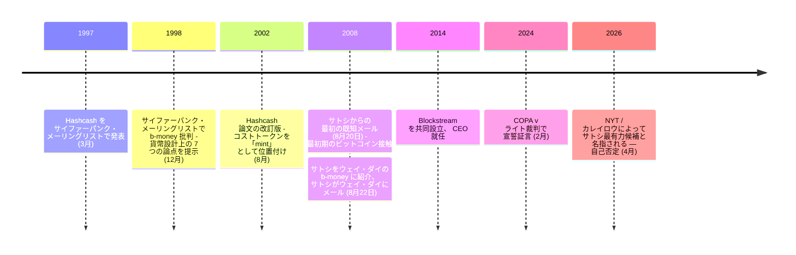

2008 年 8 月 20 日、アダム・バックの受信箱に 1 通のメールが届いた。送信者は自らを[サトシ・ナカモト](/BitcoinArchive/ja/participants/satoshi-nakamoto/)と名乗り、近く公開する「新しい電子キャッシュシステム」の論文向けに Hashcash の引用形式を尋ねた。11 年前の 1997 年 3 月、バックはサイファーパンクメーリングリストで [Hashcash を発表](/BitcoinArchive/ja/entries/aftermath/1997-03-28-adam-back-hashcash-announcement/)していた。翌日、バックは引用情報を返し、続けて[ウェイ・ダイ](/BitcoinArchive/ja/participants/wei-dai/)の [b-money](/BitcoinArchive/ja/entries/threads/emails/cypherpunks/b-money-protocol/) を紹介した。同日、サトシは返信した:

<!-- speaker: Satoshi Nakamoto -->
> 「ありがとう。b-money は読んだことがなかったが、私のアイデアはまさにその出発点から始まっている。私のシステムが追加した主なものは、分散タイムスタンプサーバーを支えるためにプルーフ・オブ・ワークを使うことだ。」

この返信は、サトシがビットコインの設計に独自に到達したことを示す一次資料の一つであり、[専用のエントリー](/BitcoinArchive/ja/entries/aftermath/2008-08-21-satoshi-to-adam-back-b-money/)で詳しく扱っている。

2026 年 4 月、[NYT と記者カレイロウは、フォーラム投稿とメールの文体計量解析でバックをサトシの最有力候補](/BitcoinArchive/ja/entries/aftermath/2026-04-08-nyt-carreyrou-adam-back-satoshi-investigation/)と名指した。バックは公的に否定した。この仮説は、他のサトシ正体候補と並んで[専用の正体仮説分析](/BitcoinArchive/ja/entries/analysis/2026-04-08-adam-back-satoshi-identity-hypothesis/)で検討されている。

アダム・バック（1970 年、英国生まれ）は暗号学者、サイファーパンク。エクセター大学でコンピューターサイエンスの博士号を取得。2014 年に Blockstream を共同設立し、同社の CEO を務めている。

## Hashcash（1997年）
1997年3月、バックはメールスパムとサービス拒否攻撃に対抗するために設計されたプルーフ・オブ・ワーク・システムである Hashcash を提案した。このシステムは、送信者がメール送信前に部分的なハッシュ衝突を計算するという、計算コストの高い操作を要求した。これが大量スパムを経済的に非現実的にした。Hashcash はデジタル通貨や決済システムではなく、純粋に計算コストのメカニズムであった。

ビットコインは後にそのプルーフ・オブ・ワーク概念をマイニングとコンセンサスの基盤として採用したが、ビットコインの通貨・決済の設計はサトシ自身のものであった。最も近い概念的先行はウェイ・ダイの b-money（ホワイトペーパーが引用）と、より緩やかにニック・サボの bit gold（非引用）で、いずれも直接は継承していない。[ビットコインホワイトペーパー](/BitcoinArchive/ja/entries/emails/cryptography/bitcoin-p2p-e-cash-paper/2008-10-31-bitcoin-p2p-e-cash-paper/)は Hashcash を主要な参考文献の一つとして引用している。

## サトシからの最初の連絡

2008 年 8 月のやり取りは 3 日間に渡る: [サトシのバック宛メール](/BitcoinArchive/ja/entries/aftermath/2008-08-20-satoshi-to-adam-back/) (8 月 20 日、引用形式の問い合わせ)、 [バックの返信](/BitcoinArchive/ja/entries/aftermath/2008-08-21-adam-back-to-satoshi/) (8 月 21 日、 Hashcash 引用情報と b-money 紹介)、サトシの同日返信での、公開前の設計・コーディング期間中に b-money を知らなかったとの自認 (冒頭引用)、翌日の[サトシのウェイ・ダイ宛メール](/BitcoinArchive/ja/entries/correspondence/wei-dai/2008-08-22-satoshi-to-wei-dai/) (ホワイトペーパー引用のため b-money 公開日を尋ねるもの)。

この連鎖は、バックの紹介時点でビットコインの設計がほぼ完了していたことを示しており、詳細は[サイファーパンク核心への独立到達についての分析](/BitcoinArchive/ja/entries/analysis/2008-10-31-cypherpunk-independent-arrival/)で扱っている。

## 証言とメールの公開
バックがサトシとやり取りしたメールは、後に Bitcoin Magazine が公開した。ビットコイン最初期の概念段階を伝える数少ない一次資料の一つだ。2024 年 2 月、バックはロンドンの [COPA 対ライト裁判で宣誓のうえ証言し](/BitcoinArchive/ja/entries/aftermath/2024-02-21-adam-back-retrospective-testimony/)、サトシとの往復とビットコイン誕生の時系列を語った。

## Blockstream
2014 年、バックは Blockstream を共同設立し、CEO になった。同社が作るのはビットコインのインフラ、すなわち Liquid Network サイドチェーン、ブロックチェーンの衛星配信、関連するプロトコル開発である。

## 意義
バックのビットコインへの貢献は、具体的には、計算コストが希少で検証可能なリソースとして機能しうるというプルーフ・オブ・ワークの概念であった。Hashcash はこのメカニズムを提供したが、通貨の設計、ピアツーピア決済システム、金融政策は別の革新である。サトシが最初に連絡を取った人物として、彼はビットコインの記録された創造史の冒頭に位置している。

*[補足：アダム・バックは、小説『[ジェネシス ― 創設者の消失と約束](/BitcoinArchive/ja/novel/)』で、主人公が 2008 年 8 月に最初に Hashcash の引用形式について連絡を取るサイファーパンクとして登場する。後の b-money 発見と、ホワイトペーパーの参考文献 [1] への橋となる人物である。]*
