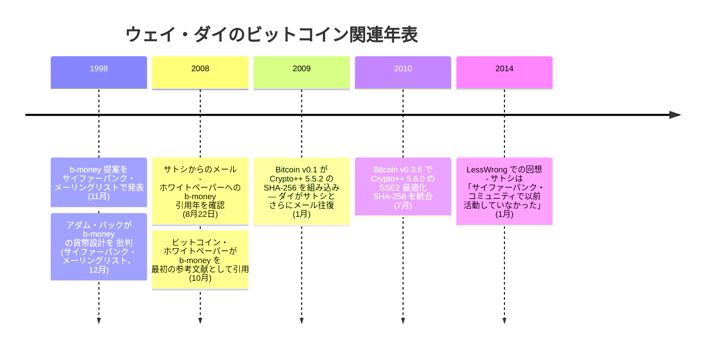

<!-- tone-skip -->

ウェイ・ダイは、デジタル通貨のb-money提案と暗号ライブラリCrypto++という2つの主要な貢献で知られるコンピューターサイエンティスト・暗号学者である。University of Washingtonでコンピューターサイエンスを学び、Microsoftで働いた。

**b-money（1998年）：**
1998年11月、ダイは匿名の分散型電子キャッシュシステムの提案[「b-money」](/BitcoinArchive/ja/entries/aftermath/1998-11-26-wei-dai-pipenet-b-money-announcement/)をサイファーパンクスメーリングリストに公開した。b-money提案は、参加者が計算パズルの解を放送することで貨幣を作成できるシステムを記述した — ビットコインのプルーフ・オブ・ワーク・マイニングと概念的に類似する概念である。論文では2つのプロトコルを概説した：1つは同期的なブロードキャストチャネルを必要とするもの、もう1つは残高を追跡するサーバー群を使用するものである。b-moneyは実装されなかったが、ビットコインの主要な知的先駆者の一つとなった。

**Crypto++：**
ダイはCrypto++を作成・保守した。これは暗号アルゴリズムとスキームの包括的なコレクションを提供する無料のオープンソースC++ライブラリである。このライブラリは学術・商用プロジェクトで広く使用されており、利用可能な最も信頼される暗号ライブラリの一つであり続けている。ビットコインは最も古く保管されているリリースからSHA-256実装にCrypto++を使用していた：v0.1.3 ALPHA（2009年初頭）の`src/sha.cpp`および`src/sha.h`には、ルーチンが「Crypto++ Version 5.5.2（2007年9月24日リリース）からスタンドアロンのファイルとして切り出された」旨のヘッダーコメントが付いている — これはビットコインが設計されていた時期（2007年中頃以降）に利用可能だったCrypto++の最新版。

Crypto++ 5.6.0のSSE2アセンブリ最適化版SHA-256はバージョン0.3.6（2010年7月29日リリース）で統合された。一次資料による時系列：

- 2010-07-25：BitcoinTalkのメンバー「BlackEye」が[Crypto++ 5.6.0 SHA-256のSSE2アセンブリ統合を実演](/BitcoinArchive/ja/entries/forum/bitcointalk/topic-453/2010-07-25-blackeye-msg5774/) — 「the fastest SHA256 yet using the SSE2 assembly code」。
- 2010-07-26：サトシが[応答](/BitcoinArchive/ja/entries/forum/bitcointalk/topic-501/2010-07-26-re-bitcoin-x64-for-windows/) — 「Is that still starting from Crypto++? Lets get this into the main sourcecode」。
- 2010-07-27（SVN rev 114）：サトシが[ライブラリサブセットを追加したと確認](/BitcoinArchive/ja/entries/forum/bitcointalk/topic-572/2010-07-27-sni282-re-bitcoin-x86-for-windows/) — 「I added a subset of the Crypto++ 5.6.0 library to the SVN. I stripped it down to just SHA and 11 general dependency files... The combined speedup is about 2.5x faster than version 0.3.3. This is SVN rev 114」。
- 2010-07-29：[v0.3.6リリースアラート](/BitcoinArchive/ja/entries/forum/bitcointalk/topic-626/2010-07-29-alert-upgrade-to-0-3-6/) — サトシはBlackEyeをCrypto++ ASM SHA-256で、tcatmをmidstateキャッシュ最適化でクレジット：「Total generating speedup 2.4x faster」。
- 2010-08-09：サトシが[明示的に](/BitcoinArchive/ja/entries/forum/bitcointalk/topic-765/2010-08-09-version-0-3-8-1-update-for-linux-64-bit/) — 「When we switched to Crypto++ 5.6.0 SHA-256 in version 0.3.6, generation got broken on the Linux 64-bit build」。

ダイのビットコインへのコード貢献は二重である：知的先駆者としてのb-moneyと、最も古いリリース時点から既にコードベースの直接的な依存関係としてのCrypto++である。

**サトシの最初の接触：**
2008年8月22日、[サトシ・ナカモト](/BitcoinArchive/ja/participants/satoshi-nakamoto/)は[ダイに直接メールを送り](/BitcoinArchive/ja/entries/correspondence/wei-dai/2008-08-22-satoshi-to-wei-dai/)、ダイのb-moneyのアイデアを拡張する論文を発表する準備をしていると書いた。サトシはダイにb-moneyの発表年を尋ね、適切に引用するためだった。このメールは、2日前に[アダム・バック](/BitcoinArchive/ja/participants/adam-back/)に送られた同様のメールとともに、サトシがビットコインホワイトペーパーの発表前に既存の暗号学者に接触した最も初期の既知の証拠である。2008年10月31日に発表された[ホワイトペーパー](/BitcoinArchive/ja/entries/emails/cryptography/bitcoin-p2p-e-cash-paper/2008-10-31-bitcoin-p2p-e-cash-paper/)は、b-moneyを最初の参考文献として引用している。

**その後のやり取り：**
2009年1月、ビットコインのローンチ後、ダイとサトシはさらにメールをやり取りした。サトシは[ダイにメールを送り](/BitcoinArchive/ja/entries/correspondence/wei-dai/2009-01-10-satoshi-to-wei-dai/)、[ダイは応答して](/BitcoinArchive/ja/entries/correspondence/wei-dai/2009-01-10-wei-dai-to-satoshi/)ビットコインの設計について考えを述べ、b-moneyとの類似点と相違点を指摘した。ダイはまた、貨幣と暗号通貨の本質について哲学的な考察を行い、関連する課題への深い理解を示した。

**意義：**
ダイのb-money提案はビットコインの最も直接的な知的先駆者の一つである。サトシが発表前にダイに連絡するという決定、そしてホワイトペーパーでのb-moneyの顕著な引用は、ビットコインがダイの先行研究にどれほど多く依拠していたかを裏付けている。ダイの2014年のサトシに関する回想 — 「学術的な暗号研究やサイファーパンクのコミュニティに以前から積極的に参加していた人物ではない」 — と、サトシ自身が18か月の開発期間中にb-moneyを知らなかったという自認は、[サトシとサイファーパンク運動との関係および公開記録上の実践と思想核との整合についての分析](/BitcoinArchive/ja/entries/analysis/2008-10-31-cypherpunk-independent-arrival/)の根拠となっている。暗号通貨Ethereumの単位「wei」はウェイ・ダイに敬意を表して名付けられた。
<!-- /tone-skip -->
