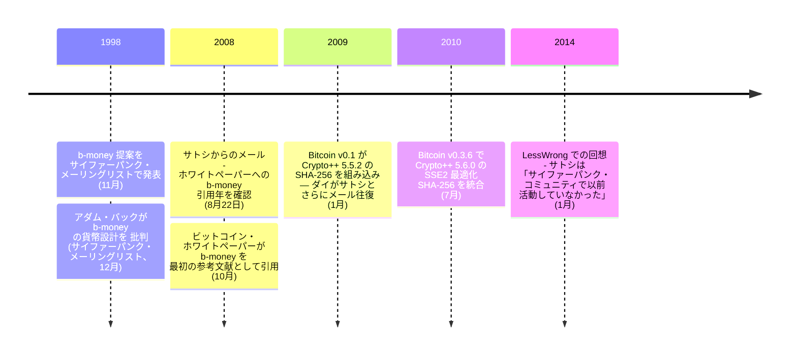

<!-- tone-skip -->

1998 年 11 月、ウェイ・ダイは匿名の分散型電子キャッシュシステムの提案 [b-money](/BitcoinArchive/ja/entries/aftermath/1998-11-26-wei-dai-pipenet-b-money-announcement/) をサイファーパンクメーリングリストに公開した。それから 10 年後、2008 年 8 月 22 日、[サトシ・ナカモト](/BitcoinArchive/ja/participants/satoshi-nakamoto/)は[ダイに直接メールを送った](/BitcoinArchive/ja/entries/correspondence/wei-dai/2008-08-22-satoshi-to-wei-dai/):

<!-- speaker: Satoshi Nakamoto -->
> 「b-moneyのページを興味深く読んだ。あなたのアイデアを発展させて、完全に動作するシステムにした論文を発表しようとしている。アダム・バックが類似性に気づいて、あなたのサイトを教えてくれた。論文で引用するため、発表年を教えてほしい。」

2 か月後、[ビットコインホワイトペーパー](/BitcoinArchive/ja/entries/emails/cryptography/bitcoin-p2p-e-cash-paper/2008-10-31-bitcoin-p2p-e-cash-paper/)は b-money を参考文献 [1] として引用した。Bitcoin v0.1 はダイの [Crypto++ ライブラリ](https://www.cryptopp.com/)を SHA-256 実装に採用 —— ダイのコードは最初のリリースからビットコインの直接的な依存となった。

2014 年 1 月、LessWrong で「サトシは暗号学やサイファーパンクのコミュニティで知られた人物ではないか」 と問われたとき、ダイはこう答えた:

> 「私の推測では、彼は暗号学やサイファーパンクコミュニティで以前活動していた人物ではないと思います。そうでなければ、文体やコーディングスタイルで特定されているはずです」

ウェイ・ダイはコンピューターサイエンティスト・暗号学者で、ワシントン大学でコンピューターサイエンスを学び、Microsoft で働いた。ホワイトペーパー参考文献 [1] としての b-money 引用、Crypto++ のコードベース依存、サトシの公開前接触 —— これらの組み合わせから繰り返しサトシ正体候補となってきた。詳細は[専用の正体仮説エントリ](/BitcoinArchive/ja/entries/analysis/2008-08-22-wei-dai-satoshi-identity-hypothesis/)。上記の回顧が主要な自己否定として扱われる。暗号通貨イーサリアムの最小単位「wei」 はウェイ・ダイに敬意を表して名付けられた。

### b-money（1998年）
1998年11月、ダイは匿名の分散型電子キャッシュシステムの提案[「b-money」](/BitcoinArchive/ja/entries/aftermath/1998-11-26-wei-dai-pipenet-b-money-announcement/)をサイファーパンクスメーリングリストに公開した。b-money 提案は、参加者が計算パズルの解を放送することで貨幣を作成できるシステムを記述した — ビットコインのプルーフ・オブ・ワーク・マイニングと概念的に類似する概念である。論文では 2 つのプロトコルを概説した：1 つは同期的なブロードキャストチャネルを必要とするもの、もう 1 つは残高を追跡するサーバー群を使用するものである。b-money は実装されなかったが、ビットコインの主要な知的先駆者の一つとなった。

### Crypto++
ダイは Crypto++を作成・保守した。これは暗号アルゴリズムとスキームの包括的なコレクションを提供する無料のオープンソース C++ライブラリである。このライブラリは学術・商用プロジェクトで広く使用されており、利用可能な最も信頼される暗号ライブラリの一つであり続けている。ビットコインは最も古く保管されているリリースから SHA-256 実装に Crypto++を使用していた：v0.1.3 ALPHA（2009年初頭）の`src/sha.cpp`および`src/sha.h`には、ルーチンが「Crypto++ Version 5.5.2（2007年9月24日リリース）からスタンドアロンのファイルとして切り出された」旨のヘッダーコメントが付いている — これはビットコインが設計されていた時期（2007年中頃以降）に利用可能だった Crypto++の最新版。

Crypto++ 5.6.0 の SSE2 アセンブリ最適化版 SHA-256 はバージョン 0.3.6（2010年7月29日リリース）で統合された。一次資料による時系列：

- 2010-07-25：BitcoinTalk のメンバー「BlackEye」が [Crypto++ 5.6.0 SHA-256 の SSE2 アセンブリ統合を実演](/BitcoinArchive/ja/entries/forum/bitcointalk/topic-453/2010-07-25-blackeye-msg5774/) — 「the fastest SHA256 yet using the SSE2 assembly code」。
- 2010-07-26：サトシが[応答](/BitcoinArchive/ja/entries/forum/bitcointalk/topic-501/2010-07-26-re-bitcoin-x64-for-windows/) — 「Is that still starting from Crypto++? Lets get this into the main sourcecode」。
- 2010-07-27（SVN rev 114）：サトシが[ライブラリサブセットを追加したと確認](/BitcoinArchive/ja/entries/forum/bitcointalk/topic-572/2010-07-27-sni282-re-bitcoin-x86-for-windows/) — 「I added a subset of the Crypto++ 5.6.0 library to the SVN. I stripped it down to just SHA and 11 general dependency files... The combined speedup is about 2.5x faster than version 0.3.3. This is SVN rev 114」。
- 2010-07-29：[v0.3.6 リリースアラート](/BitcoinArchive/ja/entries/forum/bitcointalk/topic-626/2010-07-29-alert-upgrade-to-0-3-6/) — サトシは BlackEye を Crypto++ ASM SHA-256 で、tcatm を midstate キャッシュ最適化でクレジット：「Total generating speedup 2.4x faster」。
- 2010-08-09：サトシが[明示的に](/BitcoinArchive/ja/entries/forum/bitcointalk/topic-765/2010-08-09-version-0-3-8-1-update-for-linux-64-bit/) — 「When we switched to Crypto++ 5.6.0 SHA-256 in version 0.3.6, generation got broken on the Linux 64-bit build」。

ダイのビットコインへのコード貢献は二重である：知的先駆者としての b-money と、最も古いリリース時点から既にコードベースの直接的な依存関係としての Crypto++である。

### サトシの最初の接触
2008年8月22日、[サトシ・ナカモト](/BitcoinArchive/ja/participants/satoshi-nakamoto/)は[ダイに直接メールを送り](/BitcoinArchive/ja/entries/correspondence/wei-dai/2008-08-22-satoshi-to-wei-dai/)、ダイの b-money のアイデアを拡張する論文を発表する準備をしていると書いた。サトシはダイに b-money の発表年を尋ね、適切に引用するためだった。このメールは、2日前に[アダム・バック](/BitcoinArchive/ja/participants/adam-back/)に送られた同様のメールとともに、サトシがビットコインホワイトペーパーの発表前に既存の暗号学者に接触した最も初期の既知の証拠である。2008年10月31日に発表された[ホワイトペーパー](/BitcoinArchive/ja/entries/emails/cryptography/bitcoin-p2p-e-cash-paper/2008-10-31-bitcoin-p2p-e-cash-paper/)は、b-money を最初の参考文献として引用している。

### その後のやり取り
2009年1月、ビットコインのローンチ後、ダイとサトシはさらにメールをやり取りした。サトシは[ダイにメールを送り](/BitcoinArchive/ja/entries/correspondence/wei-dai/2009-01-10-satoshi-to-wei-dai/)、[ダイは応答して](/BitcoinArchive/ja/entries/correspondence/wei-dai/2009-01-10-wei-dai-to-satoshi/)ビットコインの設計について考えを述べ、b-money との類似点と相違点を指摘した。ダイはまた、貨幣と暗号通貨の本質について哲学的な考察を行い、関連する課題への深い理解を示した。

### 意義

ダイの 2014 年の回顧と、サトシ自身の [2008 年 8 月 21 日のアダム・バック宛 b-money 不知応答](/BitcoinArchive/ja/entries/correspondence/adam-back/2008-08-21-satoshi-to-adam-back-b-money/)は、[サイファーパンク核心への独立到達についての分析](/BitcoinArchive/ja/entries/analysis/2008-10-31-cypherpunk-independent-arrival/)の根拠となっている —— 二つの独立した観察が、開発期間中にサトシがサイファーパンクのコミュニティに対してどこに立っていたかという同じ像に収束する。
<!-- /tone-skip -->
