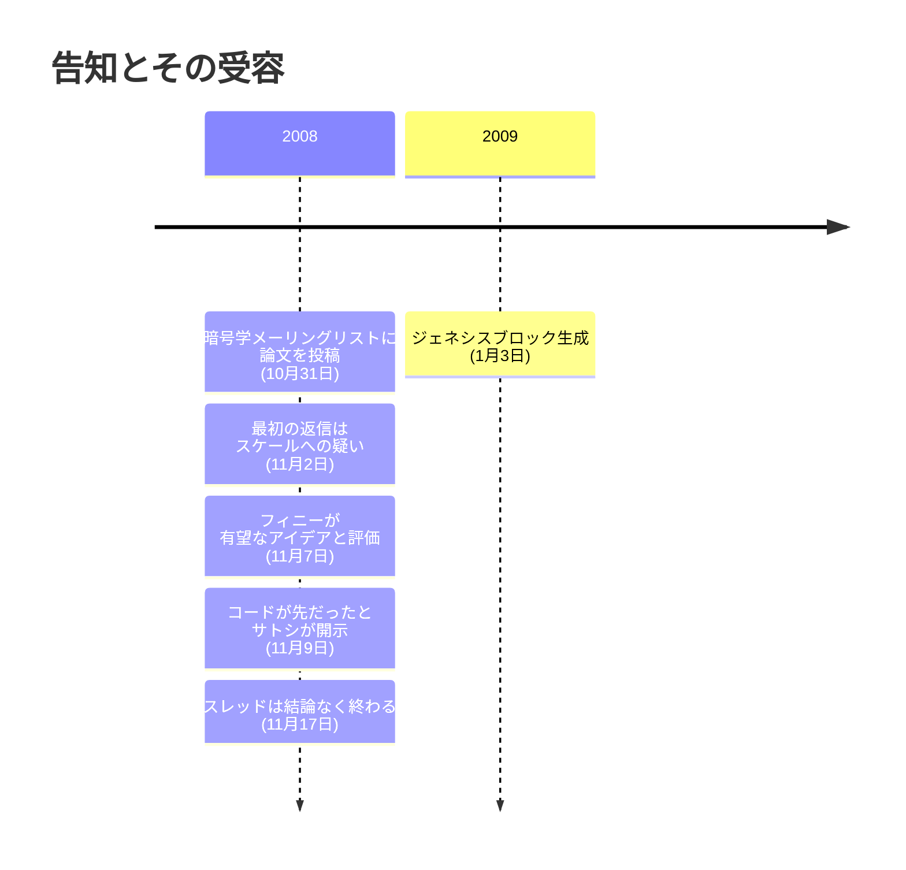

2008 年 10 月 31 日金曜日、18 時 10 分 (UTC)。metzdowd.com の暗号学メーリングリストに、身元不明の差出人からの投稿が届いた：

<!-- quote: q1 -->
> 「新しい電子キャッシュシステムに取り組んでいる。完全な P2P 方式で、信頼された第三者を必要としない」

末尾の署名はサトシ・ナカモト。本文は bitcoin.org に置かれた九ページの PDF『Bitcoin: A Peer-to-Peer Electronic Cash System』へのリンクを示し、五つの特性を列挙していた。二重支払いは P2P ネットワークが防ぐ。造幣局も信頼された第三者も不要。参加者は匿名でいられる。新しいコインは Hashcash 形式のプルーフ・オブ・ワークから生成される。そしてそのプルーフ・オブ・ワーク自体が、二重支払いを防ぐネットワークの動力になる。[論文そのもの](/BitcoinArchive/ja/entries/emails/cryptography/2008-10-31-bitcoin-whitepaper-final/)は本アーカイブに収蔵されており、最終改稿前の文言を保存した [10 月 3 日付の草稿](/BitcoinArchive/ja/entries/emails/cryptography/2008-10-03-bitcoin-whitepaper-draft/)も並んでいる。

それから二日間、何も起きなかった。

記録上の最初の返信は 11 月 2 日。切実な必要から始まり、疑いで閉じる一通だった：

<!-- quote: q2 -->
> 「こういうシステムは切実に必要だ。だが、あなたの提案を私が理解する限り、この方式では必要な規模にスケールしないんじゃないか？」

[ジェームズ・A・ドナルド](/BitcoinArchive/ja/participants/james-donald/)。長年のサイファーパンクである彼が、スレッドの最初の応答で名指ししたのは、以後ビットコインの記録された歴史に付きまとい続ける論点、スケールだった。ジョン・レヴィンは迷惑メール対策の現場から答えた。彼の知るブラックリスト運用者たちは一日に百万台規模で新たな乗っ取られたマシンを観測しており、その世界の算術では「正直なノードが CPU パワーの過半を握る」という前提は、すでに反証済みに見えた。サトシが選んだ投稿先は、この議論を絵空事にしない唯一の読者層だった。デジタルキャッシュの設計を自ら作り、査読し、あるいは葬ってきた世代がそこにいた。

11 月 7 日、空気が変わる。プルーフ・オブ・ワーク型トークンシステム RPOW を自分の手で作り上げた経験を持つ唯一の読者、[ハル・フィニー](/BitcoinArchive/ja/participants/hal-finney/)が返信した：

<!-- quote: q3 -->
> 「ビットコインはすごく有望なアイデアだと思うんだ」

フィニーはこの設計をニック・サボのビットゴールドに結びつけ、資金力のある攻撃者への耐性を突いた。サトシはその後二日間、ブロック伝播や競合チェーンをめぐる追加の質問、そして具体的なデータ構造を求めるフィニーの要望に一つずつ答えていく。11 月 9 日の返信に、この計画の時系列を確定させる開示があった：

<!-- quote: q4 -->
> 「実は私はこれを逆の順序で行った。すべての問題を解決できると自分を納得させるために、まずすべてのコードを書き、その後論文を書いた」

九ページは提案書ではなく、報告書だった。サトシはまずコードを書き、動く実装ですべての問題を解けると確認し、その後で論文を書いた。つまりリストが概要を読んだ時点で、そこに記述されたシステムは公開を待つソフトウェアとして既に存在していた。論文は、公開される前からメールとしてすでに届いていた。論文が引用した二人のサイファーパンクの先行者、[アダム・バック](/BitcoinArchive/ja/entries/aftermath/2008-08-20-satoshi-to-adam-back/)と[ウェイ・ダイ](/BitcoinArchive/ja/entries/correspondence/wei-dai/2008-08-22-satoshi-to-wei-dai/)には、引用の許可を求めて、8 月にサトシから連絡が届いていた。

スレッドは 11 月 17 日まで続き、懐疑派が転向しないまま止まった。本アーカイブが保存する全 24 通は、すべての反論とすべての答えを含めて、[スレッド表示](/BitcoinArchive/ja/entries/threads/emails/cryptography/bitcoin-p2p-e-cash-paper/)で順に読める。告知から九週間後、サトシは[ジェネシスブロックを生成し](/BitcoinArchive/ja/entries/aftermath/2009-01-03-genesis-block/)、九ページが記述したシステムは文書であることをやめた。

*[補足：2008 年 10 月 31 日の投稿は、小説『[ジェネシス ― 創設者の消失と約束](/BitcoinArchive/ja/novel/)』の物語が始まる瞬間として描かれる。金融危機の只中に主人公が世界へ放ったこの九ページを、小説は「数千年続いた通貨の概念を、根底から覆すことになる」プロトコルの記録として語る。]*
