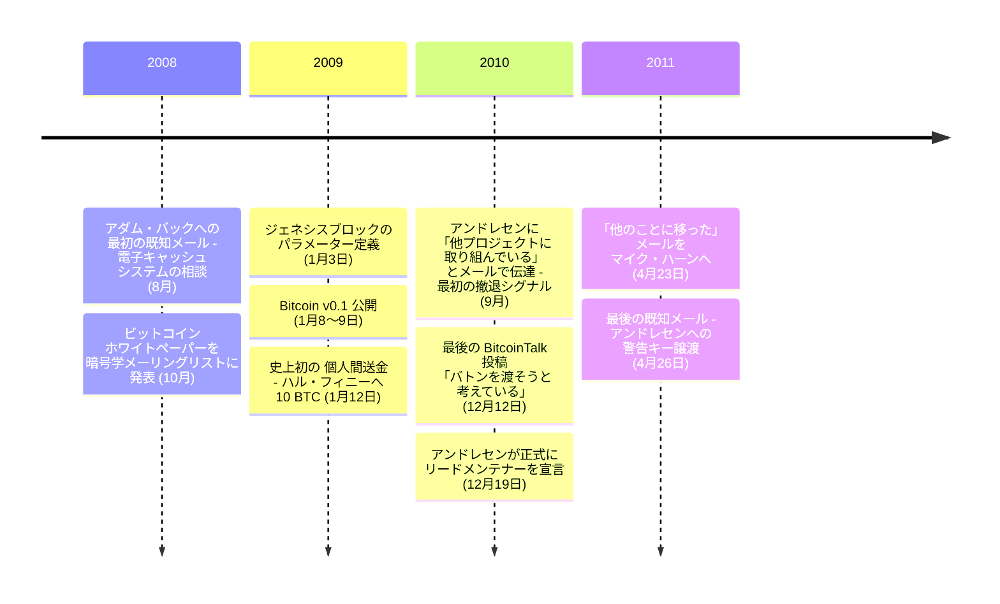

2008年10月31日、サトシ・ナカモトはビットコインホワイトペーパーを発表した。2年半後、最後の既知のメールを送信して消えた。最初の数か月に単一の協調的なパターンでマイニングされた約 110 万 BTC は、その後一度も動いていない。

「サトシ・ナカモト」 は仮名である。その背後にいる個人またはグループは、これまで特定されていない。

### ホワイトペーパー

公開記録上最も早い通信は、Hashcash の引用形式について尋ねた [2008年8月20日のアダム・バック宛メール](/BitcoinArchive/ja/entries/correspondence/adam-back/2008-08-20-satoshi-to-adam-back/)。2008年10月31日、metzdowd.com の暗号学メーリングリストに[ホワイトペーパー](/BitcoinArchive/ja/entries/emails/cryptography/bitcoin-p2p-e-cash-paper/2008-10-31-bitcoin-p2p-e-cash-paper/)が投稿された —— 9 ページにわたり、デジタル署名の連鎖をプルーフ・オブ・ワークで保護することで、信頼される第三者なしに二重支払いに抗える仕組みを記述している。

### ローンチ

2009年1月3日、サトシは[ブロック 0](/BitcoinArchive/ja/entries/aftermath/2009-01-03-genesis-block/) のパラメーターを定義した。その coinbase 欄に埋め込まれていたのは、当日付の『タイムズ』 紙一面の見出し：

> 「The Times 03/Jan/2009 Chancellor on brink of second bailout for banks」

ブロック 0 はソースコード内に定数としてハードコードされており、各ノードが同じパラメーターからローカルに再構築する（詳細は[ジェネシスブロックハードコード分析](/BitcoinArchive/ja/entries/analysis/2009-01-03-genesis-block-hardcode-analysis/)を参照）。1月8日、[Bitcoin v0.1 が公開された](/BitcoinArchive/ja/entries/aftermath/2009-01-09-bitcoin-v01-released/)。その 4 日後、ブロック 170 がサトシから[ハル・フィニー](/BitcoinArchive/ja/participants/hal-finney/)への 10 BTC を運んだ —— [史上初の個人間ビットコイン送金](/BitcoinArchive/ja/entries/aftermath/2009-01-12-first-bitcoin-transaction/)である。

### 開発とコミュニケーション

サトシは暗号学メーリングリスト、SourceForge 上の bitcoin-list メーリングリスト、BitcoinTalk フォーラム（サトシとマルッティ・マルミが開設）、P2P Foundation フォーラム、そしてメールで活動した。直接の通信相手は[アダム・バック](/BitcoinArchive/ja/participants/adam-back/)、[ウェイ・ダイ](/BitcoinArchive/ja/participants/wei-dai/)、[ハル・フィニー](/BitcoinArchive/ja/participants/hal-finney/)、[ジェームズ・A・ドナルド](/BitcoinArchive/ja/participants/james-donald/)、[レイ・ディリンジャー](/BitcoinArchive/ja/participants/ray-dillinger/)、[ダスティン・トランメル](/BitcoinArchive/ja/participants/dustin-trammell/)、[マルッティ・マルミ](/BitcoinArchive/ja/participants/martti-malmi/)、[マイク・ハーン](/BitcoinArchive/ja/participants/mike-hearn/)、[ギャビン・アンドレセン](/BitcoinArchive/ja/participants/gavin-andresen/)、[ラズロ・ハニエツ](/BitcoinArchive/ja/participants/laszlo-hanyecz/)、[ジェフ・ガージック](/BitcoinArchive/ja/participants/jeff-garzik/)その他。2009〜2010年にかけて、設計判断の説明、技術的反論への応答、開発調整のため、数百のフォーラム投稿とメールを執筆している。

### 移行と消失

2010年9月時点で、サトシはギャビン・アンドレセンに「[他のプロジェクトに取り組んでいる](/BitcoinArchive/ja/entries/aftermath/2010-09-01-satoshi-andresen-other-projects-notice/)」 と私的に伝えていた —— 公開記録上最も早い撤退シグナル。続く数か月のあいだに、ビットコインソースリポジトリの管理権とネットワーク警告キーをアンドレセンへ移譲し、メールでは少数の開発者と 2011年初頭まで通信を続けた。

[最後の公開 BitcoinTalk 投稿](/BitcoinArchive/ja/entries/forum/bitcointalk/topic-2228/2010-12-12-satoshi-final-post/)は 2010年12月12日：

<!-- speaker: Satoshi Nakamoto -->
> 「あといくつかのことを行ったら、バトンを渡す予定だ。」

7 日後、[アンドレセンがプロジェクト管理を引き受けることを公的に告知した](/BitcoinArchive/ja/entries/aftermath/2010-12-19-andresen-lead-maintainer-announcement/)。

2011年4月23日、サトシは[マイク・ハーン宛て](/BitcoinArchive/ja/entries/correspondence/mike-hearn/holding-coins/2011-04-23-satoshi-to-hearn-moved-on/)に書いている：

<!-- speaker: Satoshi Nakamoto -->
> 「他のことに取り組むことにした。ギャビンたちに任せれば、安心だ」

その 3 日後、2011年4月26日、[最後の既知のメール —— アンドレセンへの警告キー譲渡](/BitcoinArchive/ja/entries/correspondence/gavin-andresen/2011-04-26-satoshi-to-andresen-alert-key/)：

<!-- speaker: Satoshi Nakamoto -->
> 「私を謎の人物として語らないでほしい。」

以降、サトシからの確認された通信は記録されていない。

### プロフィール

P2P Foundation プロフィールは生年月日を 1975年4月5日、所在地を日本と記載していた —— 未確認、かつ架空のものと広く考えられている。サトシの英語は流暢で、英国または英連邦の慣習に一致する。投稿タイムスタンプの分析からはさまざまなタイムゾーンが推測されてきたが、所在地の決定的な特定には至っていない。「サトシ・ナカモト」 という仮名は 1980〜90 年代のテクノオリエンタリズム的な象徴空間の内側に落ちる —— 作者の意図とは独立な、受容についての構造的観察として[仮名と『AKIRA』 についての分析](/BitcoinArchive/ja/entries/analysis/2008-10-31-satoshi-name-techno-orientalism/)で扱う。サトシのサイファーパンク運動との関係および公開記録上の実践と思想核との整合は、[サイファーパンク核心への独立到達についての分析](/BitcoinArchive/ja/entries/analysis/2008-10-31-cypherpunk-independent-arrival/)で別途扱う。

### 開発環境

Bitcoin v0.1 は Windows 上で Microsoft Visual C++ 6.0 SP6 と MinGW GCC 3.4.5 を使って構築された。最初のリリースは Windows 専用、.rar アーカイブとしての配布 —— オープンソースプロジェクトとしては異例である。v0.1 にバージョン管理システムはなく、[SVN はマルッティ・マルミとギャビン・アンドレセンの助けで後から導入された](/BitcoinArchive/ja/entries/aftermath/2009-08-30-bitcoin-svn-repository-committers/)。

2009年後半から、サトシはマルッティ・マルミの支援で Linux（Ubuntu）への移植に着手した。Ubuntu のテスト環境を自ら構築し、pthread_cancel、MSG_DONTWAIT、Berkeley DB、GTK のスレッド安全性といった深い問題をデバッグした。一方で Linux の慣習そのもの —— 設定ファイル形式、デーモンスイッチの命名、スタートアップスクリプト —— は不慣れな領域だった。2009年12月、フォーラムにこう書いている：

<!-- speaker: Satoshi Nakamoto -->
> 「そこは自分の専門外だから助かる」

2010年12月のアンドレセン宛メールでは、アンドレセンを「技術的に自分よりはるかに Linux に精通している」 と評している。Mac 対応はラズロ・ハニエツが全面的に貢献した —— サトシにはテスト用の Mac がなかった。BSD の知識はソケットの起源など概念的なもので、実践的ではなかった。2010年を通じて、コミュニティからのパッチを取り込みながら Linux、macOS、FreeBSD のクロスプラットフォーム対応が拡大した。[サトシのソースコードの統計的分析](/BitcoinArchive/ja/entries/analysis/2009-01-09-satoshi-code-analysis/)が、コーディングスタイル、コミット時間帯パターン、v0.1.0 から v0.3.19 までのコード進化を扱う。

### ビットコイン保有量

ビットコイン最初の数か月に、単一の協調的なパターンでマイニングされたビットコインは約 110 万 BTC ——「[Patoshi パターン](/BitcoinArchive/ja/entries/aftermath/2013-04-17-sergio-lerner-patoshi-analysis/)」 と呼ばれ、サトシのものと考えられている。これらのコインは一度も動いていない。

---

### 編集分析
- **配布形式と開発環境**: `.rar` パッケージング、バージョン管理の不在、ハンガリアン記法による変数命名、OpenSSL 依存、[ダン・カミンスキーによる 2011 年セキュリティ監査](/BitcoinArchive/ja/entries/aftermath/2011-10-10-dan-kaminsky-bitcoin-security/)、そして「先見的セキュリティと非形式的プロセスの区別」は [v0.1 配布形式と開発環境の異例性についての分析](/BitcoinArchive/ja/entries/analysis/2009-01-09-satoshi-distribution-and-tooling-anomalies/)で扱う
- **自己言及**: サトシが自分自身に言及した発言（識別子主張、設計過程の自己開示、運用状態、能力の自己評価、撤退表明）はすべて[自己言及分析](/BitcoinArchive/ja/entries/analysis/2008-08-20-satoshi-self-statements/)で網羅する
- **サイファーパンクとの位置関係**: コミュニティへの参加痕跡がないにもかかわらず実践がサイファーパンク思想核と一致する点は[独立到達についての分析](/BitcoinArchive/ja/entries/analysis/2008-10-31-cypherpunk-independent-arrival/)で扱う
- **署名の読解**: 「サトシ・ナカモト」という仮名が落ちるテクノオリエンタリズム的な象徴空間は[仮名と『AKIRA』についての分析](/BitcoinArchive/ja/entries/analysis/2008-10-31-satoshi-name-techno-orientalism/)で扱う

サトシはメーリングリストとフォーラム上で設計判断を説明し、技術的反論に応答し、運用判断を下した —— 2010年12月の WikiLeaks 寄付推進の辞退、2010年末から 2011年初頭にかけてのソースリポジトリのコミット権限とネットワーク警告キーのアンドレセンへの引き渡し。
