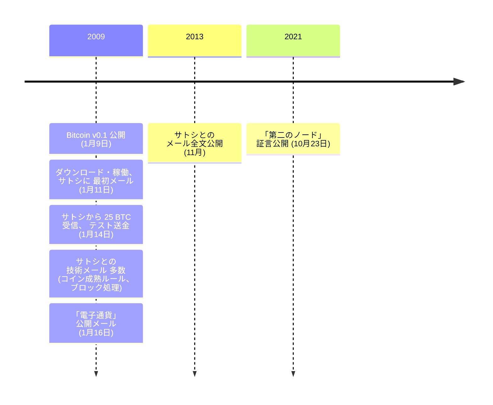

ダスティン・D・トランメルは、テキサス州オースティン在住の情報セキュリティ研究者である。サイバーセキュリティ業界で働き、脆弱性とエクスプロイト開発の研究で情報セキュリティコミュニティに知られている。ビットコインの公開リリース後に、最初期にダウンロードして稼働させた人物の一人である。

**ダスティン・トランメルのビットコイン関連年表**

**サトシとの最初の接触：**
2009年1月11日 — [Bitcoin v0.1のリリース](/BitcoinArchive/ja/entries/sourceforge/2009-01-09-bitcoin-v01-released/)から3日後 — トランメルはソフトウェアをダウンロードして稼働させた後、[サトシ・ナカモト](/BitcoinArchive/ja/participants/satoshi-nakamoto/)に[メールを送った](/BitcoinArchive/ja/entries/correspondence/dustin-trammell/2009-01-11-trammell-to-satoshi-first-email/)。自身の経験を報告し、システムの設計について質問した。サトシは同日に返信し、短いが重要なメールのやり取りが始まった。

**初期のマイニングとビットコイン送金：**
トランメルは最初期からビットコインのマイニングを開始し、サトシや[ハル・フィニー](/BitcoinArchive/ja/participants/hal-finney/)とともにネットワーク上の最初のノードの一つを運用していた可能性がある。2009年1月14日、サトシはテスト取引として[トランメルに25 BTCを送信し](/BitcoinArchive/ja/entries/correspondence/dustin-trammell/2009-01-13-satoshi-to-trammell-send-coins/)、これは最初期の既知の個人間ビットコイン送金の一つとなった（[1月12日にサトシがハル・フィニーに送った10 BTC](/BitcoinArchive/ja/entries/aftermath/2009-01-12-first-bitcoin-transaction/)に続く）。やり取りの中で、サトシはコインの成熟ルールやシステムが新しいブロックをどのように処理するかなどの技術的詳細について議論した。

**意義：**
トランメルの早期の採用とサトシとの直接的なやり取りは、彼を最初期のビットコインユーザーの一人として位置付けている。Satoshi Nakamoto Instituteに保存されたサトシとのメールは、ネットワークがわずか数台のノードで構成されていたビットコインの最初期の日々を垣間見る窓を提供している。
