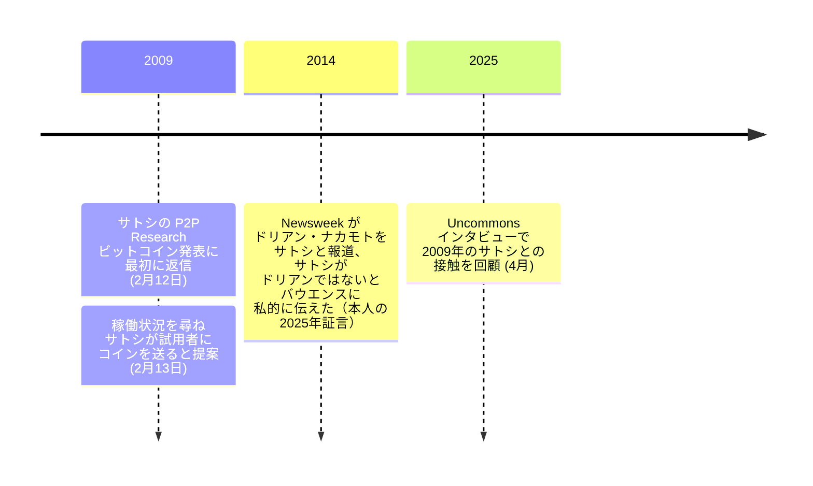

2009 年 2 月 13 日、P2P Foundation の創設者ミシェル・バウエンスがサトシ・ナカモトに単純な質問を投げかけ、いまや有名な提案が返ってきた:

<!-- speaker: Satoshi Nakamoto -->
> 「完全に稼働しており、ネットワークは成長している。ソフトウェアを試してくれれば、あなたのビットコインアドレスにコインを送る。」

バウエンスはサトシの [P2P Research メーリングリストにおけるビットコイン発表](/BitcoinArchive/ja/entries/emails/p2p-research/bitcoin-open-source/2009-02-11-bitcoin-open-source-p2p-currency/)に最初に返信した人物であり、翌日に「プロジェクトはどの程度稼働していますか？実生活で使えるようになるのはいつ頃だと思いますか？」と尋ねて上記の返信を引き出した。バウエンス（1958 年 3 月 21 日生まれ）はベルギーの政治理論家で、彼の P2P Foundation はエクアドル政府やゲント市のためのコモンズベースの移行計画を策定してきた。

## サトシとのやり取り
2009年2月12日、バウエンスは[サトシ・ナカモト](/BitcoinArchive/ja/participants/satoshi-nakamoto/)の [P2P Research メーリングリストにおけるビットコイン発表](/BitcoinArchive/ja/entries/emails/p2p-research/bitcoin-open-source/2009-02-11-bitcoin-open-source-p2p-currency/)に最初に返信した人物であった。サトシにイニシアチブの共有を感謝し、コミュニティのより専門的なメンバーの意見を求めた。注目すべきことに、バウエンスはサトシが日本人であると想定し、P2P Foundation のウィキに日本のイニシアチブに関する情報を追加するよう依頼した。

2月13日、バウエンスはサトシに直接こう尋ねた。

> 「きみのプロジェクトはどの程度動いているのか? 実生活で使えるようになるのはどれくらい先になると思うか?」

サトシの返信は、冒頭に引用した提案だった。

## 意義
サトシの返信は、状況報告というより勧誘だった。サトシが P2P リサーチでビットコインを発表したわずか二日後、しかも同じ週に [P2P Foundation のフォーラム](/BitcoinArchive/ja/entries/forum/p2pfoundation/bitcoin-open-source/2009-02-11-bitcoin-open-source-implementation/)でも告知しながら、その作者はなお、ネットワークを一人ずつ手作業で広げていた。
