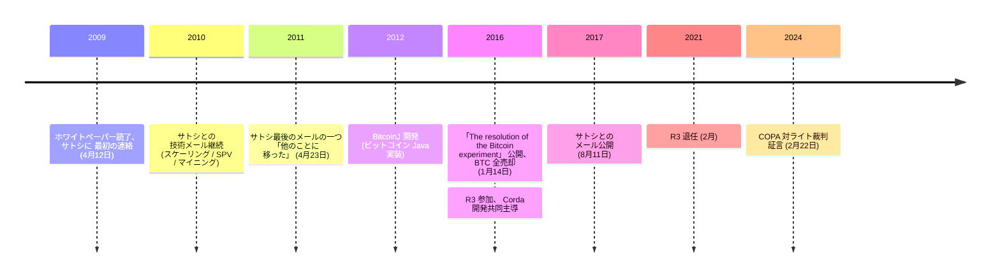

2009 年 4 月 12 日、Google のエンジニアだったマイク・ハーンは[ビットコインホワイトペーパー](/BitcoinArchive/ja/entries/emails/cryptography/2008-10-31-bitcoin-whitepaper-final/)を読み、[サトシ・ナカモト](/BitcoinArchive/ja/participants/satoshi-nakamoto/)に[メールを送った](/BitcoinArchive/ja/entries/correspondence/mike-hearn/questions/2009-04-12-hearn-to-satoshi-questions/)。その後 2 年間で技術的なメールが続いた —— スケーリング、簡易決済検証、長期的なマイニングの形。ハーンはサトシが送信した最後の私的メールの一つを受け取った相手である:

<!-- speaker: Satoshi Nakamoto -->
> 「他のことに取り組むことにした。ギャビンたちに任せれば、安心だ。」

それから 5 年近く経った 2016 年 1 月 14 日、ハーンは Medium に[「The resolution of the Bitcoin experiment」](/BitcoinArchive/ja/entries/aftermath/2016-01-14-mike-hearn-resolution-bitcoin-experiment/)を公開した。冒頭は 1 行だった:

> 「ビットコインは失敗した」

ハーンは保有する全ビットコインを売却、プロジェクトから離脱、エンタープライズ向けブロックチェーンコンソーシアム R3 に参加して分散台帳プラットフォーム Corda の開発を共同主導した。[2017 年 8 月にサトシとのメールを公開](/BitcoinArchive/ja/entries/aftermath/2017-08-11-mike-hearn-publishes-emails/)、これはサトシの技術的思考を記録した最大級の一次資料群となった。2024 年 2 月、[COPA 対ライト裁判で証言](/BitcoinArchive/ja/entries/aftermath/2024-02-22-mike-hearn-copa-trial-testimony/)。

ハーンは Google で Google Maps、Google Earth、Gmail のスパム対策システムに従事していた。[BitcoinJ](https://github.com/bitcoinj/bitcoinj) —— プロトコルの Java 実装 —— を開発し、これは元の C++ クライアントに対する最初の主要な代替実装、そして多くの Android ビットコインウォレットの基盤となった。

### サトシとのメール

2009 年 4 月から 2011 年 4 月にかけて、ハーンとサトシは技術的なメールを継続的に交わした。話題は、システムのスケーリング、簡易決済検証（SPV）クライアントの動作、CPU から専門ハードウェアへのマイニングの進化など。ハーンは初期のサイファーパンクサークル外からビットコインに本格的な技術的関心を寄せた最初期の人物の一人であり、公開された往復メールは、サトシが公の投稿には残さなかった技術的思考を記録している。

### ビットコインからの離脱

2016 年 1 月の「ビットコインは失敗した」 エッセイは、主に二つの不満を挙げていた。1 メガバイトのブロックサイズ上限引き上げに開発コミュニティが合意できなかったこと、そして本来分散型であるべきシステム内に「システム上重要な機関」 が現れたとハーンが評したこと。ハーンは公開と同時に保有 BTC を売却した。
