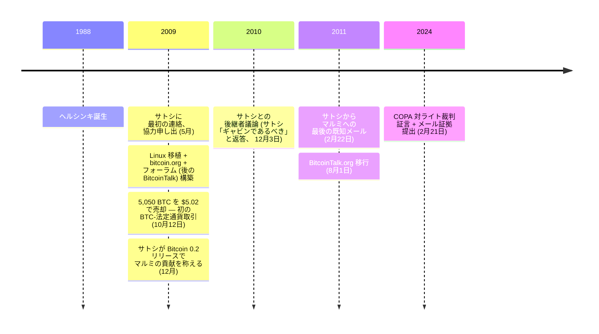

<!-- tone-skip -->

2009 年 5 月、20 歳のヘルシンキ大学コンピューターサイエンス専攻の学生が、サトシ・ナカモトに協力を申し出るメールを送った。その後 2 年間で二人は約 260 通のメールをやり取りした — サトシと単一個人との間で知られる最大量の通信。マルミはこのアーカイブを 13 年間私的に保持。2024 年 2 月、[COPA 対ライト裁判](/BitcoinArchive/ja/entries/aftermath/2024-03-14-copa-v-wright-ruling/)の証拠として提出した。

マルッティ・マルミ（1988 年、フィンランド・ヘルシンキ生まれ）は、ヘルシンキ工科大学（現アールト大学）でコンピューターサイエンスを学んだ。ビットコイン最初の 2 年間における貢献は、Linux 移植、bitcoin.org ウェブサイト、最初のビットコインフォーラム（後の BitcoinTalk）、そして最初の既知のビットコイン-法定通貨売却。

### サトシとの最初の接触
2009年5月、マルミはビットコインを発見し、プロジェクトへの協力を申し出て[サトシ・ナカモト](/BitcoinArchive/ja/participants/satoshi-nakamoto/)に連絡を取った。彼らのやり取りは約 260 通のメールに及び、サトシと単一の個人との間で知られる最大量の通信となった。これらのメールは 2024年2月の [COPA 対ライト裁判](/BitcoinArchive/ja/entries/aftermath/2024-03-14-copa-v-wright-ruling/)で証拠として提出された。

### ビットコインへの貢献

マルミはビットコインソフトウェアを Linux に移植し、初めて Windows 以外でもアクセス可能にした。プロジェクトの主要な情報ハブとなった bitcoin.org ウェブサイトを構築・管理した。最初のビットコインフォーラム（後の BitcoinTalk）も作成し、コミュニティに初の専用ディスカッションプラットフォームを提供した。サトシは Bitcoin 0.2 のリリースアナウンス（2009 年 12 月）で貢献を称えた:

<!-- speaker: Satoshi Nakamoto -->
> 「マルッティ（sirius-m）の開発作業すべてに深く感謝する」
<!-- speaker: reset -->

### 初のビットコイン-法定通貨取引
[2009年10月12日](/BitcoinArchive/ja/entries/aftermath/2009-10-12-martti-malmi-first-btc-sale/)、マルミは 5,050 BTC を [NewLibertyStandard](/BitcoinArchive/ja/participants/newlibertystandard/) に$5.02 で PayPal 経由で売却した。これはビットコインと法定通貨の最初の既知の交換として広く認識されており、ビットコインに現実世界の金銭的価値があることを確立した。マルミは後にこの取引を Twitter で確認し、「世界初のビットコイン取引サービスの立ち上げを助けるため」に売却したと述べた。

### 後継者議論における役割

[2010 年 12 月 3 日](/BitcoinArchive/ja/entries/aftermath/2010-12-03-handover-to-gavin/)、サトシが[第一線から退き始めていた](/BitcoinArchive/ja/entries/aftermath/2010-09-01-satoshi-andresen-other-projects-notice/)時期、マルミはビットコイン開発・管理を引き継ぐべき人物について尋ねた。サトシの返答は明確だった:

<!-- speaker: Satoshi Nakamoto -->
> 「ギャビンが適任だ。彼は信頼できる。責任感があり、プロフェッショナルだ。Linuxに関しては、技術的に私よりずっと上だ。」

このメールのやり取りが、[2010 年 12 月 12 日のギャビンへの SVN 正式引き継ぎ](/BitcoinArchive/ja/entries/aftermath/2010-12-12-satoshi-handover-to-andresen/)と、[2010 年 12 月 19 日のギャビンによるプロジェクト管理引き受けの公的告知](/BitcoinArchive/ja/entries/aftermath/2010-12-19-andresen-lead-maintainer-announcement/)の基盤となった。

### その後
マルミは 2011 年初頭まで、サトシと折に触れてやり取りを続けた。[サトシからマルミへの最後の既知のメールは 2011 年 2 月 22 日](/BitcoinArchive/ja/entries/aftermath/2011-02-22-satoshi-final-email-to-malmi/) — マイク・ハーンおよびギャビン・アンドレセンとのサトシ最後のメールの 2 か月前である。マルミは 2011 年頃、他の開発者がより大きな役割を担うようになるにつれて、ビットコイン開発への関与を徐々に減らした。その後フィンランドのテクノロジー業界で働いている。
<!-- /tone-skip -->
