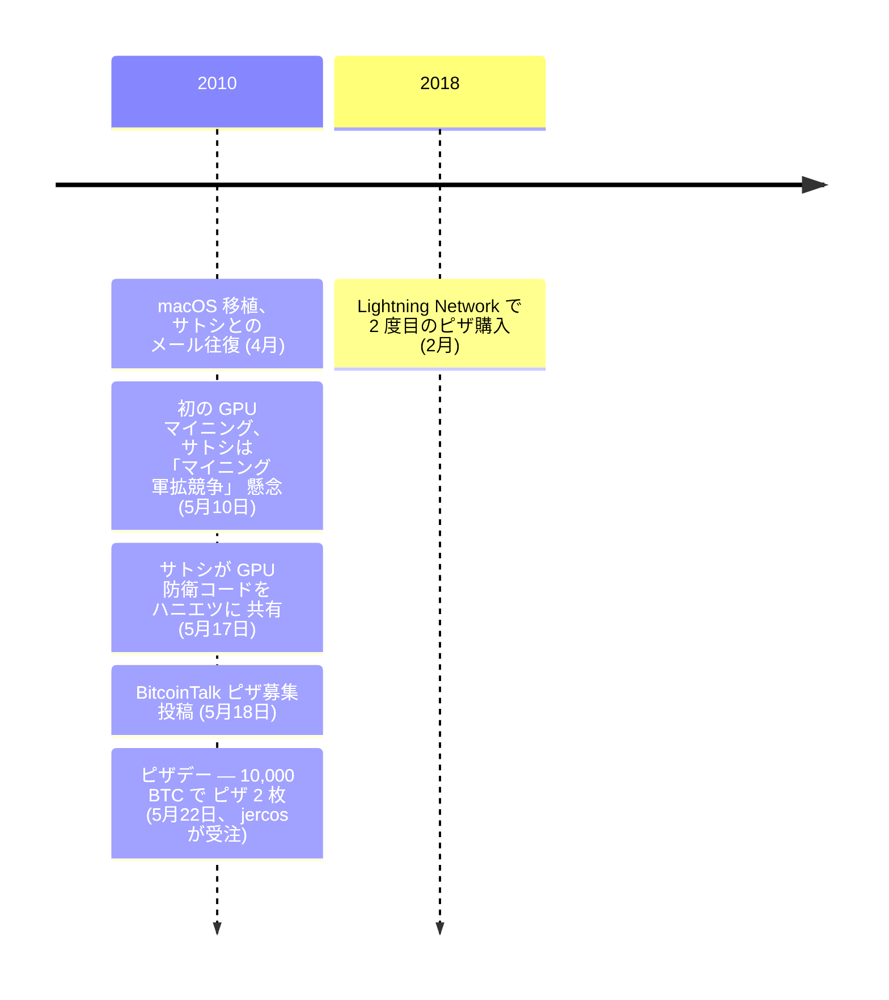

2010 年 5 月 22 日、ラズロ・ハニエツは 10,000 BTC で Papa John's のピザ 2 枚を購入した。当時の価値は約 41 ドル。ビットコインのピーク評価額では、同額は数億ドルに相当する。この日は毎年[「ビットコイン・ピザ・デー」](/BitcoinArchive/ja/entries/aftermath/2010-05-22-bitcoin-pizza-day/)として祝われており、ビットコインによる最初の既知の実商取引だ。

ハニエツはフロリダ州ジャクソンビル在住のソフトウェア開発者。ピザ購入の前、すでに[ビットコインクライアントを macOS に移植](/BitcoinArchive/ja/entries/aftermath/2010-04-19-hanyecz-recalls-satoshi-correspondence/)（初の Windows 以外のバージョン）し、GPU でビットコインをマイニングした最初の人物として知られていた。どちらについても[サトシ・ナカモト](/BitcoinArchive/ja/participants/satoshi-nakamoto/)と直接やり取りしている。

### macOS 移植
2010年初頭、ハニエツは[ビットコインクライアントを macOS に移植し](/BitcoinArchive/ja/entries/aftermath/2010-04-19-hanyecz-recalls-satoshi-correspondence/)、Apple のプラットフォームで初めてソフトウェアを利用可能にした。移植についてサトシ・ナカモトとやり取りし、彼らのメールにはクロスプラットフォーム互換性とマイニングアーキテクチャに関するサトシの指針が記されている。

### GPU マイニングの先駆者
ハニエツは、GPU（グラフィックス・プロセッシング・ユニット）を使用してビットコインのマイニングに成功した最初の人物として知られ、CPU のみのマイニングと比較してマイニング効率を劇的に向上させた。この開発についてサトシと直接議論し、サトシはマイニングハードウェアの「軍拡競争」への懸念を表明し、マイニングができるだけ長く一般のコンピューターでアクセス可能であることを望んだ。

### ビットコイン・ピザ・デー

2010 年 5 月 18 日、ハニエツは [BitcoinTalk フォーラム](/BitcoinArchive/ja/entries/forum/bitcointalk/topic-137/2010-05-18-re-laszlo-pizza-original/)に 10,000 BTC でラージピザ 2 枚を購入したいと投稿した。4 日後、2010 年 5 月 22 日、jercos（ジェレミー・スターディヴァント）というユーザーがオファーを受け入れ、Papa John's のピザ 2 枚をハニエツの自宅に配達注文した。

### その後

2018 年 2 月、ハニエツはもう一つの象徴的なピザ購入を行った —— 今回はビットコインのレイヤー 2 スケーリングソリューションである Lightning Network を使用した。後年、当初の取引を後悔していないかと問われたとき、彼はこう答えた:

> 「後悔？ してないよ。ビットコインの最初の歴史に関われたんだ。最高じゃん」
