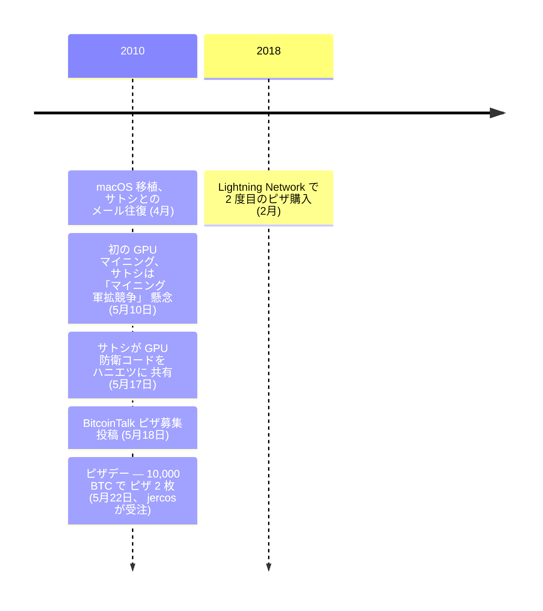

ラズロ・ハニエツは、フロリダ州ジャクソンビル在住のソフトウェア開発者で、ビットコインの初期開発にいくつかの基盤的な貢献を行った。技術的な問題について[サトシ・ナカモト](/BitcoinArchive/ja/participants/satoshi-nakamoto/)と直接やり取りし、ビットコインによる初の実商取引で最もよく知られている。

### macOS移植
2010年初頭、ハニエツは[ビットコインクライアントをmacOSに移植し](/BitcoinArchive/ja/entries/aftermath/2010-04-19-hanyecz-recalls-satoshi-correspondence/)、Appleのプラットフォームで初めてソフトウェアを利用可能にした。移植についてサトシ・ナカモトとやり取りし、彼らのメールにはクロスプラットフォーム互換性とマイニングアーキテクチャに関するサトシの指針が記されている。

### GPUマイニングの先駆者
ハニエツは、GPU（グラフィックス・プロセッシング・ユニット）を使用してビットコインのマイニングに成功した最初の人物として知られ、CPUのみのマイニングと比較してマイニング効率を劇的に向上させた。この開発についてサトシと直接議論し、サトシはマイニングハードウェアの「軍拡競争」への懸念を表明し、マイニングができるだけ長く一般のコンピューターでアクセス可能であることを望んだ。

### ビットコイン・ピザ・デー
2010年5月18日、ハニエツは[BitcoinTalkフォーラムに](/BitcoinArchive/ja/entries/forum/bitcointalk/topic-137/2010-05-18-re-laszlo-pizza-original/)10,000 BTCでラージピザ2枚を購入したいと投稿した。[2010年5月22日](/BitcoinArchive/ja/entries/aftermath/2010-05-22-bitcoin-pizza-day/)、jercos（ジェレミー・スターディヴァント）というユーザーがオファーを受け入れ、Papa John'sのピザ2枚をハニエツの自宅に配達注文した。これはビットコインを使用した初の既知の実商取引として認識されている。この日は毎年「ビットコイン・ピザ・デー」として祝われている。当時、10,000 BTCは約$41の価値だった。ビットコインのピーク評価額では、同額は数億ドルに相当する。

### その後
2018年2月、ハニエツはもう一つの象徴的なピザ購入を行った — 今回はビットコインのレイヤー2スケーリングソリューションであるLightning Networkを使用した。元のピザ取引について後悔はないと公に述べており、ビットコインが交換手段として機能できることを実証する重要なマイルストーンだったと見なしている。
