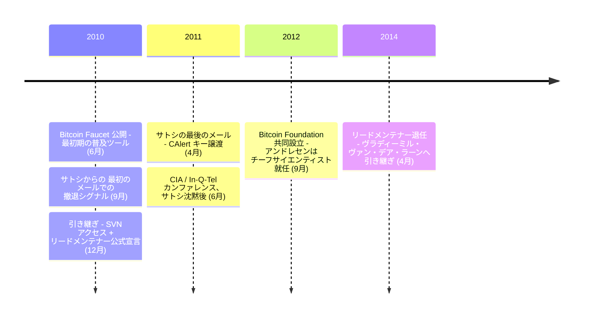

2010 年 12 月、[サトシ・ナカモト](/BitcoinArchive/ja/participants/satoshi-nakamoto/)はギャビン・アンドレセンにビットコインの鍵を渡した —— 12 月 12 日にソースリポジトリへのアクセス、[2011 年 4 月 26 日にネットワーク警告キー](/BitcoinArchive/ja/entries/correspondence/gavin-andresen/2011-04-26-satoshi-to-andresen-alert-key/)。警告キー譲渡の数か月前、アンドレセンはバージニア州ラングレーの CIA 本部でビットコインについて講演する招待を受けていた。事前にサトシに伝えた。その後、サトシの通信頻度は減少し、やがて完全に途絶えた。アンドレセンは 2011 年 6 月 14 日に講演した。

ギャビン・アンドレセン（本名ギャビン・ベル、1966 年オーストラリア・メルボルン生まれ）はアメリカで育ち、1988 年にプリンストン大学でコンピューターサイエンスの学位を取得し、3D グラフィックス会社 Wasabi Software を設立した。2010 年にビットコインを知り、すぐに最も活発な貢献者の一人となった。[Bitcoin Faucet](/BitcoinArchive/ja/entries/correspondence/gavin-andresen/2010-06-11-andresen-bitcoin-faucet/) ——無料でビットコインを配布し、人々がこの技術を学び使い始めるのを支援するウェブサイト —— を作成。2010 年 12 月から 2014 年 4 月までビットコインのリードメンテナーを務めた。

### サトシの後継者 — 段階的な引き継ぎ（2010–2011 年）
サトシからアンドレセンへの引き継ぎは、一度の指名ではなく、7 ヶ月にわたる運営権限の段階的な譲渡だった。アーカイブ収録の以下のエントリーで時系列に追える。

| 日付 | 出来事 | 範囲 |
|------|------|------|
| 2010-09-01 | [アンドレセン宛メール「他のプロジェクトに取り組んでいる」](/BitcoinArchive/ja/entries/aftermath/2010-09-01-satoshi-andresen-other-projects-notice/) | 公開記録上最も早い撤退シグナル |
| 2010-12-03 | [マルミ宛メールでアンドレセンを開発・管理の引き継ぎ先として推薦](/BitcoinArchive/ja/entries/correspondence/martti-malmi/2010-12-03-handover-to-gavin/) | 推薦 |
| 2010-12-12 朝 | [SVN 権限譲渡 + リーダーシップ承認メール](/BitcoinArchive/ja/entries/correspondence/gavin-andresen/2010-12-12-satoshi-handover-to-andresen/) | コードベース + メール承認 |
| 2010-12-12 18:22 UTC | [BitcoinTalk フォーラム最終投稿](/BitcoinArchive/ja/entries/forum/bitcointalk/topic-2228/2010-12-12-satoshi-final-post/) | 最後の公開発信 |
| 2010-12-19 | [アンドレセン公的告知「サトシの祝福を受けて」](/BitcoinArchive/ja/entries/aftermath/2010-12-19-andresen-lead-maintainer-announcement/) | 役割の公的引き受け。同日 `bitcoin/bitcoin` GitHub リポジトリを作成 |
| 2011-04-23 | [マイク・ハーン宛メール「他のことに取り組むことにした。ギャビンたちに任せれば、安心だ」](/BitcoinArchive/ja/entries/correspondence/mike-hearn/holding-coins/2011-04-23-satoshi-to-hearn-moved-on/) | 撤退表明（アンドレセンへの信任）。当時は非公開、後年公開 |
| 2011-04-26 10:29 UTC | [最後のメール：CAlert キー譲渡](/BitcoinArchive/ja/entries/correspondence/gavin-andresen/2011-04-26-satoshi-to-andresen-alert-key/) | ネットワーク非常停止権限 |

役割と一緒に**渡らなかったもの**：Patoshi マイニングパターンに紐づく約 110 万 BTC（2010 年以降オンチェーンで未移動）、サトシの匿名性そのもの、ジェネシスブロックの coinbase アドレス秘密鍵。

アンドレセンは [2016 年の回想](/BitcoinArchive/ja/entries/aftermath/2016-05-02-gavin-andresen-satoshi-retrospective/)で、この移行の段階性についてこう振り返っている。

> 「彼は僕に一杯食わせたんだ。ビットコインのホームページに僕のメールアドレスを載せていいかと聞かれて、いいよと答えた。気づかなかったのは、僕のアドレスを載せた時に、自分のアドレスを消していたことだ。僕がビットコインについて知りたい人全員からメールを受ける窓口になった。サトシはプロジェクトのリーダーから身を引き始め、僕をリーダーとして前に押し出していった」

### リードメンテナー（2010 年 12 月〜2014 年 4 月）
[2010 年 12 月 19 日のアンドレセンの公的告知](/BitcoinArchive/ja/entries/aftermath/2010-12-19-andresen-lead-maintainer-announcement/)はこう始まった。

> 「サトシの承認を得て、正直かなり気が進まないが、ビットコインのプロジェクト管理にもっと積極的に関わっていくことにする」

アンドレセンはその時点からビットコイン開発を表立って牽引することになり、サトシは 2011 年初頭までメールを続けた。サトシの [2011 年 4 月 23 日のマイク・ハーン宛メール](/BitcoinArchive/ja/entries/correspondence/mike-hearn/holding-coins/2011-04-23-satoshi-to-hearn-moved-on/) —— 当時は非公開、後年公開 —— は撤退の言葉を残した:

<!-- speaker: Satoshi Nakamoto -->
> 「他のことに取り組むことにした。ギャビンたちに任せれば、安心だ」

3 日後、[最後の既知のメール](/BitcoinArchive/ja/entries/correspondence/gavin-andresen/2011-04-26-satoshi-to-andresen-alert-key/)は CAlert キーの正式な譲渡を伴っていた:

<!-- speaker: Satoshi Nakamoto -->
> 「私を謎の人物として語らないでほしい。」

2012 年 9 月に Bitcoin Foundation が設立されると、アンドレセンはチーフサイエンティストに就任した。

### CIA での講演

2011 年 6 月 14 日、アンドレセンはバージニア州ラングレーの CIA 本部でビットコインについてプレゼンテーションを行った。これは In-Q-Tel 主催の新興技術カンファレンスの一環だった。その晩、アンドレセンは Twitter にこう投稿した:

> 「今日の CIA での講演はうまくいった。あそこの廊下は本当に広くて、面白いものがいっぱい置いてあるんだ。」

事前にサトシに招待のことを伝えていたが、その後サトシの通信頻度は減少し、最終的に完全に途絶えた。

### その後
2014年4月8日、アンドレセンはリードメンテナーの役割をウラジミール・ファン・デル・ラーンに引き継いだ。その後もビットコイン開発への貢献を続け、トランザクション処理能力の向上のためブロックサイズ上限の引き上げを提唱した。
