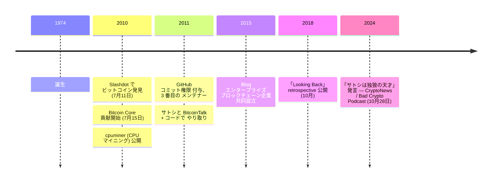

2010 年 7 月、Red Hat の Linux カーネル開発者ジェフ・ガージックは[ビットコインに関する Slashdot 投稿](/BitcoinArchive/ja/entries/aftermath/2010-07-11-slashdot-bitcoin-article/)を読み、コードベースを取得して、パッチを送り始めた。数か月のうちにサトシ以外で最大のコミット数の貢献者となり、サトシと[ギャビン・アンドレセン](/BitcoinArchive/ja/participants/gavin-andresen/)に次ぐ位置に立った。cpuminer（初期の独立型ビットコインマイニングツールの一つ）を書き、[BIP 100 動的ブロックサイズ提案](https://github.com/bitcoin/bips)を含む複数の BIP を著作、2015 年にエンタープライズ・ブロックチェーン企業 Bloq を共同設立した。

ガージックはジョージア工科大学でコンピューターサイエンスを学び、初期キャリアは Red Hat での Linux カーネル業務だった。カーネルレベルのシステム経験はビットコインの C++ コードベースに直接活きた。

### ビットコインの発見
ガージックは 2010年7月、人気のテクノロジーニュースアグリゲーションサイト [Slashdot の投稿](/BitcoinArchive/ja/entries/aftermath/2010-07-11-slashdot-bitcoin-article/)を通じてビットコインを発見した。すぐにコードベースの研究とパッチの貢献を開始した。Linux カーネル開発の経験は、ビットコインの C++コードベースでの作業に強固な基盤を与えた。

### Bitcoin Core への貢献
ガージックは、コミット数で[サトシ・ナカモト](/BitcoinArchive/ja/participants/satoshi-nakamoto/)と[ギャビン・アンドレセン](/BitcoinArchive/ja/participants/gavin-andresen/)に並ぶ Bitcoin Core のトップ 3 の貢献者の一人となった。ビットコインリポジトリへのコミットアクセスを受けた最初期の開発者の一人だった。彼の貢献はネットワーキング、マイニング、プロトコルの改善に及んだ。

### cpuminer
ガージックは、ビットコイン用の広く使用されたオープンソース CPU マイニングソフトウェアである cpuminer を作成した。このツールは最初のスタンドアロンマイニングアプリケーションの一つで、フルビットコインクライアントを実行せずにマイニングを可能にした。

### サトシとのやり取り
ガージックはサトシ・ナカモトがまだ活動していた時期に、BitcoinTalk フォーラムとコード貢献を通じてサトシとやり取りした。プロジェクトに直接パッチを提出し、プロトコル設計の決定についてサトシからフィードバックを受けた。

### Bitcoin Improvement Proposals
ガージックは複数の Bitcoin Improvement Proposals（BIP）を起草した。BIP 100 はマイナーの投票によって決定される動的ブロックサイズ制限を提案するものだった。彼のスケーリング提案は、ビットコインコミュニティの中心的な問題となったビットコインのトランザクション容量に関するより広範な議論の一部だった。

### その後のキャリア
2015年、ガージックはエンタープライズソリューションを提供するブロックチェーンテクノロジー企業 Bloq を共同設立した。暗号通貨業界で活動を続け、ビットコインの技術的進化に対する実用的なアプローチを提唱した。
