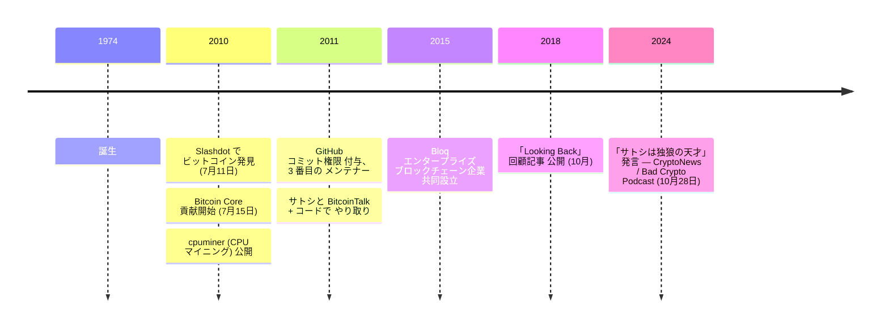

2010 年 7 月、Red Hat の Linux カーネル開発者ジェフ・ガージックは[ビットコインに関する Slashdot 投稿](/BitcoinArchive/ja/entries/aftermath/2010-07-11-slashdot-bitcoin-article/)を読み、コードベースを取得して、パッチを送り始めた。数か月のうちにサトシ以外で最大のコミット数の貢献者となり、サトシと[ギャビン・アンドレセン](/BitcoinArchive/ja/participants/gavin-andresen/)に次ぐ位置に立った。cpuminer（初期の独立型ビットコインマイニングツールの一つ）を書き、BIP 100 動的ブロックサイズ提案を含む複数の BIP を著作、2015 年にエンタープライズ・ブロックチェーン企業 Bloq を共同設立した。

ガージックはジョージア工科大学でコンピューターサイエンスを学び、初期キャリアは Red Hat での Linux カーネル業務だった。カーネルレベルのシステム経験はビットコインの C++ コードベースに直接活きた。

```mermaid
timeline
    1974 : 誕生
    2010 : Slashdot で ビットコイン発見 (7月11日)
    %% link: /BitcoinArchive/ja/entries/aftermath/2010-07-11-slashdot-bitcoin-article/
         : Bitcoin Core 貢献開始 (7月15日)
         : cpuminer (CPU マイニング) 公開
    2011 : GitHub コミット権限 付与、 3 番目の メンテナー
         : サトシと BitcoinTalk + コードで やり取り
    2015 : Bloq エンタープライズ ブロックチェーン企業 共同設立
    2018 : 「Looking Back」 回顧記事 公開 (10月)
    %% link: /BitcoinArchive/ja/entries/aftermath/2018-10-29-jeff-garzik-retrospective/
    2024 : 「サトシは独狼の天才」 発言 — CryptoNews / Bad Crypto Podcast (10月28日)
    %% link: /BitcoinArchive/ja/entries/aftermath/2024-10-28-jeff-garzik-satoshi-lone-genius/
```

## ビットコインの発見
ガージックを引き寄せた [2010 年 7 月の Slashdot 投稿](/BitcoinArchive/ja/entries/aftermath/2010-07-11-slashdot-bitcoin-article/)は、ビットコイン v0.3 のリリースを取り上げたものだった。すなわち、初期の開発者が後に「Great Slashdotting」と呼んだアクセス殺到であり、多くのプログラマーが初めてこのプロジェクトを知った瞬間でもあった。ガージックもその一人で、カーネル開発の素地のおかげで、すぐに C++ コードを読みパッチを当て始めた。

## Bitcoin Core への貢献
ガージックは、コミット数で[サトシ・ナカモト](/BitcoinArchive/ja/participants/satoshi-nakamoto/)と[ギャビン・アンドレセン](/BitcoinArchive/ja/participants/gavin-andresen/)に次ぐ Bitcoin Core 第 3 位の貢献者となった。リポジトリへのコミットアクセスを得た最初期の開発者の一人でもある。最初の大きな仕事は、新規ユーザーが最も苦しむ部分に向けられた。彼はブロックチェーンの初回ダウンロードを書き直し、その速度を [10〜100 倍](/BitcoinArchive/ja/entries/aftermath/2018-10-29-jeff-garzik-retrospective/)に引き上げた。もっとも、同時期の [v0.3.18 の SourceForge リリースノート](/BitcoinArchive/ja/entries/aftermath/2010-12-08-bitcoin-v0318-released/)では、同種の作業について「初期ブロックダウンロードを若干高速化する」程度の控えめな表現にとどまっている。

## cpuminer
ガージックは、ビットコイン用の広く使用されたオープンソース CPU マイニングソフトウェアである cpuminer を作成した。このツールは最初のスタンドアロンマイニングアプリケーションの一つで、フルビットコインクライアントを実行せずにマイニングを可能にした。

## サトシとのやり取り
二人の協働は、メールとパッチで進んだ。ガージックは変更を書き、テストし、パッチにまとめてサトシへ送る。サトシがそれを受け入れれば、コードはプロジェクトの Subversion リポジトリに取り込まれた。ガージックは[後年](/BitcoinArchive/ja/entries/aftermath/2018-10-29-jeff-garzik-retrospective/)、サトシを「実際的で良識があり、やり取りはとても楽で快適だった」と評し、「声を一切使わなかった——動画も、音声チャットも、雑談も一切なかった」相手だったと振り返っている。

## Bitcoin Improvement Proposals
ガージックは複数の Bitcoin Improvement Proposals（BIP）を起草した。BIP 100 はマイナーの投票によって決定される動的ブロックサイズ制限を提案するものだった。彼のスケーリング提案は、ビットコインコミュニティの中心的な問題となったビットコインのトランザクション容量に関するより広範な議論の一部だった。

## その後のキャリア
2015 年、ガージックはエンタープライズ向けブロックチェーン企業 Bloq を共同設立し、後に Hemi Network を率いた。スケーリングの分野では、BIP 100 を筆頭とする提案を通じて、彼はブロックサイズ拡大・スループット優先の陣営に立った。これは、ビットコインの中期を覆った容量論争の、まさにその一角である。
