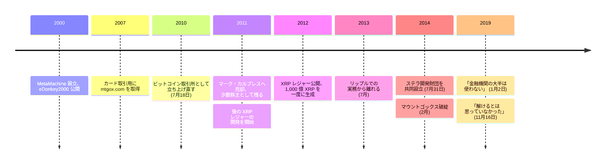

ジェド・マケーレブは、同時接続が数百万に達するファイル共有網 — 自身の会社 MetaMachine が 2000 年に公開した eDonkey2000 — をすでに作り上げた後で、カードゲーム『マジック：ザ・ギャザリング』の取引用に一つのドメインを取得した。2007 年に買った mtgox.com である。2010 年 7 月 18 日、彼はその遊んでいたドメインを別の用途で立ち上げ直した。価格の気配を出すビットコインの取引所だった。

ビットコイン最初の四年について世間が知っていることの大半は、この場所を通っている。2013 年から 2014 年にかけて、世界のビットコイン取引の 70% 超がここで行われていた。[2014 年 2 月の破綻](/BitcoinArchive/ja/entries/aftermath/2014-02-28-mt-gox-bankruptcy/)は、記録に残るビットコインの損失史における最大の保管崩壊にあたる。そのときマケーレブはもう運営していない。彼は 2011 年初頭にマーク・カルプレスへ売却した — ウィキペディアの本人の項目は 2 月、取引所の項目は 3 月と書いており、このアーカイブにはどちらを採るべき根拠がない — その後も少数株主として最後まで残った。

## 論文が彼にしたこと

ビットコインとの出会いについてのマケーレブの説明は、サトシが解いた問題について、アルトコインの創設者が残した中でもっとも圧縮された一文である。

<!-- audit:quote-skip -->
> あの論文を読むまで、私はその [二重支払いの] 問題が解けるとは思っていなかった。

これは賛辞よりも強い。「解ける」という範疇そのものを引き直さねばならなかったという告白だからだ。そこから続くもの — その後マケーレブが作ったすべて — は、この解の正しさではなく、その費用についての議論である。

## 採掘を外すために作られた二つのチェーン

2011 年、マケーレブは後に [XRP レジャー](/BitcoinArchive/ja/entries/currency/2026-07-27-xrp-currency-overview/)となるものの開発を始め、2014 年にはジョイス・キムとステラ開発財団を共同で設立した。どちらの設計も、プルーフ・オブ・ワークを、選ばれた検証者集合のあいだの合意に置き換えている。理由は明示されている。

<!-- audit:quote-skip -->
> 採掘なしで合意アルゴリズムを解けるなら、明らかにそのほうが良い状況だ。文字どおり何十億ドルもが採掘に費やされているのだから。

同時に彼は、手放した性質が本物であり、手放すことが無償ではなかったことも明言している。

<!-- audit:quote-skip -->
> ビットコインは明らかに極めて分散していて、前へ進める中心企業が存在しない。それは本当に見事な形だが、複製するのはとても難しい。

「複製するのはとても難しい」というのが、この譲歩の正直な形である。ビットコインの後に現れた創設者主導のチェーンは、主義として分散を辞退したのではない。その多くは、意図的には再現できないと結論した。ビットコインにおける分散は、立ち上がりの条件 — 不在の創設者、事前発行なし、企業なし — に依存しており、その条件は「今から演出します」と見えている状態では作り直せないからである。

SEC 対リップルの裁判記録は、その設計意図を争いのない事実として、裁判官自身の要約の中に置いている。

<!-- audit:quote-skip -->
> 彼らは、2009 年に登場した最初のブロックチェーン台帳であるビットコインのブロックチェーンに対し、より速く、より安く、よりエネルギー効率の高い代替物を作ることを目指していた。……2012 年に XRP レジャーが立ち上がったとき、そのソースコードは 1,000 億 XRP の固定供給を生成した。

後半の一文が構造上の断絶にあたる。ビットコインの供給は時間をかけて、仕事をした者へ発行される。XRP の供給は最初のブロックの時点で全量が存在し、創設者たちの手にあった。[固定供給と自動調整の比較](/BitcoinArchive/ja/entries/analysis/2008-10-31-fixed-supply-vs-adjustable-money/)が扱うのは発行計画の問いである。配分の問い — 初日に誰がコインを持っているか — はそれとは別の軸で、事前生成型のチェーンが採掘型ともっとも鋭く分かれるのがこの軸になる。

XRP レジャーの現在の公式文書は、その置き換えを取り繕わずに書いている。

<!-- audit:quote-skip -->
> プルーフ・オブ・ワーク (PoW) は、信頼できる第三者を要さずに二重支払いの問題を解いた最初の仕組みだった。XRP レジャーの合意形成の仕組みは、同じ問題を、はるかに速く、安く、エネルギー効率よく解く。

2014 年のリップルの当初の技術文書は、同じ選択をエネルギーではなく遅延の議論として説明していた。すべてのノードが同期して通信するという要件を、「集合的に信頼された部分網」に依拠することで回避する、というものである。効いている言葉は信頼であり、設計はそれを隠していない。

## 彼がビットコインは行かないと考えた先

2019 年 1 月、彼はいま読むと当時とは違って響く予測を述べている。

<!-- audit:quote-skip -->
> 金融機関の大半は、ビットコインを使うことにはならない。

狭く読めば — 銀行が決済の配管としてビットコインを走らせるという主張として — これまでの記録は彼を否定していない。機関による保有についての主張として読めば、2024 年以降の現物上場投資信託や企業の準備資産としての保有は逆を指す。ネットワークを使うことと資産を持つことの区別は、ビットコイン自身の歴史の中で[電子現金とデジタルゴールド](/BitcoinArchive/ja/entries/analysis/2008-10-31-bitcoin-electronic-cash-vs-digital-gold/)を分けているものと同じである。彼の一文が誤りになるのは、その二つを一緒くたにしたときだけだ。

## ビットコインにおける意義

マケーレブの位置は誰とも重ならない。初期のビットコイン取引の大半が流れた仕組みを作り、その仕組みを必要にさせた機構の代替物を、その後十年かけて作り続けた。XRP レジャーもステラもビットコインのコードから派生していないので、[フォークと隣接通貨の系譜](/BitcoinArchive/ja/entries/analysis/2008-10-31-bitcoin-fork-and-altcoin-genealogy/)には現れない。マウントゴックスのほうはこの歴史に否応なく現れる。それを作った人物は、ビットコインが本物の突破であると同時に、その周りに別のものを建てるに値する対象でもあると考えた理由を、明確な言葉で残している。
