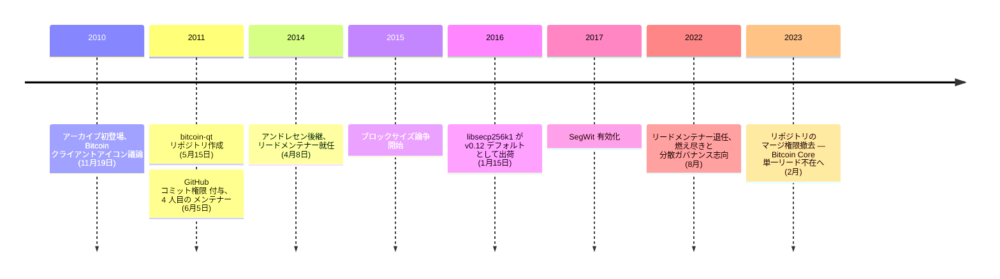

ウラジミール・ファン・デル・ラーン（オンライン名 **laanwj**）はオランダのソフトウェア開発者で、[ギャビン・アンドレセン](/BitcoinArchive/ja/participants/gavin-andresen/)の後を継いで Bitcoin Core の2代目リードメンテナーとなった人物である。Bitcoin 開発における公的な役割を除き、個人の経歴はほとんど公表されていない。

### 初期の関与
ファン・デル・ラーンはアーカイブに2010年11月19日、[Bitcoin クライアントのアイコンに関する議論](/BitcoinArchive/ja/entries/forum/bitcointalk/topic-64/2010-11-19-laanwj-msg22887/)で初めて登場する。そこで彼はスケール調整できるようSVG版が欲しい、と要望を出している──質感や仕上がりの観点からソフトウェアに向き合う開発者らしい、小さいが特徴的な発言だった。その後数か月間、Qt ベースの GUI クライアントへのパッチを寄せていき、2011年5月15日には整理のため独立した `bitcoin-qt` リポジトリーを作成した。このリポジトリーは後に本体の `bitcoin/bitcoin` プロジェクトへ統合された。

### GitHub コミット権限
2011年6月5日、アンドレセンはファン・デル・ラーンに [`bitcoin/bitcoin` GitHub リポジトリーのコミット権限を付与](/BitcoinArchive/ja/entries/aftermath/2011-09-13-bitcoin-github-migration-committers/)した。クリス・ムーア、ピーター・ウィーユ、ジェフ・ガージックに次ぐ4人目の被付与者だった。その後数年間、彼はプロジェクトで最も継続的にコードレビューとリリース管理を担う存在となっていった。

### リードメンテナー（2014–2022）
2014年4月8日、アンドレセンはリードメンテナー職を退き、ファン・デル・ラーンに引き継いだ。彼の統率下で Bitcoin Core は、[OpenSSL の secp256k1 実装を専用ライブラリー libsecp256k1 に置き換える v0.12 の重要な作業](/BitcoinArchive/ja/entries/aftermath/2016-01-15-libsecp256k1-replaces-openssl-bitcoin-core-v012/)を含め、数々の成果を出した。彼の任期は2015–2017 年のブロックサイズ論争の全期間、2017年の SegWit 有効化、そしてその後の静かだが堅実なインフラ整備期を通して続いた。

### 退任
2022年8月、ファン・デル・ラーンはリードメンテナーを退任した。理由として燃え尽きと、プロジェクトのガバナンスをさらに分散させたいという意図を挙げている。2023年2月にはリポジトリーから自らのマージ権限も撤去し、直接的なコミット権限を終了させた。以降、リードメンテナーの席は空位のままで、Bitcoin Core は単一のリード人物ではなく、コミット権を持つ複数の開発者による分散的な体制で維持されている。

### 意義
アンドレセンの任期がサトシからの引き継ぎと初期成長期を象徴するものだったとすれば、ファン・デル・ラーンの任期は、プロジェクトの最も争点の多い年月を淡々と遂行することで定義される。8年間の継続性がリファレンス実装をリーダーシップの交代・プロトコル論争・外圧を通じて前進させ続け、最終行為として自らコミット権限を放棄したことで、Bitcoin の分散化は、プロトコル層からプロジェクトのガバナンス自体へと拡張された。
