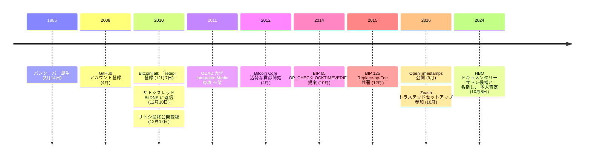

2010 年 12 月 7 日、BitcoinTalk に「retep」 という名前の新しいアカウントが登録された。3 日後、このアカウントの 2 番目の投稿は[サトシ・ナカモトのスレッド](/BitcoinArchive/ja/entries/forum/bitcointalk/topic-2181/2010-12-10-retep-re-fees-in-bitdns-confusion/) —— トランザクション置換手数料に関するもの —— に返信した:

> 「もちろん、正確に言えば、二つ目のトランザクションに手数料がある場合、入力と出力は*正確には*一致しない。」

2 日後、[サトシは最後の公開投稿](/BitcoinArchive/ja/entries/forum/bitcointalk/topic-2228/2010-12-12-satoshi-final-post/)を行って沈黙した。数年後、このアカウントのユーザー名は Peter Todd に変更された。Bitcoin Core 開発者のグレゴリー・マクスウェルは [Hacker News でこう書いている](https://news.ycombinator.com/item?id=41784567) —— 「retep が peter の逆綴りだと気づくのに 10 年近くかかった」。

2024 年 10 月、HBO のドキュメンタリー[「Money Electric: The Bitcoin Mystery」](/BitcoinArchive/ja/entries/aftermath/2024-10-08-hbo-money-electric-peter-todd/)はトッドをサトシ・ナカモトの正体候補として名指しし、2010 年 12 月の返信を証拠として挙げた。放送当日の CoinDesk への取材でトッドは映画製作者カレン・ホーバックを「藁にもすがる」 と評しつつ「もちろん、俺はサトシじゃない」 と明確に否定した。ドキュメンタリー本編でホーバックから問われた際は皮肉で「ばかげている。だが、まあそう言うなら、そうだよ、俺がサトシだ」 と返している。トッドは作品を無責任な主張として退けている。

ピーター・トッド（1985 年 3 月 14 日、カナダ・バンクーバー生まれ）は暗号学者、応用暗号コンサルタント、Bitcoin Core 開発者である。2011 年に OCAD 大学（オンタリオ・カレッジ・オブ・アート・アンド・デザイン）の Integrated Media 専攻を卒業、それ以前は地球物理学スタートアップ Gedex Inc. でアナログ電子工学の設計者として勤務していた。ビットコインへの主要貢献は [BIP 65 OP_CHECKLOCKTIMEVERIFY](/BitcoinArchive/ja/entries/aftermath/2014-10-01-peter-todd-bip-65-checklocktimeverify/)（2014）、[BIP 125 Replace-by-Fee](/BitcoinArchive/ja/entries/bip/2015-11-03-bip-0125/) の共著（2015）、[OpenTimestamps](/BitcoinArchive/ja/entries/aftermath/2016-09-15-peter-todd-opentimestamps-announcement/)（2016）。

### Bitcoin Core への貢献

トッドは 2012年4月から Bitcoin Core の活発な貢献者となり、最終的に Bitcoin Core の GitHub リポジトリで 11番目に多い貢献者となった。プロトコルレベルのセキュリティ、トランザクションポリシー、ネットワークの耐障害性に注力した。

### BIP 65: OP_CHECKLOCKTIMEVERIFY（2014年10月）
トッドは [BIP 65](/BitcoinArchive/ja/entries/aftermath/2014-10-01-peter-todd-bip-65-checklocktimeverify/) を提案し、トランザクション出力を指定された将来の時点まで使用不能にする新しいオペコードを導入した。ソフトフォークとしてデプロイされ、ペイメントチャネルおよび Lightning Network の構成要素となった。

### Replace-by-Fee（RBF）— BIP 125（2015年12月）
トッドが最も知られているのは Replace-by-Fee（RBF）の推進である。未確認トランザクションを手数料の高い新しいバージョンに置き換えることを可能にする仕組みで、[BIP 125](/BitcoinArchive/ja/entries/bip/2015-11-03-bip-0125/) としてデイヴィッド・A・ハーディングとの共著で正式に策定された。BIP の Rationale（根拠）は、サトシ・ナカモトのオリジナルのトランザクション置換メカニズムに概念を明示的に辿っている。

### [OpenTimestamps](/BitcoinArchive/ja/entries/aftermath/2016-09-15-peter-todd-opentimestamps-announcement/)（2016年9月）
トッドは OpenTimestamps を開発した。ビットコインブロックチェーンを利用して改ざん不可能なタイムスタンプを作成するオープンソースプロジェクトで、特定の時点で文書が存在していたことを証明できる。サトシがビットコインのコア設計に組み込んだタイムスタンプ機能を一般化したプロジェクトである。

### Zcash トラステッドセットアップセレモニー（2016年10月）
トッドは Zcash のトラステッドセットアップセレモニーの 6人の参加者の 1人だった。ブリティッシュコロンビア州をドライブしながら計算を実行し、ラップトップをファラデーケージで遮蔽し、終了後にハードウェアをプロパントーチで破壊した。参加したにもかかわらず、プロセスを痛烈に批判し、参加者間の共謀は証明不可能であり、未監査の決定論的ビルドはセレモニーを「暗号的なまやかし」にしていると述べた。

### その他の役職
トッドは Mastercoin および Dark Wallet でチーフサイエンティストを務め、プライバシー強化のためのステルスアドレス（BIP 63、未実装）の設計にも貢献した。2014年7月から Coinkite のコンサルタントとして勤務した。

