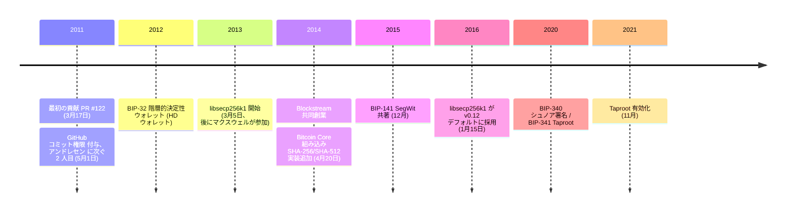

階層的決定性ウォレット。Segregated Witness。シュノア署名。Taproot。現代のすべてのビットコインウォレットの鍵導出方法、すべてのトランザクションが展性を回避する方法、ブロック容量の拡張、Taproot のプライバシーとスクリプトの柔軟性。これらを定義する 4 つの BIP のすべてを書いた／共著したのが **ピーター・ウィーユ**（GitHub と IRC では **sipa**）である。2013 年には、OpenSSL に代わって Bitcoin Core の署名バックエンドとなる目的特化型の楕円曲線ライブラリとして [libsecp256k1](/BitcoinArchive/ja/entries/aftermath/2016-01-15-libsecp256k1-replaces-openssl-bitcoin-core-v012/) も開始した。

ウィーユはベルギーのソフトウェア技術者。bitcoin/bitcoin への最初の貢献は [2011 年 3 月 17 日の PR #122](/BitcoinArchive/ja/entries/forum/github/pr-122/2011-03-17-pr-122-spent-per-txout/)。6 週間後にコミット権限を取得し、ギャビン・アンドレセンに次ぐ 2 番目の長期メンテナーとなった。2014 年に Blockstream を共同設立、後に Chaincode Labs へ。

## 初期の貢献（2011年）
ウィーユの bitcoin/bitcoin への最初の貢献は、[2011年3月17日の PR #122](/BitcoinArchive/ja/entries/forum/github/pr-122/2011-03-17-pr-122-spent-per-txout/) である。ウォレット構造の変更により、トランザクション出力ごとに使用済み状態を個別に追跡できるようにし、部分的な使用を可能にする変更だった。2011年5月1日、[ギャビン・アンドレセン](/BitcoinArchive/ja/participants/gavin-andresen/)が彼に [GitHub コミット権限を付与](/BitcoinArchive/ja/entries/aftermath/2011-09-13-bitcoin-github-migration-committers/)した。これによりウィーユは、アンドレセン自身の次、そして[ウラジミール・ファン・デル・ラーン](/BitcoinArchive/ja/participants/wladimir-van-der-laan/)よりも前の、長期メンテナーとして 2人目の地位を得た。

## Bitcoin Improvement Proposals
ウィーユはサトシ離脱後のビットコイン進化の驚くほど広い範囲をカバーする 4 本の BIP の著者または共著者である。

- **[BIP-32](/BitcoinArchive/ja/entries/bip/2012-02-11-bip-0032/)**（2012年）は階層的決定性ウォレット（HD ウォレット）。1 つのマスターシードから鍵ツリー全体を導出することで「頻繁なウォレットバックアップ」問題を解消。現代のあらゆるビットコインウォレットの基盤。この規格の初期の独立実装は、ヴィタリック・ブテリンの pybitcointools ライブラリにも見られる。詳細は[ブテリンの伝記](/BitcoinArchive/ja/participants/vitalik-buterin/)を参照。
- **[BIP-141](/BitcoinArchive/ja/entries/bip/2015-12-21-bip-0141/)**（2015年、エリック・ロンブロゾ、ジョンソン・ラウと共著）は Segregated Witness（SegWit）。トランザクションの展性を修正し、Lightning を可能にし、実効ブロック容量を増加。
- **[BIP-340](/BitcoinArchive/ja/entries/bip/2020-01-19-bip-0340/)**（2020年）— secp256k1 曲線上のシュノア署名。
- **[BIP-341](/BitcoinArchive/ja/entries/bip/2020-01-19-bip-0341/)**（2020年）— Taproot。2021年11月に有効化。

2015年から 2017年にかけてのブロックサイズ紛争では、ウィーユは大ブロック提案に対抗した Core 開発者派を代表する三人の中心人物の一人として名指しされている。詳しい経緯は[ブロックサイズ戦争の総覧](/BitcoinArchive/ja/entries/analysis/2015-08-15-block-size-war-2015-2017-overview/)にまとめられている。

## libsecp256k1
2013年3月5日、ウィーユは当初 GLV 手法エンドモーフィズムの性能実験として [libsecp256k1](/BitcoinArchive/ja/entries/aftermath/2016-01-15-libsecp256k1-replaces-openssl-bitcoin-core-v012/) を開始した。まもなく[グレゴリー・マクスウェル](/BitcoinArchive/ja/participants/gregory-maxwell/)が参加し、ライブラリーは OpenSSL の secp256k1 実装を目的別にフルリプレースするものへと成長した。2016年1月15日、Bitcoin Core v0.12 でデフォルトのバックエンドとして採用された。

## Blockstream と Chaincode Labs
ウィーユは 2014年、グレゴリー・マクスウェルらとともに Blockstream を共同創業し、後に Chaincode Labs にも参画した。一貫して Bitcoin Core の最も継続的なレビュアーであり、暗号設計者でもあり続けている。

## 意義
4 本の BIP と libsecp256k1 を合わせれば、ウィーユの直接的な設計作業は、現代のあらゆるビットコインウォレットが鍵を導出する方法、あらゆる現代のトランザクションが署名を検証する方法、あらゆる現代の決済がオンチェーンの展性を逃れる方法、あらゆる Taproot 出力が得るプライバシーとスクリプトの柔軟性、その全ての下地となっている。プロトコル自体にこれほど広い影響面を持つサトシ離脱後の貢献者はごく少ない。
