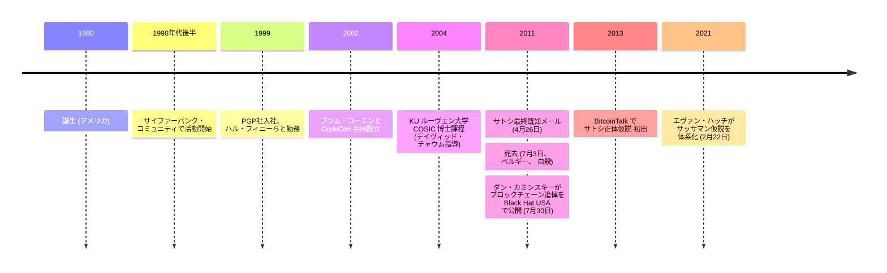

レン・サッサマン（1980 年 – 2011 年 7 月 3 日）はアメリカの暗号学者、サイファーパンク、プライバシー研究者である。本アーカイブで彼を記録する理由は、主に死後にビットコインに関連する二つの出来事にある：[ダン・カミンスキーによるブロックチェーン追悼](/BitcoinArchive/ja/entries/aftermath/2011-07-30-len-sassaman-blockchain-tribute/)（彼の死から数週間後に刻印）、そして 2013 年以降の公的議論で彼の名前をサトシ・ナカモトと結びつける [サトシ正体仮説](/BitcoinArchive/ja/entries/analysis/2011-07-03-sassaman-satoshi-identity-hypothesis/)。

### サイファーパンクと暗号学の活動
サッサマンは十代の頃からサイファーパンクコミュニティで活動し、約 15 年にわたってプライバシー関連プロジェクトに貢献した：

- **Mixmaster 匿名リメイラー** — サッサマンは Mixmaster のリード開発者・メンテナーになった。Mixmaster は通信解析を防ぐことを目的とした Type-II 匿名リメイラーであり、ランス・コットレルの初期作業の継続として、サイファーパンク時代の匿名性ツーリングの中核成果のひとつである。
- **PGP社** — フィル・ジマーマンの Pretty Good Privacy ソフトウェアを商品化した会社で、初期サイファーパンクの一人である [ハル・フィニー](/BitcoinArchive/ja/participants/hal-finney/) などとともに勤務した。
- **Anonymizer社** — 初期の商用匿名化サービス。
- **CodeCon** — BitTorrent の作者ブラム・コーエンと共同創設したカンファレンスシリーズ。新しいプライバシー・セキュリティ技術の動作するコードによる発表に焦点を当てた。
- **KU ルーヴェン大学 COSIC** — 死亡時点で、ベルギーの KU ルーヴェン大学の Computer Security and Industrial Cryptography（COSIC）研究グループに博士課程在籍者として所属し、リメイラー設計と暗号プロトコルの研究を行っていた。

### 結婚
サッサマンは暗号学者で計算機科学者のメレディス・L・パターソンと結婚していた。パターソン自身も、言語理論的セキュリティとパーサ関連の脆弱性の研究で活動する研究者である。

### 死
サッサマンは 2011 年 7 月 3 日にベルギーで亡くなった。パターソンは公の声明で、死因が「明確に自殺」であることを確認した。31 歳だった。

### 死後のビットコインとの関わり
本アーカイブにとってビットコイン関連の文脈はすべて死後のものである：

1. 2011 年 7 月 30 日、[ダン・カミンスキーが](/BitcoinArchive/ja/entries/aftermath/2011-07-30-len-sassaman-blockchain-tribute/)、ビットコインのブロックチェーンに埋め込んだサッサマンへの ASCII アート追悼を公に発表した。お披露目は Black Hat USA 2011 で行われた。
2. 2013 年 3 月以降（最初は BitcoinTalk のスレッド、その後 2021 年のエヴァン・ハッチの記事でより目立つ形で）、一部の論者がサッサマンをサトシ・ナカモトの正体候補として提案している。彼らが挙げる根拠は、タイミング（サッサマンの死は、サトシの [2011 年 4 月 26 日の最後の既知のメール](/BitcoinArchive/ja/entries/correspondence/gavin-andresen/2011-04-26-satoshi-to-andresen-alert-key/) の 3 か月後）と、サッサマンのサイファーパンクとしての経歴である。これは本アーカイブでは [独立した分析エントリー](/BitcoinArchive/ja/entries/analysis/2011-07-03-sassaman-satoshi-identity-hypothesis/) として、Bitcoin Institute の主張ではなく、明示的に推論として枠組みを与えて記録されている。

パターソンは、正体仮説について公に確認も否定もしていない。彼女の公的な発言は死因についてのみで、それ以外の事項には及んでいない。

*[編者注：サッサマンは 2008–2011 年の公的記録において、ビットコイン開発者またはサトシの通信相手としては登場しない。本アーカイブとの関連は、したがって死後の追悼とその後の正体仮説に関する議論に限定される。本伝記は、公的な記録が支える水準でビットコイン関連の事実を記録する。]*
