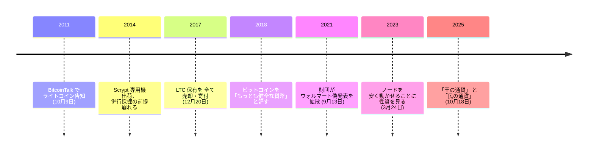

## ライトコインを作った動機

2011 年 10 月 9 日、チャーリー・リーは BitcoinTalk に一本の投稿を置いた。当時の彼は Google の技術者で、ビットコインは公開から二年半、価格は数ドルの水準にあった。投稿は[ライトコイン](/BitcoinArchive/ja/entries/currency/2026-07-27-litecoin-currency-overview/)の公開告知であり、同時に設計の意図を自分の言葉で書き残した一次資料でもある。

<!-- audit:quote-skip -->
> ライトコインは、我々の何人かが IRC に集まり、ビットコインに似た本物の代替通貨を作ろうとした結果である。

代替通貨、と彼は書いた。置き換えるとは書いていない。同じ投稿には、後に何度も引用されることになる一行がある。

<!-- audit:quote-skip -->
> 我々は、ビットコインの金に対する銀となるコインを作りたかった。

この比喩は、ライトコインがビットコインの上位互換を主張しないという宣言でもあった。金の代わりに銀を持つ人はいるが、銀が金を廃止するとは誰も言わない。

## 設計は「変えない理由」で組み立てられた

告知に書かれた設計方針は、追加ではなく抑制の言葉だった。

<!-- audit:quote-skip -->
> ライトコインの目標の一つは、正当な理由がない限り、（ビットコインで）動いているものを変えないことである。

実際の変更は四点に絞られている。いずれもビットコインの数値をちょうど 4 倍または 4 分の 1 にした値である。

| 設定値 | ビットコイン | ライトコイン | 関係 |
|---|---|---|---|
| プルーフ・オブ・ワーク | SHA-256 | Scrypt | 別の関数。公開時は両方を同時に採掘できる形として説明された |
| ブロック間隔 | 10 分 | 2.5 分 | 4 分の 1 |
| 供給上限 | 2,100 万枚 | 8,400 万枚 | 4 倍 |
| 半減の間隔 | 210,000 ブロック | 840,000 ブロック | 4 倍 |

この四点は、[ローンチ記録](/BitcoinArchive/ja/entries/aftermath/2011-10-13-litecoin-launch/)が扱うとおり内部的に整合している。[十二チェーンの設計比較](/BitcoinArchive/ja/entries/analysis/2026-07-26-altcoin-count-and-design-comparison/)は、ビットコインの上限をそのまま継いで規模だけを変えたチェーンの一群に、ライトコインを位置づけている。

Scrypt を選んだ理由も、告知では対立ではなく併存として説明されている。

<!-- audit:quote-skip -->
> 我々は Tenebrix の Scrypt プルーフ・オブ・ワークをとても気に入った。Scrypt を使えば、ビットコインを採掘しながらライトコインも採掘できる。

この「ビットコインを採掘しながら」という前提は、後に成立しなくなる。Scrypt 対応の専用機が 2014 年以降に出荷され、ライトコインの採掘もビットコインと同じく専用機の世界になったからだ（[ジハン・ウーの記録](/BitcoinArchive/ja/participants/jihan-wu/)が同じ変化を採掘機の側から扱う）。

## ビットコインについて語り続けた人

アルトコインの創設者としては珍しく、リーはビットコインを一貫して上に置いてきた。2018 年の取材では、自らの通貨を二番手と明言している。

<!-- audit:quote-skip -->
> ビットコインは明らかにこの空間でもっとも健全な貨幣であり、ライトコインは、私が言うなら二番目に健全だ。

同じ取材で、変えないことの理由も語っている。

<!-- audit:quote-skip -->
> ビットコインにはこの空間で最強の開発者たちがいる。変える理由がない、とりわけ自分がよく理解していないものを、変えるためだけに変える理由はない。

2023 年には、ビットコインの何が問題を解いているのかについて、装置の側から答えている。

<!-- audit:quote-skip -->
> ビットコインがこれを解決している理由は、誰もが自分のノードを簡単かつ安価に動かせることにある。

2025 年の取材では、両者の関係をこう言い換えた。

<!-- audit:quote-skip -->
> ビットコインは王のための通貨、ライトコインは民のための通貨だ。

そして同じ場で、暗号資産の初心者への助言として、自らの通貨ではなくビットコインを挙げている。

<!-- audit:quote-skip -->
> ビットコインを買い、しまい込み、何も売らず、暗号資産に関する他のことは何もしない。ただ座して、匿名でいることだ。

## 自分の保有を手放した

2017 年 12 月 20 日、リーはライトコインの保有をすべて売却または寄付したと公表した。理由として挙げたのは利益ではなく、自分の発言が価格を動かすことだった。

<!-- audit:quote-skip -->
> 私が LTC を空売りしていると考える人さえいる。だからある意味で、LTC を持ちながらそれについて発言するのは利益相反なのだ。私はそれほどの影響力を持ってしまっている。

創設者が自分の通貨を手放す判断は、暗号資産の歴史の中で数少ない。発表当時は価格の天井付近であり、売り抜けだという批判も受けた。彼自身が挙げた理由は上のとおりで、それ以上の動機は公開記録からは確認できない。

## 誤情報の増幅

2021 年 9 月 13 日、ライトコイン財団の公式アカウントが、ウォルマートとの提携を伝える偽のプレスリリースを拡散した。価格は一時急騰し、直後に崩れた。ウォルマートは記録に残る形で否定している。

<!-- audit:quote-skip -->
> ウォルマートは GlobeNewswire が配信したプレスリリースについて何も知らず、その内容に真実はない。ウォルマートはライトコインと何の関係もない。

リー自身も認めた。

<!-- audit:quote-skip -->
> 今回は本当にやらかした。二度とやらないよう努める。

## ライトコインが残したもの

[ライトコイン](/BitcoinArchive/ja/entries/currency/2026-07-27-litecoin-currency-overview/)の技術的な独自性は、後年ほとんど失われた。Scrypt の専用機耐性は崩れ、ブロック間隔と上限の差は数値の違いに留まる。それでも[フォークと隣接通貨の系譜](/BitcoinArchive/ja/entries/analysis/2008-10-31-bitcoin-fork-and-altcoin-genealogy/)がライトコインを外せないのは、これがネームコインに続く二番目の「ビットコインを複製して数値だけ変える」型を示し、その型から[ドージコイン](/BitcoinArchive/ja/entries/aftermath/2013-12-06-dogecoin-launch/)が直接派生したからだ。ドージコインはビットコインではなくライトコインを複製している。

供給設計の側から見れば、ライトコインはビットコインの上限つきスケジュールをそのまま継いだ側にいる（[固定供給 vs 自動調整通貨](/BitcoinArchive/ja/entries/analysis/2008-10-31-fixed-supply-vs-adjustable-money/)の比較表では、規模だけを変えて踏襲した例として置かれている）。上限を捨てた設計が現れるのは、もう少し後のことになる。
