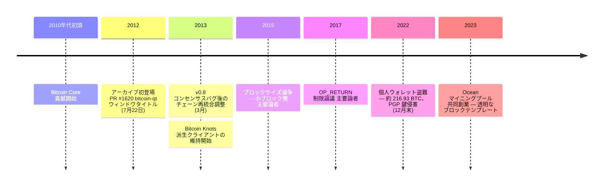

ルーク・ダッシュジュニア（GitHub および BitcoinTalk 上のハンドル名 **Luke-Jr**）はアメリカのソフトウェア開発者で、長期にわたる Bitcoin Core 貢献者である。Bitcoin 関連の公開活動を除き、個人の伝記的情報はあまり流通していない。

### Bitcoin Core
ダッシュジュニアはアーカイブに2012年7月22日、bitcoin-qt のウィンドウタイトルに関する [PR #1620](/BitcoinArchive/ja/entries/forum/github/pr-1620/2012-07-22-pr-1620-change-window-titles-to-bitcoin-qt-purpose-misc-re/) を開く形で登場する。2010年代初頭から継続的に Bitcoin Core の貢献者であり、パッチのレビュー、改善の提案、そして Bitcoin の原意と一致しないと判断した変更への反論を続けてきた。2013年3月、v0.8 のコンセンサスバグによって Bitcoin が2つの非互換なチェーンに分裂した際、彼はノードを v0.7 互換の挙動に戻してチェーンを再統合するコミュニティの対応を調整する役割を担った。

### Bitcoin Knots
ダッシュジュニアは **Bitcoin Knots** を維持している。これは Bitcoin Core の派生クライアントで、追加の設定可能性──特にメンプール・フィルターと `OP_RETURN` データ搬送出力に対する制限──を備える。Bitcoin Knots は、Bitcoin ノードが非金融データをどの程度中継することを許容すべきかというコミュニティ内の継続的な議論のなかで、くり返し参照される位置を占めてきた。

### Ocean マイニングプール
2023年、ダッシュジュニアは **Ocean** マイニングプールを共同創業した。掲げた目的は、ブロックテンプレートを透明に公開し、マイナーがマイニングするトランザクション集合に対する制御権を持てるようにすることで、Bitcoin のマイニングを分散化することである。

### ウォレット盗難（2022–2023）
2022年12月末、ダッシュジュニアの個人ウォレット──約216.93 BTC を保有していたと報告された──が流出した。彼はこの攻撃を、自身の PGP 鍵の侵害に起因すると説明した。侵害された PGP 鍵を通じて攻撃者がホットウォレットに到達したという。当時、個人開発者のウォレット損失としては比較的大きな公的議論の的となった事件の一つだった。

### 意義
ダッシュジュニアは、サトシ離脱後の Bitcoin の全期にわたって活動を続けてきた数少ない参加者の一人である──初期の Core パッチから、ブロックサイズ論争（小ブロック側）を経て、OP_RETURN・インスクリプションをめぐる議論まで、そして近年のマイニング分散化の取り組みまで。彼の立場はベースレイヤーの挙動変更に対して一貫して保守的であり、Bitcoin Knots の継続的なメンテナンスはその保守性の具体的な表現である。
