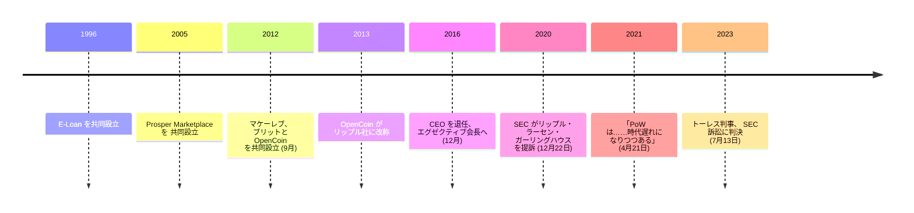

クリス・ラーセンは、暗号資産に触れる前にすでに二つのフィンテック企業を作り、売却していた。2012 年 9 月、彼は後に XRP レジャーを作ることになる会社を共同創業する。そして九年後、ビットコインを支えるその仕組みは正すべき誤りだと、業界に向けて語ることになる。

## リップル以前、すでに二度の出口を経験していた

ラーセンは 1996 年、オンライン住宅ローン会社の E-Loan を共同創業した。消費者が自分の FICO スコアを無料で見られるようにした最初の企業になるという、小さな透明性への取り組みが、この会社を特徴づけることになる。E-Loan は 2000 年 2 月までに時価総額およそ 10 億ドルに達した。ラーセンは 2005 年に CEO を退き、同じ年に会社は売却された。

彼はそこで止まらなかった。同じ 2005 年、ベトナムの伝統的な回転信用講「フイ」を手本にした個人間融資プラットフォーム、Prosper Marketplace を共同創業し、2006 年から 2012 年まで CEO を務めた。Prosper は、後にラーセンが暗号資産の世界で再び直面することになるのと同じ規制上の課題にぶつかる。2008 年、SEC は Prosper の融資証書を無登録証券だとして問題視し、同社は目論見書を提出し融資の仕組みを再設計して応じた。ラーセンは 2012 年 3 月 15 日に Prosper の CEO を辞任し、会長には留まった。

## 台帳から採掘を取り除く

半年後の 2012 年 9 月、ラーセンはジェド・マケーレブ、アーサー・ブリットとともに OpenCoin を共同創業する。マケーレブが前年から設計を始めていた、ビットコインの採掘工程を意図的に取り除いた台帳を中心に据えた会社だった。[その設計判断についてのマケーレブ自身の説明](/BitcoinArchive/ja/participants/jed-mccaleb/)は、それが何をもたらし何を犠牲にしたかを率直に語っている。OpenCoin は 2013 年 9 月にリップル社へ改称し、ラーセンは CEO を務めた後、2016 年 12 月にエグゼクティブ会長へ移った。

この会社が作った台帳の仕組みの詳細は [XRP 通貨ページ](/BitcoinArchive/ja/entries/currency/2026-07-27-xrp-currency-overview/)で扱っている。ユニークノードリスト、ジェネシス時点で生成された 1,000 億 XRP、エスクロー計画、そして創業者・経営陣が受け取ったもの、いずれもそこに含まれる。この取引について、ラーセン自身は言葉を濁さず、ビットコインにあってリップルの設計にはない性質をそのまま名指ししている。

<!-- audit:quote-skip -->
> ビットコインは明らかに極めて分散していて、前へ進める中心企業が存在しない。それは本当に見事な形だが、複製するのはとても難しい。

## 「時代遅れになりつつある」

アースデイである 2021 年 4 月 21 日、ラーセンは業界全体が(ビットコインだけでなく)プルーフ・オブ・ワークから離れるべきだと論じるエッセイを発表した。冒頭に置いたのは一つの数字である。

<!-- audit:quote-skip -->
> ビットコイン単体で年間平均 132 テラワット時を消費している (米国の住宅約 1,200 万戸分に相当する)

そして、その数字が土台となる技術について何を意味するかを、[十二チェーンの設計比較](/BitcoinArchive/ja/entries/analysis/2026-07-26-altcoin-count-and-design-comparison/)でも取り上げているビットコインの採掘への評価として、こう言い切った。

<!-- audit:quote-skip -->
> プルーフ・オブ・ワークをありのままに見るべきだ — 見事に設計された技術だが、今日の世界では時代遅れになりつつある。

ラーセンは批判の対象を注意深く切り分けている。彼はビットコインをはじめとするプルーフ・オブ・ワーク型のチェーンが別の検証方式へ移るべきだと主張しているのであり、それらがその条件のもとで失敗しているとは主張していない。彼が実例として挙げたのは、九年前に自らの会社が作り、すでに稼働していた台帳だった。

<!-- audit:quote-skip -->
> XRP レジャーは取引の検証にフェデレーテッド・コンセンサスを用いてきた……消費エネルギーは米国の住宅わずか 50 戸分に相当するにすぎない。

この比較はその条件のもとでは正確だが、別の条件については何も語っていない。XRP レジャーの検証者リストはハッシュパワーをめぐる公開競争ではなく、名指しされた二つの組織による推奨リストである。これはラーセンが提起したエネルギーの論点と表裏をなす取引であり、詳しくは[通貨ページ](/BitcoinArchive/ja/entries/currency/2026-07-27-xrp-currency-overview/)で扱う。

## その設計が招いた、五年越しの裁判

2012 年 9 月、ラーセンが関わって決めた当初の配分は、五年にわたる SEC 訴訟の争点となる。新会社に 800 億 XRP、残る 200 億 XRP は三人の創業者が個人として保有する配分だった。2020 年 12 月 22 日、SEC はリップル社・ラーセン・ブラッド・ガーリングハウスを相手取り、2013 年に遡る 13 億ドル相当の XRP 販売について提訴した。2023 年 7 月のアナリサ・トーレス判事の判決は、訴状にはなかった線引きを示す。XRP そのものは本質的に証券ではないが、リップルと直接交渉した機関投資家向けの販売は証券にあたり、取引所での匿名の買い手への販売は証券にあたらない、というものだ。争いのない事実についての裁判所自身の要約は、ラーセンが共同創業した台帳の設計意図をこう記している。

<!-- audit:quote-skip -->
> 彼らは、2009 年に登場した最初のブロックチェーン台帳であるビットコインのブロックチェーンに対し、より速く、より安く、よりエネルギー効率の高い代替物を作ることを目指していた。

## ビットコインにおける意義

この記録に登場する創業者の中で、ビットコインに出会う前にすでに二つの会社を作っていた人物はラーセンを含めて数少ない。それは彼のビットコイン評が、最初の反応ではなく、より長いキャリアを通じた比較であることを意味する。彼は一貫して、ビットコインの技術設計が失敗しているとは主張してこなかった。主張しているのは、それを支える特定の仕組み、すなわち採掘が、その費用を避けるために自ら設計した台帳と比べたとき、必要以上にかかっているということだ。その台帳自身も、人においても当初の供給量においても、集中を抱えている。この集中こそが、ビットコイン自身の答えと引き換えにした取引だ。その答えとは、口説くべき採掘プールはなく、尋ねるべき創業者ももういないということである。この取引は[固定供給と自動調整の比較](/BitcoinArchive/ja/entries/analysis/2008-10-31-fixed-supply-vs-adjustable-money/)と[デジタルゴールドとしての構造的特徴](/BitcoinArchive/ja/entries/analysis/2008-10-31-bitcoin-digital-gold-structural-features/)でさらに詳しく検討している。
