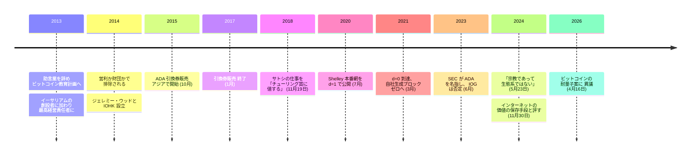

チャールズ・ホスキンソンがこの歴史に現れたときの肩書きは、教える人だった。2013 年、彼は助言業の職を辞してビットコイン教育計画を始めている。当時まだ講座というものが存在しなかった対象について、講座を作る仕事である。同じ年の末には[ヴィタリック・ブテリン](/BitcoinArchive/ja/participants/vitalik-buterin/)の周りに集まった集団に加わり、[イーサリアム](/BitcoinArchive/ja/entries/currency/2026-07-27-ethereum-currency-overview/)の創設者の一人として最高経営責任者の座に就いた。2014 年、彼は他の創設者たちに排除される。争点はイーサリアムを営利企業とするか財団とするかで、前者を望んだのがホスキンソン、後者がブテリンだった。その年の後半、彼は元同僚のジェレミー・ウッドと IOHK を設立し、そこから[カルダノ](/BitcoinArchive/ja/entries/currency/2026-07-27-cardano-currency-overview/)が生まれる。

興味深いのはチェーンの側ではない。彼は十二年にわたって、公の場で、長く、しかも立場を変えながらビットコインについて語り続けてきた。

## 2018 年の評価 — チューリング賞と、ハッシュレートへの異議

2018 年 11 月、StartEngine Summit の会場で、ホスキンソンは Bitcoin Magazine の取材に答えている。最初に出てきたのは留保なしの賛辞だった。

<!-- audit:quote-skip -->
> サトシは完全に魔法のような、素晴らしいことをやってのけた。チューリング賞に値する。驚くべきものだ。

同じ取材で、彼はそこに二つの限界を読み込んでいる。一つ目は分類の話だった。

<!-- audit:quote-skip -->
> これは貨幣ではない。商品、あるいは価値の保存手段だ。

二つ目は観測の話で、採掘の集中を扱う文献が一貫して指摘してきたものと同じ論点である。

<!-- audit:quote-skip -->
> ビットコインネットワークのハッシュレートを握っているのは、参加者の 10% にも満たない。

この二つはカルダノの設計を支える柱でもある。ビットコインが貨幣ではなく商品なら、決済と契約を狙うチェーンはそもそも競合しない。プルーフ・オブ・ワークが少数の主体に支配を集めるなら、それを置き換えるのは近道ではなく是正になる。

## カルダノは逆の判断で組み立てられた

カルダノ自身の文書は、ビットコインに対する設計判断を明示的に書いている。しかも、その判断が争いのあるものだと認めている点で珍しい。合意形成について。

<!-- audit:quote-skip -->
> 暗号通貨にプルーフ・オブ・ステークを使うことは激しく議論される設計判断である。それでも、安全な投票の仕組みを導入でき、規模を拡大する余地が大きく、より風変わりな誘因設計を許すという理由から、我々はこれを採ることにした。

構造について。カルダノは価値の記録と計算を切り離した。決済層が価値を動かし、別の計算層が契約の論理を走らせる。

<!-- audit:quote-skip -->
> したがって我々は、価値の会計処理を、その価値がなぜ動いたのかという物語から切り離すという立場を選んだ。

そして匿名性について。ここでのビットコインとの分岐は、意図的で、しかも徹底している。

<!-- audit:quote-skip -->
> 中央の主体を匿名化し中抜きしようとする過程で、ビットコインとその同時代の設計は、商取引における安定した識別子・付帯情報・評判の必要性まで捨ててしまった。

ビットコインが安定した識別子を持たないことを、迂回すべき不都合として扱っていない。カルダノが継がないと決めたものとして名指ししている。[十二チェーンの設計比較](/BitcoinArchive/ja/entries/analysis/2026-07-26-altcoin-count-and-design-comparison/)も、カルダノがビットコインに対して掲げるこの理由付けを同じ形でまとめている。

| 軸 | ビットコイン | カルダノ |
|---|---|---|
| 合意形成 | プルーフ・オブ・ワーク | プルーフ・オブ・ステーク。安全な投票・規模を拡げる余地・誘因設計のために採った |
| 識別子 | 安定した識別子・付帯情報・評判を捨てた | 商取引に必要なものとして保った |
| 供給 | 上限あり | 上限あり — 両者が一致する唯一の軸 |

最後の行があるために、[固定供給と自動調整の比較](/BitcoinArchive/ja/entries/analysis/2008-10-31-fixed-supply-vs-adjustable-money/)はカルダノをビットコイン・ライトコインと同じ上限あり群に置いている。分岐は希少性ではなく、合意形成と識別子の側を走っている。

## 2024 年の評価 — もう必要ない

チューリング賞の一行から六年後、評価は反転していた。2024 年 5 月に公開された録音取材から。

<!-- audit:quote-skip -->
> 業界が生き延びるのに、もはやビットコインは必要ない。

同じ発言の中で、コードではなく文化についてはこう言っている。

<!-- audit:quote-skip -->
> あれは宗教であって、生態系ではない。

この反転はきれいな線を描かない。そして、アーカイブはそれを整えない。半年後の 2024 年 11 月の配信では、彼はビットコインをインターネットにおける価値の保存手段と呼んでいる。2018 年の立場の言い直しであって、撤回ではない。発言のあいだで何が変わったのかは、少なくとも分析の側では見えない。この並びを一本の進化した判断として読むのは、記録が持っていない一貫性を後から与えることになる。

2026 年 4 月、彼はビットコイン自身の耐量子計算の議論に踏み込んだ。期限を過ぎた旧来の宛先形式の資金を使用不能にする案に対してである。

<!-- audit:quote-skip -->
> その設計では少なくとも 170 万ビットコインが回収不能になる。サトシのコインを盗むのを楽しむといい。

この異議は実在の論点で、ビットコインの開発者たち自身が同じことを議論している。同時にここは、彼の論評が自分のチェーンの優位を語るものから、ビットコインの特定の提案についての技術的な主張へ変わった地点でもある。

## 彼自身の記録が示すもの

カルダノの歴史には、公表されてきた枠組みと並べると緊張の残る事柄が二つある。どちらも当事者自身か規制当局が記録したもので、どちらも彼がビットコインに向けた分散の議論と直接関係する。

**ブロック生成は完全な中央集権から始まった。** それを支配していた変数について、IOG 自身の技術ブログがこう書いている。分散度を表す `d` が 1 のとき、すべてのブロックは自社のノードから出る。

<!-- audit:quote-skip -->
> d=1 のとき、すべてのブロックは IOG の中核ノードが Ouroboros ビザンチン障害耐性 (OBFT) 方式で生成する。

カルダノは 2020 年 7 月に Shelley 本番網を `d=1` で公開し、自社生成ブロックがゼロになる `d=0` に到達したのは 2021 年 3 月である。その間は八か月。しかもその記述は批判者の要約ではなく当事者自身のものである。

**配分について。** 2023 年 11 月、ホスキンソンは X 上で、カルダノは ICO を一度も行っていないと述べた。

<!-- audit:quote-skip -->
> カルダノの ICO は存在しなかった。あったのは配分に向けたエアドロップであり、その後、互いに面識のない何千人もが取引所で ADA を売買し、自分たちの企画にカルダノを使った。

一方、カルダノ自身のジェネシス配分ページは、2015 年 10 月から 2017 年 1 月初頭にかけてアジアで四段階に分けて実施された公開引換券販売を記録し、販売された引換券の 20% にあたる 5,185,414,108 ADA が IOHK・EMURGO・カルダノ財団に割り当てられたと書いている。この形を「ICO」と呼ぶかどうかは言葉の問題である。配分そのものは争点ではない。企画の側が公開している。

これとは別に、米国証券取引委員会は 2023 年 6 月の Coinbase・Binance に対する提訴で、未登録証券にあたると主張する資産の中に ADA を挙げた。IOG は同じ週にこれを否定している。

<!-- audit:quote-skip -->
> ADA が米国証券法上の証券にあたることは、いかなる状況においてもない。過去にもなかった。

その後、当局は Binance の件から ADA を外す申立てを行い、Coinbase の件は全面的に取り下げた。つまりこの分類は、判断が下されたのではなく、訴訟上の立場が放棄されたものである。この二件の提訴で、ビットコインは名指しされていない。この非対称は当局の好意ではなく、発行主体が存在しないことから生じている。

## ビットコインにおける意義

ホスキンソンは、ある型のもっとも分かりやすい実例である。ビットコインからもっとも鋭く離れた創設者ほど、ビットコインを深く読んでいることが多く、その異議は退けではなく技術的に具体的である。プルーフ・オブ・ステーク、層に分けた構造、任意の識別子 — いずれもビットコインの設計が意図的に閉じている問いへの答えになっている。カルダノは[フォークと隣接通貨の系譜](/BitcoinArchive/ja/entries/analysis/2008-10-31-bitcoin-fork-and-altcoin-genealogy/)がたどる技術的血統の外にある。合意形成の由来がビットコインのソースコードではなく、学術的なプルーフ・オブ・ステーク研究にあるからだ。それでも彼のビットコイン評はビットコインの歴史に属する。[ウェイ・ダイの貨幣政策批判](/BitcoinArchive/ja/entries/aftermath/2013-04-21-wei-dai-bitcoin-monetary-policy-critique/)と同じ理由で — この仕組みについて人が何を言ったかは、この仕組みに何が起きたかの一部である。
