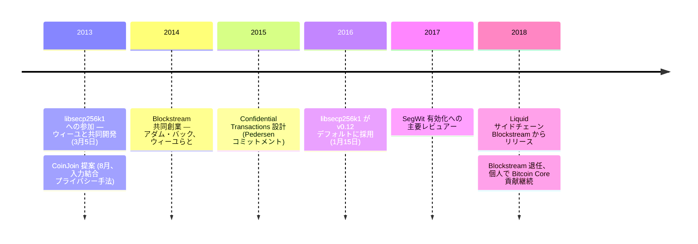

CoinJoin と Confidential Transactions は、ビットコインのプライバシー強化提案として最も知られながら本体チェーンには採用されなかった 2 つで、いずれもグレゴリー・マクスウェルの設計である。どちらもビットコインのメインチェーンでは動かないが、Wasabi、JoinMarket、Liquid など一世代のプライバシー研究と、暗号通貨プライバシー文献の広い領域を形成した。

マクスウェル（オンライン名 **gmaxwell**）は Bitcoin Core の長期貢献者。2013 年 3 月の[ピーター・ウィーユ](/BitcoinArchive/ja/participants/pieter-wuille/)の [libsecp256k1](/BitcoinArchive/ja/entries/aftermath/2016-01-15-libsecp256k1-replaces-openssl-bitcoin-core-v012/) 立ち上げに合流、2014 年に[アダム・バック](/BitcoinArchive/ja/participants/adam-back/)およびウィーユとともに Blockstream を共同設立、現代の Bitcoin プロトコルスタックの主要レビュアーとして残っている。

## libsecp256k1
[ピーター・ウィーユ](/BitcoinArchive/ja/participants/pieter-wuille/)が 2013年3月5日に [libsecp256k1 ライブラリー](/BitcoinArchive/ja/entries/aftermath/2016-01-15-libsecp256k1-replaces-openssl-bitcoin-core-v012/)を開始した直後、マクスウェルはこの取り組みに参加した。二人の共同作業のもとで、ライブラリーは性能実験から、OpenSSL の secp256k1 実装を専用に置き換える存在へと拡大し、2016年1月15日に Bitcoin Core v0.12 のデフォルトバックエンドとして採用された。

## CoinJoin と Confidential Transactions
マクスウェルが最も広く引用されるプライバシー関連の貢献は 2 つある。1 つは **CoinJoin** 構成で、複数ユーザーの支払いを 1 つのトランザクションに結合することで、単純な入力→出力ヒューリスティックを無効化する手法である。もう 1 つは **Confidential Transactions** で、Pedersen コミットメントの背後にトランザクション金額を隠しつつ、価値保存の検証可能性を維持するスキームである。

## Blockstream
2014年、マクスウェルは[アダム・バック](/BitcoinArchive/ja/participants/adam-back/)、[ピーター・ウィーユ](/BitcoinArchive/ja/participants/pieter-wuille/)らとともにビットコインインフラ企業 Blockstream を共同創業した。Blockstream はサイドチェーン（Liquid）、衛星ブロック配信、そして Bitcoin Core 開発の継続的支援などと関連してきた。

## 意義
マクスウェルはビットコインの暗号工学と開発者文化の交点に位置する。すなわち、長文のフォーラム・メーリングリスト投稿を通じて微妙なプロトコル挙動を教える教師であり、現代のビットコインスタックが依拠するライブラリーと基礎プリミティブの著者でもある、生産的なレビュアーである。彼のプライバシー構成は特に、ベースプロトコル自体がそれらを取り込まない選択をした場合でも、秘匿性レイヤーでビットコインが「なり得た」姿の多くを素描したものと言える。
