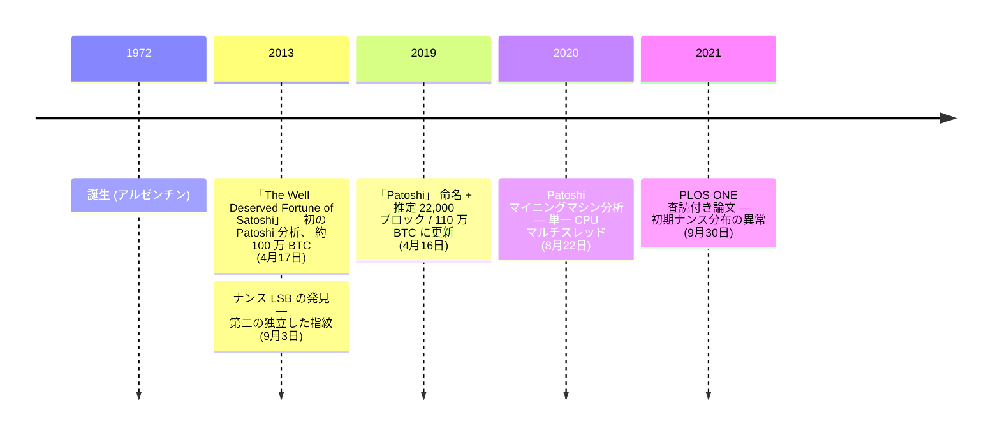

2013 年 4 月 17 日、アルゼンチンの暗号学者セルジオ・デミアン・ラーナーが自身のブログ Bitslog で[「サトシ・ナカモトの正当な財産」](/BitcoinArchive/ja/entries/aftermath/2013-04-17-sergio-lerner-patoshi-analysis/)を公開した。最初の 36,288 ブロック分の ExtraNonce フィールドを追跡し、ビットコインの最初の 1 年間に約 100 万 BTC を採掘した単一の実体を特定した。これらのコインは事実上一度も使われていなかった。5 か月後、ラーナーは同じマイナーの[ナンス値に第 2 の指紋を発見](/BitcoinArchive/ja/entries/aftermath/2013-09-03-sergio-lerner-nonce-lsb-discovery/)、2019 年には[このパターンを「Patoshi」 と命名](/BitcoinArchive/ja/entries/aftermath/2019-04-16-sergio-lerner-patoshi-naming/)し、件数を約 22,000 ブロック・約 110 万 BTC に修正、2020 年には[採掘機を再構成](/BitcoinArchive/ja/entries/aftermath/2020-08-22-sergio-lerner-patoshi-mining-machine/) —— 単一の高性能 CPU が 5 つにナンス空間分割されたスレッドを並列実行、他の初期マイナーより約 4.3 倍速い構成だった。

ラーナーの解析はビットコイン史上最も重要なブロックチェーンフォレンジック研究である。[サトシ・ナカモト](/BitcoinArchive/ja/participants/satoshi-nakamoto/)は単一マシンでビットコイン総量 2,100 万のおよそ 5% を採掘し、一度も使わずにいることを確立した。

### 最初の Patoshi 分析（2013年4月）
2013年4月17日、ラーナーは[「The Well Deserved Fortune of Satoshi Nakamoto」](/BitcoinArchive/ja/entries/aftermath/2013-04-17-sergio-lerner-patoshi-analysis/)を発表した——ビットコインの最初期のマイニングパターンに関する初の体系的分析である。最初の 36,288 ブロックにわたるコインベーストランザクションの ExtraNonce フィールドを追跡し、ビットコインの最初の 1年間に約 100 万 BTC を採掘した単一のエンティティを特定した。これらのコインは事実上一度も使用されていなかった。

### ナンス LSB の発見（2013年9月）
5 ヵ月後、ラーナーは[第二の独立した指紋を発見した](/BitcoinArchive/ja/entries/aftermath/2013-09-03-sergio-lerner-nonce-lsb-discovery/)。支配的マイナーのブロックにおけるナンス値の最下位バイト（LSB）が、256 通りの値のうち約 50個に制限されていた——ナンス探索空間を並列スレッドに分割するカスタムマイニングソフトウェアと一致するパターンだった。このマイナーが標準のビットコインクライアントではなく、改変されたソフトウェアを使用していたことが証明された。

### 「Patoshi」命名（2019年4月）
[「The Return of the Deniers and the Revenge of Patoshi」](/BitcoinArchive/ja/entries/aftermath/2019-04-16-sergio-lerner-patoshi-naming/)で、ラーナーは「Patoshi」——Pattern と Satoshi の合成語——という用語を提唱し、以降のすべての研究で標準的な呼称となった。推定を約 22,000 ブロック・約 110 万 BTC に更新した。タイムスタンプ逆転分析により、ほぼ数学的な証明を提供した——連続する Patoshi ブロック間のタイムスタンプ逆転がゼロであるのに対し、非 Patoshi ブロック間では 224回であり、単一の PC クロックの使用が証明された。

### マイニングマシン（2020年8月）
ラーナーは、Patoshi マイナーが 50 台以上のネットワーク接続されたコンピューターではなく、マルチスレッドを備えた単一のハイエンド CPU を使用したと[結論づけた](/BitcoinArchive/ja/entries/aftermath/2020-08-22-sergio-lerner-patoshi-mining-machine/)。ナンス空間は 5 つのサブレンジに分割され、並列スレッドでスキャンされていた。SSE2 の最適化が使用された可能性が高い。このマシンは他の初期マイナーの約 4.3倍の速度であった。

### 歴史的意義
ラーナーの研究は、[サトシ・ナカモト](/BitcoinArchive/ja/participants/satoshi-nakamoto/)がビットコインの総供給量 2,100 万の約 5%を蓄積し、一度も使用しないことを選んだことを確立した。この発見は、ビットコインの経済性、サトシの動機、初期ビットコインの歴史の解釈に重大な意味を持つ。彼の研究は複数の研究者により独立して検証・拡張されている。
