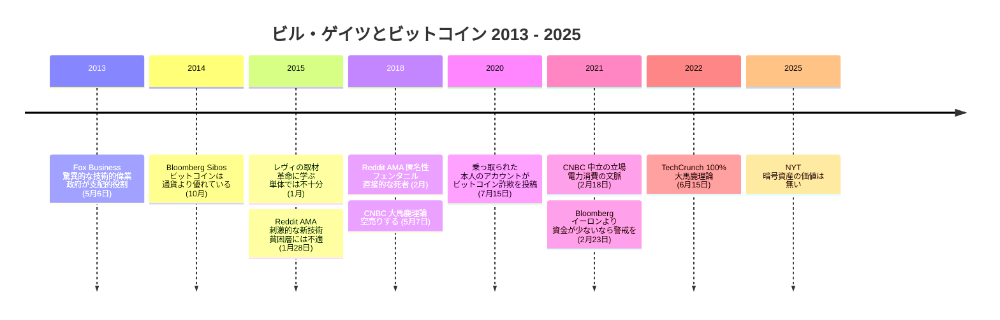

2013 年 5 月 6 日の午後、オマハでのバークシャー・ハサウェイ年次総会から二日後。Fox Business のアンカー、リズ・クレイマンがウォーレン・バフェットとビル・ゲイツをデスクに迎えていたところに、チャーリー・マンガーが席に着いた。放送の字幕に残るクレイマンの質問はこうだ。「どうしてもビットコインについて伺いたかったんです。世間では次の大物かもしれないと言われている、あのデジタル通貨です。どう思われますか？」

マンガーが先に答えた。

<!-- audit:quote-skip -->
> 殺鼠剤だと思うね。

笑いが起き、デスクの誰かが「彼は『未定』としておこう」と混ぜ返した。ビットコインの作り手が何をしようとしているのか理解しているのかと問われたマンガーは、「いや。だが深く怪しげなものだと見ている」と付け加えた。クレイマンがもう一人の客に向き直る。「ビットコイン、ビルはどうですか？」

<!-- audit:quote-skip -->
> 驚異的な技術的偉業だと思う。ただ、そこは政府が支配的な役割を維持していく領域だ。

バフェットはどちらも選ばずに締めた。「チャーリーかビルの、どちらかが正しいと思うよ」。マイクロソフトの共同創業者は一文のうちに、デスクの他の誰もが混ぜて論じていた二つの問いを切り分けていた。この工学に何の価値があるかと、この資産に何が許されるか。以後 12 年、ゲイツがビットコインについて語った言葉はすべて、この線を引いた場所から一歩も動かしていない。

## 消えかけた一句

この発言の記録は、その知名度に比べて驚くほど薄い。2013 年当時に主要メディアがこれを報じた記事は、本アーカイブの調査では見つかっていない。Wayback Machine にはその 5 月の Fox Business のビットコイン関連ページのスナップショットが一つも無く、同じ日の朝にバフェットとゲイツが出演した CNBC の番組の公式記録は 70 ページに及ぶが、ビットコインへの言及は一度も出てこない。このやり取りは午後の一番組で一度だけ起き、放送局の当該映像ページは後に消えた。

一句を保存したのはビットコインのフォーラムだった。放送の翌日、BitcoinTalk に「2013-05-06 Fox Business: Buffet/Gates/Munger on Bitcoin: Rat Poison, Flakey」と題したスレッドが立ち、5 月 8 日には三人の評決を並べて書き留めた返信が付いた。同じ 5 月 8 日に立った別のスレッドはゲイツの一句をタイトルに掲げたが、そちらは「techno tour de force」と聞き取っていた。同じ放送への二つの聞き取りが何年も併走し、さらに第三の形「technological tour de force」が、引用サイトや印刷グッズにまで広がった。本アーカイブが確認した掲載には、出典を付けたものが一つも無い。現存するクリップの音声が決着を付ける。ゲイツが言ったのは「technical」である。

| 流通した語形 | 出典付きの最初の出現 | たどり着く先 |
|---|---|---|
| a technical tour de force | BitcoinTalk の返信（2013 年 5 月 8 日） | 放送の音声。現存クリップで確認済み |
| a techno tour de force | BitcoinTalk のスレッドタイトル（2013 年 5 月 8 日） | 同じ放送。別の聞き手の聞き違い |
| a technological tour de force | 引用集サイト（日付なし） | 本アーカイブが確認できたどの掲載にも出典が無い |

一句はフォーラムと、二組の競合する耳と、再アップロードされたクリップを経由して生き残った。一方、隣で発された「殺鼠剤」のほうは独り歩きを始めた。マンガー、バフェット、ゲイツの三人は 2018 年 5 月にもっと辛辣な批判をそろって繰り返しており、後年の語り直しでは二つの場面がひとつに混ざって伝わることが多い。

## 賞賛は技術に向き続けた

ゲイツは 2014 年 10 月、国際銀行会議 Sibos で再びビットコインに触れた。2013 年の一文に含まれていた技術面の評価が、ここで具体的になっていく。「ビットコインが刺激的なのは、どこまで安くできるかを示しているからだ」と Bloomberg に語っている。「ビットコインは通貨より優れている。物理的に同じ場所にいる必要がないし、大きな取引では現金はかなり不便になるからね」。2015 年 1 月のスティーブン・レヴィのインタビューでは、この潮流の不可逆性を認めると同時に境界を引いた。「ビットコインの革命に学んだものが必要だ。ただ、ビットコイン単体では十分ではない」。その数日後の Reddit AMA では「ビットコインは刺激的な新技術だ」と書いている。

同じ AMA は、ゲイツ財団の貧困層向けデジタル通貨事業がビットコインを基盤に使わない理由も説明していて、その二つの理由はどちらもプロトコルの工学に触れていない。価値が激しく上下する通貨は蓄えのない人々には不適切で、取り消せない送金は間違いを吸収できない人々には不適切だ、という理由である。設計は設計どおりに動いていた。設計が目指したものが、彼の顧客の必要と違っただけだ。

## 批判は技術の外へ

2018 年以降、ゲイツの発言は明確に否定へ転じる。そして、そのすべてが設計以外のものを狙っている。

| 日付 | 場 | 発言 | 向かった先 |
|---|---|---|---|
| 2018 年 2 月 | Reddit AMA | 暗号通貨の「主要な特徴」は匿名性であり、フェンタニル購入を可能にしている。「かなり直接的な形で死者を出した稀な技術」 | 犯罪利用 |
| 2018 年 5 月 | CNBC（オマハ） | 「資産クラスとして何も生産していない。値上がりを期待すべきではない。純粋な『大馬鹿理論（greater fool theory）』型の投資だ」「簡単な方法があるなら空売りする」 | 機械ではなく資産 |
| 2021 年 2 月 | CNBC | 「ビットコインは保有していないし、空売りもしていない。中立の立場だ」— マイニングの電力消費の文脈で問われて | 運用コスト |
| 2021 年 2 月 | Bloomberg | 「イーロンは莫大な資金があって洗練されている。……イーロンより資金が少ないなら、警戒したほうがいい」 | 個人の投機 |
| 2022 年 6 月 | TechCrunch の会議 | 暗号資産と NFT は「100% 大馬鹿理論に基づく」 | 資産クラス |
| 2025 年 | ニューヨーク・タイムズ（二次報道経由） | 暗号資産の価値を問われて「無い。高い知能指数の持ち主たちが、あれで自分を欺いてきた」 | 資産クラス |

七年分の発言を通して、型は崩れない。匿名性と犯罪、投機と大馬鹿理論、電力、個人投資家の被害。2018 年のフェンタニル発言はゲイツがビットコインに向けた最も苛烈な言葉だが、それはビットコインで何が買われているかへの異議だ。2021 年の電力発言が技術に最も近づいた瞬間だが、それは機械の運用に何がかかるかの話であって、機械が動くかどうかの話ではない。ここに集めた 12 年分の発言の中で、ゲイツは工学への評決を一度も撤回していない。そして一度も繰り返してもいない。この記録の範囲では、設計そのものへの評価は 2013 年の一文だけである。

## ビットコインにおける意義

ゲイツの 2013 年の一文は、[他者がサトシについて語った言葉の記録](/BitcoinArchive/ja/entries/analysis/2008-08-21-what-they-said-about-satoshi/)で検証者たちが時間をかけてやったことを、一息でやってのけた。仕事の出来と、現象の行方を、別々に採点することである。ダン・カミンスキーはコードを攻撃し「チームか天才」と認めながら、通貨そのものにはなお怯えていた。ゲイツは同じ切り分けを、言い切りと但し書きの一文に圧縮した。展開し続けたのは但し書きのほうだ。「政府が支配的な役割を維持していく」という読みは、後年の異議のすべてを貫いている。匿名性が問題なのは国家が資金洗浄を取り締まるからで、資産が熱狂なのは何の裏付けも無いからで、財団のデジタル通貨は規制されたレールの上を走る。ゲイツは機械が壊れていると論じたことは一度もない。機械の領土が他人のものだと論じ続けたのである。

後年の記録には、本人の意思によらない一項がある。2020 年 7 月、[Twitter 史上最大のセキュリティ侵害](/BitcoinArchive/ja/entries/aftermath/2020-07-15-twitter-hack-bitcoin-scam/)が他の多数のアカウントとともに彼のアカウントを乗っ取り、ビットコイン配布詐欺を投稿した。暗号資産と犯罪について警告してきた当人が、一つの午後だけ、その経路にされた。

今も記録に欠けているものは、この記録の始まり方と対をなしている。2013 年の発言のうち誰でも確かめられる形で残っているのはフォーラムのスレッドと再アップロードされたクリップだけで、放送の録画そのものはテレビアーカイブの中にアクセス制限付きで眠っている。2025 年の「無い」は、本アーカイブがまだ一次記事を特定できていないニューヨーク・タイムズのインタビューの、二次報道によってしか現存しない。ビットコインの設計が外の世界から受け取った賞賛の中でも屈指の技術的重みを持つこの一句は、12 年間、サトシ自身の記録と同じ生き方をしてきた。たまたま聞いていた誰かによって、保存されるという生き方である。
