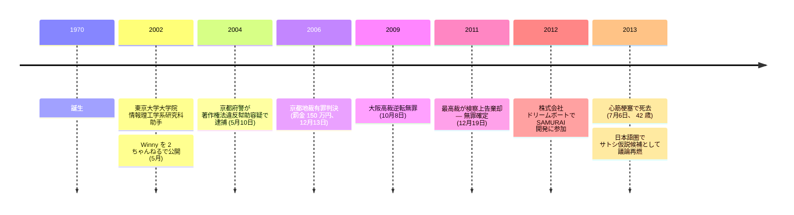

金子勇（1970 年 – 2013 年 7 月 6 日）は日本の研究者・ソフトウェア開発者である。本アーカイブで彼を記録する理由は、主に死後の議論で彼の名前をサトシ・ナカモトと結びつける[サトシ正体仮説](/BitcoinArchive/ja/entries/analysis/2013-07-06-kaneko-isamu-satoshi-identity-hypothesis/)である — これは日本語圏のフォーラムと技術系メディアで繰り返し取り上げられているが、英語圏のビットコイン議論ではほぼ知られていない。

**金子勇のビットコイン関連年表**

**Winny（2002 年）：**

金子は東京大学大学院情報理工学系研究科の助手を務めていた時期、2002 年 5 月に[2 ちゃんねる](https://ja.wikipedia.org/wiki/2%E3%81%A1%E3%82%83%E3%82%93%E3%81%AD%E3%82%8B)上で **Winny** と呼ばれる P2P ファイル共有システムを公開した。Winny は、各コンテンツの発信元を否認可能にするように設計されたルーティング方式を採用しており、ピーク時には日本国内で数百万のユーザーを擁するネットワークとなった。Winny の設計は Freenet、Gnutella、匿名ルーティング文献に依拠している。

**著作権法違反幇助裁判（2004–2011 年）：**

2004 年 5 月、京都府警は金子を著作権法違反幇助の容疑で逮捕した。検察側の主張は、Winny を開発・配布したことで、Winny を使って著作物を共有したユーザーの行為を幇助した、というものだった。

| 日付 | 出来事 |
|---|---|
| 2004 年 5 月 10 日 | 京都府警逮捕 |
| 2006 年 12 月 13 日 | 京都地裁有罪判決（罰金 150 万円） |
| 2009 年 10 月 8 日 | 大阪高裁逆転無罪 |
| 2011 年 12 月 19 日 | 最高裁検察側上告棄却、無罪確定 |

本裁判は、ツール開発者の刑事責任に関する画期的判例として、日本の技術政策議論で広く引用されている。

**裁判後とその後：**

無罪確定後、金子は商用ソフトウェア開発に再び従事した — 2012 年には株式会社ドリームボートで SAMURAI（コンテンツ配信プラットフォーム）の開発に参加した。

**死：**

金子は 2013 年 7 月 6 日に心筋梗塞で死去した。42 歳だった。

**死後のサトシ仮説との関わり：**

本アーカイブにおけるビットコイン関連の文脈はすべて死後のものである。日本語圏（特に 2 ちゃんねる／5 ちゃんねるの派生議論や日本語の技術系メディア）では、金子をサトシ・ナカモトの正体候補として議論する声が繰り返し現れる。論じ方は、日本人名形の仮名としての「Satoshi Nakamoto」 の適合、Winny が示す P2P プロトコル能力、東京大学助手としての日英バイリンガル能力、Winny 裁判における反体制的姿勢などを根拠とする。

主要な反証は、(a) ビットコイン開発期と重なる刑事裁判中の社会的注視（2007–2008 年は控訴中の被告人として持続的な注視下にあった）、(b) ビットコインの知的系譜（Hashcash、b-money、Bit Gold）からの断絶、(c) ビットコイン v0.1 ソースに日本語の痕跡が一切ないこと、(d) サトシの英語の文体と金子の学術英語の文体差、(e) サトシ最終既知メール（2011 年 4 月）と金子死去（2013 年 7 月）の間に約 2 年の間隔があり、間に商用ソフトウェア開発を含む公的な技術活動が記録されていること。

詳細は [金子勇 = サトシ仮説エントリー](/BitcoinArchive/ja/entries/analysis/2013-07-06-kaneko-isamu-satoshi-identity-hypothesis/) を参照されたい。

*[編者注：金子はビットコインの公的な開発記録に登場せず、本アーカイブの関連は死後の正体仮説と、その文脈での裁判タイムラインの参照に限定される。本伝記は、公的記録が支える水準でビットコイン関連の事実を記録する。Winny 刑事裁判の法的論点はサトシ正体問題の論拠としては用いない（裁判は金子の 2007–2008 年の公的可視性に関する史実として扱う）。遺族の発言には立ち入らない。死因（心筋梗塞）とサトシの沈黙との間隔（約 2 年）について物語的な接続は引かない。]*
