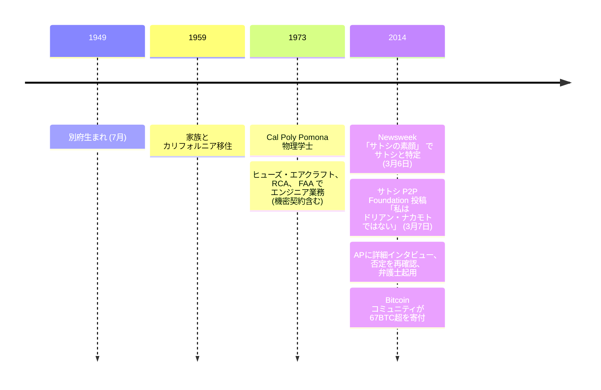

ドリアン・プレンティス・サトシ・ナカモトは、1949年7月に日本の別府で生まれた日系米国人の物理学者・システムエンジニアである。1959年（10歳のとき）に家族とともにカリフォルニアへ移住、カリフォルニア州立工科大学ポモナ校で物理学の学士号を取得した。職歴はヒューズ・エアクラフト、RCA、米国連邦航空局（FAA）など防衛・航空宇宙関連企業でのエンジニア業務で、一部は機密契約下のものだった。長年カリフォルニア州テンプル市（サンガブリエル・バレーの小さな郊外）に居住。

### Newsweek による特定

2014年3月6日、[Newsweek がリア・マグラス・グッドマン執筆の「サトシの素顔」 を公開](/BitcoinArchive/ja/entries/aftermath/2014-03-06-newsweek-dorian-nakamoto/)し、ビットコインの創設者を特定したと主張した。記事の根拠は主に 3 点：ドリアンの戸籍上の名前が文字通り「サトシ・ナカモト」 だったこと、機密寄りの工学キャリアを持つこと、そしてグッドマンが玄関先での短い質問に対する回答として引用した一文「私はもうそれには関わっていない、議論できない」 であった。記事公開後、記者と写真家がテンプル市の自宅に殺到、Newsweek が住所と自宅写真を掲載したことに対し広範な批判が起きた。

### 本人による否定

ドリアン・ナカモトはビットコインへの関与を断固として繰り返し否定した。記者の質問を誤解し、過去の機密エンジニアリング業務（特定プロジェクトについて「議論できない」 と答えるのが業界慣行）について聞かれていると思ったと説明。法的代理人を立て、APに詳細なインタビューを行い否定を再確認した。Newsweek 報道の翌日、[長期間休眠状態にあったサトシの P2P Foundation アカウントが短文「私はドリアン・ナカモトではない」 を投稿した](/BitcoinArchive/ja/entries/aftermath/2014-03-07-satoshi-p2p-foundation-return/)が、その投稿の真正性は議論が残る — [同アカウントは2016年末に再度説明のつかないログイン活動を見せている](/BitcoinArchive/ja/entries/aftermath/2016-12-12-satoshi-p2pfoundation-profile-login/)。

### ハル・フィニーとの地理的偶然

ドリアン・ナカモトのテンプル市の住所は、[ハル・フィニー](/BitcoinArchive/ja/participants/hal-finney/)（同じ町に約10年居住）から数ブロックの距離にあった。この地理的偶然は[2014年3月25日のアンディ・グリーンバーグによる Forbes 特集「Nakamoto's Neighbor」](/BitcoinArchive/ja/entries/aftermath/2014-03-25-greenberg-forbes-nakamotos-neighbor/)の中心的論点となり、ハル・フィニーが数ブロック先に住む実在の人物の名前から「サトシ・ナカモト」 仮名を構築した可能性が提案された。フラン・フィニーはハルがドリアン・ナカモトとの繋がりや認識を持っていなかったと一貫して述べている。

### 仮説としての位置付け

ドリアン・ナカモトは [サトシ正体仮説総覧](/BitcoinArchive/ja/entries/analysis/2008-10-31-satoshi-identity-hypotheses-overview/) に主に網羅性のため候補として記載され続けている — 候補性は名前一致のみに依拠し、ビットコインのコードベースとの技術的繋がり、サイファーパンクとしての実績、ビットコイン v0.1 規模のプログラミング業務、貨幣設計の検討履歴、いずれも文書として存在しない。Newsweek の特定への対応として、ビットコインコミュニティは 67 BTC 超の寄付を彼に集めた。
