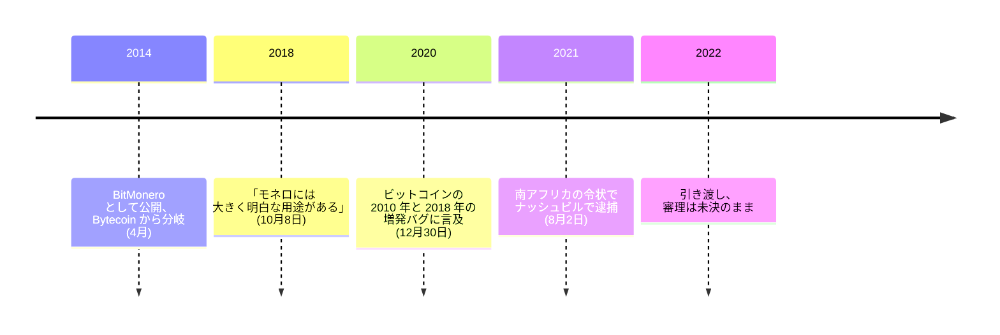

[モネロ](/BitcoinArchive/ja/entries/currency/2026-07-27-monero-currency-overview/)は 2014 年 4 月、BitMonero として公開された。分岐元は Bytecoin — CryptoNote 方式の実装であり、その供給量の大半が、外部が存在を知る前に採掘され終えていたと当時の界隈が読んだチェーンである。オンライン上の名を `fluffypony` というリカルド・スパーニは、この企画のもっとも表に立つ保守者となり、その役を十年近く担った。

彼は、ビットコインの透明性は欠陥でも長所でもなく事実であり、その事実がビットコイン自身には満たせない用途を生んだ、という立場をもっとも明確に語ってきた人物である。

## ビットコインの台帳に対する設計上の論拠

モネロが実装した CryptoNote の技術文書は、何を基準にビットコインを測っているかを曖昧にしていない。電子現金の条件を二つ挙げ、ビットコインは片方を満たさないと明言する。

<!-- audit:quote-skip -->
> 追跡不能性 — 受け取った各取引について、送り手となりうる者はすべて等確率であること。連結不能性 — 送出された任意の二つの取引について、それらが同じ相手に送られたと証明できないこと。……残念ながら、ビットコインは追跡不能性の要件を満たさない。

二つ目の異議は採掘に向けられており、サトシ自身の言い回しをネットワークに突き返している。

<!-- audit:quote-skip -->
> したがってビットコインは、参加者の投票力に大きな開きが生じる条件を作り出している。GPU や専用機の保有者は CPU の保有者よりはるかに大きな投票力を持つのだから、「1 CPU につき 1 票」の原則を破っているからである。

三つ目は半減の設計を狙う。報酬が階段状に落ちるのは貨幣の出来事ではなく安全性の出来事だ、という主張である。

<!-- audit:quote-skip -->
> 当初の意図は指数的に減衰するなめらかな発行だったが、実際にあるのは区分線形の発行関数であり、その折れ点はビットコインの基盤に問題を起こしうる。

モネロの答えは、なめらかな発行曲線と、その後に続く恒久的な末尾発行だった。1 ブロックあたり 0.6 XMR を永久に出し続けることで、ブロック生成が手数料だけに支えられる状態を作らない。ビットコインの答えは逆で、報酬はゼロへ向かい、手数料市場が引き継ぐ。この未決の問いは[固定供給と自動調整の比較](/BitcoinArchive/ja/entries/analysis/2008-10-31-fixed-supply-vs-adjustable-money/)が扱っている。モネロはその問いが差し迫る前にビットコインと反対側を選び、2022 年 5 月から末尾発行を払い続けている。[十二チェーンの設計比較](/BitcoinArchive/ja/entries/analysis/2026-07-26-altcoin-count-and-design-comparison/)は、公正な発行と支配組織の不在という点でモネロを他のどのチェーンよりもビットコインに近い位置に置く — 二つの設計が実際に分かれるのは供給の側である。

## 彼がビットコインについて語ったこと

スパーニの立場は、ビットコインが失敗したというものではない。ビットコインの透明性は帰結を伴う性質であり、その帰結の一つがモネロだ、というものである。

<!-- audit:quote-skip -->
> ビットコインが匿名ではないと判明した以上、モネロには大きく明白な用途がある。

その性質を後から獲得できるかどうか — ビットコインの匿名化提案がいつもぶつかる問い — について、彼は 2018 年に悲観を述べ、同じ取材の中で逆の可能性も認めている。

<!-- audit:quote-skip -->
> ビットコインに強い匿名性を足すのが楽な道だとは思っていない。とても、とても難しいだろう。

<!-- audit:quote-skip -->
> と同時に、ビットコインの歴史の中で興味深い転換点に近づいているとも思う。本当の匿名性がチェーン上のビットコインに来る目がある。

そして 2020 年の取材から、ビットコインの持続性について。

<!-- audit:quote-skip -->
> ビットコインがなくなるとは思わない。最初の 10 年がそれを証明した。社会的にも規制の面でも、また暗号技術と工学の面でも、あらゆる種類の攻撃に耐えてきた極めて堅牢なプロトコルだ。だから 10 年後にもまだ存在しているだろう。

## 「二つの増発バグ」の主張を、このアーカイブの記録と突き合わせる

彼がビットコインについて述べる技術的主張のうち、もっとも実質があるのは供給の監査可能性についてのものだ。モネロの匿名性には固有の代償がある。金額が隠れていると、無から通貨が作られていないことの検証が難しくなる。これに対するスパーニの答えは、透明性は人が思っているほどの保証を与えない、というものである。

<!-- audit:quote-skip -->
> 結局のところ、ビットコインも監査可能性の危険から免れてはいない。それは、ビットコインに明白な増発バグが二件あったことから分かる。一件目は 2010 年に実際に悪用され、誰かが数十億ビットコインを作り出した……二件目はもう少し厄介で、2018 年の CVE、取引出力の二重支払いにあたるものだ。

どちらの出来事もこのアーカイブにある。そして記録は、この主張の前半を支持し、後半には条件を付ける。

|  | 2010 年 — [バリュー・オーバーフロー事件](/BitcoinArchive/ja/entries/aftermath/2010-08-15-value-overflow-incident/) | 2018 年 — CVE-2018-17144 |
|---|---|---|
| 不具合 | 出力合計の検査における整数あふれ | 重複入力の検査の欠落 |
| 生成された枚数 | 一件の取引でおよそ 1,840 億 BTC | なし |
| 本番のチェーン上での悪用 | あり | なし |
| どう収まったか | 修正と巻き戻しで約 15 時間 | 誰かに使われる前に、協調開示で |

[二つの事件を並べた構造分析](/BitcoinArchive/ja/entries/analysis/2010-08-15-overflow-incident-structure-and-paradox/)がこの対を扱うのは、まさに片方が使われ片方が使われなかったからである。2018 年の不具合を「もう少し厄介」と呼ぶのは種類の話であって、結果の話ではない。何も生成されていない。

つまり彼の議論は、使える形では生き残り、強い形では生き残らない。透明な供給は原理として監査でき、2010 年に一度、遅れて監査された。バグが存在しないことの保証にはならない。ただし記録の上では、二件を発見可能にしたのもまた透明性であり、二件目は誰かに使われる前に見つかっている。

## Bytecoin の事前採掘について、本人の言葉

モネロが存在するのは、分岐元のチェーンの配分が不正だったと創設者たちが結論したからである。スパーニの説明は率直だ。

<!-- audit:quote-skip -->
> 実際のところ、コインの 82% は「公開」前にすでに採掘されていた。仮に悪意なく事前採掘されたのだとしても、コインの 82% が、正体も所在も見えない者たちの手にあるという事実は変わらない。

モネロ自身の立ち上がりには事前採掘も創設者割当もない。これはビットコインと完全に共有する唯一の構造的性質であり、[アルトコインの系譜](/BitcoinArchive/ja/entries/analysis/2008-10-31-bitcoin-fork-and-altcoin-genealogy/)に並ぶチェーンの多くが持たない性質でもある。

## 訴追について

2021 年 7 月、スパーニは南アフリカの令状によりナッシュビルで逮捕され、2022 年に引き渡された。容疑は、モネロ以前の勤務先に対し 2009 年から 2011 年にかけて虚偽の請求書を提出したとするもので、審理はケープタウンで行われている。企画の資金ではなくモネロ以前の個人的行為に関する事件であり、報道の時点で未決であり、本人は検察側の説明を争っている。上の技術的な記録には何ら影響しない。同じ人物の記録の一部である、というだけである。

## ビットコインにおける意義

モネロは[フォークと隣接通貨の系譜](/BitcoinArchive/ja/entries/analysis/2008-10-31-bitcoin-fork-and-altcoin-genealogy/)がたどる血統の明示的な外にある。CryptoNote のリング署名はビットコインのコードから独立している。それでもスパーニの記録はビットコインの歴史に属する。しかも理由は他の多くより鋭い。彼の中心的な主張はビットコインについての主張であり、ビットコイン自身の記録と突き合わせて検証でき、その検証を半分だけ通る。賛辞や切り捨てより、この形のほうが残す価値がある。
