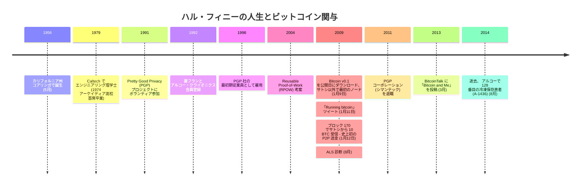

ハロルド・トーマス・フィニー二世は1956年5月4日、カリフォルニア州コアリンガに生まれ、アーケイディアで育った。1974年にアーケイディア高校を首席で卒業し、1979年にカリフォルニア工科大学（Caltech）でエンジニアリングの理学士号を取得した。サイファーパンクとしての経歴、2004 年の Reusable Proof-of-Work、人類初のビットコイン取引の受領、ドリアン・ナカモトへの地理的近接性 — これらが組み合わさり、最も多く議論されるサトシ正体候補の一人となった。詳細は[ハル・フィニー = サトシ仮説](/BitcoinArchive/ja/entries/analysis/2014-03-25-hal-finney-satoshi-identity-hypothesis/) を参照。主要な反証は[2009 年 4 月 18 日のレース当日アリバイ](/BitcoinArchive/ja/entries/aftermath/2014-03-25-greenberg-forbes-nakamotos-neighbor/) および Patoshi 規模の不整合。

**暗号学とPGP：**
1991年、フィニーはフィル・ジマーマンのPretty Good Privacy（PGP）プロジェクトに無償でコードを書くボランティアとして参加。PGP 2.0の主要開発者の一人となった。1996年にジマーマンがPGP社を設立した際、最初期の従業員として雇用された（後にシマンテックに買収）。

**エクストロピアニズムとクライオニクス：**
フィニーはエクストロピー研究所のクライオニクス、延命、宇宙移住、ナノテクノロジー、人工知能に関する議論の積極的な参加者だった。Caltech在学中の1年生の時からクライオニクスに興味を持っていた。1992年10月15日、妻フランとともにカリフォルニア州リバーサイドでアルコー・クライオニクスの会員登録書類に署名。以後20年以上アルコー会員だった。

**Reusable Proof-of-Work：**
2004年、フィニーは最初のReusable Proof-of-Work（RPOW）システムを構築した — ビットコインのプルーフ・オブ・ワーク機構の先行概念である。サイファーパンク運動のデジタルキャッシュ構想に深く関与していた。アダム・バックのHashcashから、ウェイ・ダイのb-money、ニック・サボのBit Gold、そしてRPOWを経てビットコインへと至る技術系譜は、サトシ自身がその運動に対してどのような位置にいたかという問いとあわせて、[サイファーパンク核心とサトシの知的位置についての分析](/BitcoinArchive/ja/entries/analysis/2008-10-31-cypherpunk-independent-arrival/)で精査されている。

**ビットコイン：**
2009年1月9日、フィニーはリリース当日に[Bitcoin v0.1](/BitcoinArchive/ja/entries/sourceforge/2009-01-09-bitcoin-v01-released/)をダウンロードし、[サトシ・ナカモト](/BitcoinArchive/ja/participants/satoshi-nakamoto/)以外でビットコインノードを稼働させた最初の人物となった。ブロック 70付近からマイニングを開始。2009年1月11日、[「Running bitcoin」とツイート](/BitcoinArchive/ja/entries/aftermath/2009-01-11-hal-finney-running-bitcoin-tweet/) — ソフトウェアの稼働を公に言及した最初の記録である。2009年1月12日、[ブロック 170でサトシから10 BTCを受信](/BitcoinArchive/ja/entries/aftermath/2009-01-12-first-bitcoin-transaction/) — 史上初の個人間ビットコイン送金だった。

**ALSと最後の年月：**
2009年8月、フィニーは筋萎縮性側索硬化症（ALS）と診断された。進行する麻痺にもかかわらず、ビットコインのコード作成を続けた — 最終的にはアイトラッキングソフトウェアを使用してコミュニケーションとプログラミングを行った。2011年初頭にPGP社（シマンテック）を退職。2013年3月19日、BitcoinTalkに[「Bitcoin and Me」](/BitcoinArchive/ja/entries/aftermath/2013-03-19-bitcoin-and-me-hal-finney/)を投稿し、ビットコイン最初のユーザーとしての経験を記した。

ハル・フィニーは[2014年8月28日](/BitcoinArchive/ja/entries/aftermath/2014-08-28-hal-finney-passes-away/)午前8時50分、アリゾナ州スコッツデールで死去。アルコー延命財団により128番目の患者（会員A-1436）として冷凍保存された。妻[フラン](/BitcoinArchive/ja/participants/fran-finney/)、息子ジェイソン、娘エリンが遺された。
