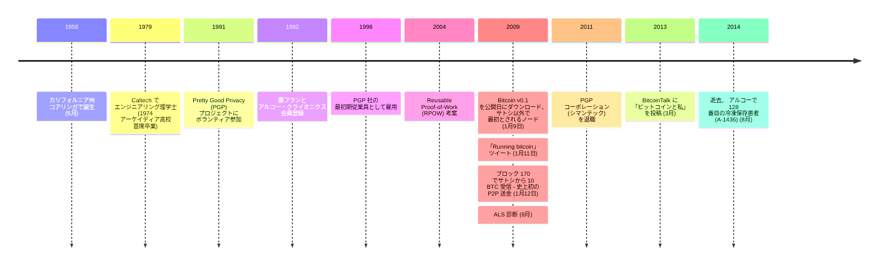

<!-- speaker: Hal Finney -->
> 「身体が外側で死につつあっても、内側では生き続けていられるんだ。」

ハル・フィニーがこう書いたのは 2009 年 10 月、ALS の診断から 2 か月後だった。同じ年、彼はサトシ以外で初めてビットコインを動かした人物になっていた。少なくとも、本人は後にそう振り返っている。2009 年 1 月 11 日の[「Running bitcoin」](/BitcoinArchive/ja/entries/aftermath/2009-01-11-hal-finney-running-bitcoin-tweet/)、たった二語のツイートが、ソフトウェアの稼働に触れた最初の公開記録になった。その翌日、サトシが彼へ[ブロック 170 で 10 BTC を送る](/BitcoinArchive/ja/entries/aftermath/2009-01-12-first-bitcoin-transaction/)。人から人へビットコインが渡った、史上初の記録である。それから 5 年、進む麻痺のなかで彼はコードを書き続けた。最後はアイトラッキングで、かつての 1/50 ほどの速さで、それでも書いた。[2014 年 8 月 28 日に逝去](/BitcoinArchive/ja/entries/aftermath/2014-08-28-hal-finney-passes-away/)。アルコー延命財団が 128 番目の患者として冷凍保存した。

だから彼の名は、サトシ候補として今もいちばんよく挙がる。話は出来すぎている。古参のサイファーパンク、2004 年の Reusable Proof-of-Work、人類最初の個人間ビットコイン送金の受領、そしてドリアン・ナカモトの近所という立地。出来すぎているからこそ、疑う価値がある。振り払いにくい反証が二つある。[2009 年 4 月 18 日のレース当日アリバイ](/BitcoinArchive/ja/entries/aftermath/2014-03-25-greenberg-forbes-nakamotos-neighbor/)と、Patoshi の採掘規模が彼の活動量と合わないことだ。説の全体は[ハル・フィニー = サトシ仮説](/BitcoinArchive/ja/entries/analysis/2014-03-25-hal-finney-satoshi-identity-hypothesis/)に詳しい。

ハロルド・トーマス・フィニー二世は 1956年5月4日、カリフォルニア州コアリンガに生まれ、アーケイディアで育った。1974年にアーケイディア高校を首席で卒業し、1979年にカリフォルニア工科大学（Caltech）でエンジニアリングの理学士号を取得した。

```mermaid
timeline
    1956 : カリフォルニア州 コアリンガで誕生 (5月)
    1979 : Caltech で エンジニアリング理学士 (1974 アーケイディア高校 首席卒業)
    1991 : Pretty Good Privacy (PGP) プロジェクトに ボランティア参加
    1992 : 妻フランと アルコー・クライオニクス 会員登録
    1996 : PGP 社の 最初期従業員として雇用
    2004 : Reusable Proof-of-Work (RPOW) 考案
    2009 : Bitcoin v0.1 を公開日にダウンロード、 サトシ以外で 最初とされるノード (1月9日)
    %% link: /BitcoinArchive/ja/entries/aftermath/2009-01-09-bitcoin-v01-released/
         : 「Running bitcoin」 ツイート (1月11日)
    %% link: /BitcoinArchive/ja/entries/aftermath/2009-01-11-hal-finney-running-bitcoin-tweet/
         : ブロック 170 でサトシから 10 BTC 受信 - 史上初の P2P 送金 (1月12日)
    %% link: /BitcoinArchive/ja/entries/aftermath/2009-01-12-first-bitcoin-transaction/
         : ALS 診断 (8月)
    2011 : PGP コーポレーション (シマンテック) を退職
    2013 : BitcoinTalk に 「ビットコインと私」 を投稿 (3月)
    %% link: /BitcoinArchive/ja/entries/aftermath/2013-03-19-bitcoin-and-me-hal-finney/
    2014 : 逝去、 アルコーで 128 番目の冷凍保存患者 (A-1436) (8月)
    %% link: /BitcoinArchive/ja/entries/aftermath/2014-08-28-hal-finney-passes-away/
```

### 暗号学と PGP
1991年、フィニーはフィル・ジマーマンの Pretty Good Privacy（PGP）プロジェクトに無償でコードを書くボランティアとして参加。PGP 2.0 の主要開発者の一人となった。1996年にジマーマンが PGP 社を設立した際、最初期の従業員として雇用された（後にシマンテックに買収）。

### エクストロピアニズムとクライオニクス
フィニーはエクストロピー研究所のクライオニクス、延命、宇宙移住、ナノテクノロジー、人工知能に関する議論の積極的な参加者だった。Caltech 在学中の 1年生の時からクライオニクスに興味を持っていた。1992年10月15日、妻フランとともにカリフォルニア州リバーサイドでアルコー・クライオニクスの会員登録書類に署名。以後 20年以上アルコー会員だった。

### Reusable Proof-of-Work
2004年、フィニーは最初の Reusable Proof-of-Work（RPOW）システムを構築した — ビットコインのプルーフ・オブ・ワーク機構の先行概念である。サイファーパンク運動のデジタルキャッシュ構想に深く関与していた。アダム・バックの Hashcash から、ウェイ・ダイの b-money、ニック・サボの Bit Gold、そして RPOW を経てビットコインへと至る技術系譜は、サトシ自身がその運動に対してどのような位置にいたかという問いとあわせて、[サイファーパンク核心とサトシの知的位置についての分析](/BitcoinArchive/ja/entries/analysis/2008-10-31-cypherpunk-independent-arrival/)で精査されている。

### ビットコイン
2009年1月9日、フィニーはリリース当日に [Bitcoin v0.1](/BitcoinArchive/ja/entries/aftermath/2009-01-09-bitcoin-v01-released/) をダウンロードし、[サトシ・ナカモト](/BitcoinArchive/ja/participants/satoshi-nakamoto/)以外で最初にビットコインノードを稼働させたとされる人物となった。ブロック 70 付近からマイニングを開始。2009年1月11日、[「Running bitcoin」とツイート](/BitcoinArchive/ja/entries/aftermath/2009-01-11-hal-finney-running-bitcoin-tweet/) — ソフトウェアの稼働を公に言及した最初の記録である。2009年1月12日、[ブロック 170 でサトシから 10 BTC を受信](/BitcoinArchive/ja/entries/aftermath/2009-01-12-first-bitcoin-transaction/) — 史上初の個人間ビットコイン送金だった。

### ALS と最後の年月

2009 年 8 月、ALS — 筋萎縮性側索硬化症の診断が下る。2011 年初頭、PGP 社（シマンテック）を退職。それでも手は止めなかった。2013 年 3 月 19 日、BitcoinTalk に[「ビットコインと私」](/BitcoinArchive/ja/entries/aftermath/2013-03-19-bitcoin-and-me-hal-finney/)を投稿する。麻痺し、管で栄養を取り、アイトラッカーで画面を操る — その暮らしのなかでも、彼はまだプログラミングを続けていた:

<!-- speaker: Hal Finney -->
> 「最近、コードを書くこともできると分かったんだ。非常に遅く、以前の 50倍は遅いだろう。でもプログラミングは今でも大好きで、目標を与えてくれる。」

ハル・フィニーは 2014 年 8 月 28 日午前 8 時 50 分、アリゾナ州スコッツデールで世を去った。アルコー延命財団が 128 番目の患者（会員 A-1436）として冷凍保存した。妻[フラン](/BitcoinArchive/ja/participants/fran-finney/)、息子ジェイソン、娘エリンが遺された。

*[補足：ハル・フィニーは、小説『[ジェネシス ― 創設者の消失と約束](/BitcoinArchive/ja/novel/)』で、「Running bitcoin」のツイートで主人公のシステムが彼ひとりのものではなくなったと告げる第二のノード運用者として登場する ― 後の冷凍保存は、記録された生涯を越えた持続性という並行モチーフを担う。]*
