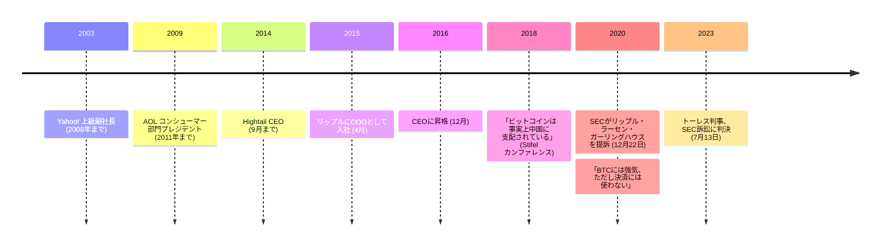

ブラッド・ガーリングハウスは、暗号資産の会社を率いる前に、十年以上をシリコンバレー屈指の大企業でコンシューマー部門の経営に費やしていた。2015 年 4 月にリップルへ最高執行責任者として入社し、共同創業者の[クリス・ラーセン](/BitcoinArchive/ja/participants/chris-larsen/)の下で働き、2016 年 12 月に CEO となる。

ビットコインについての彼の公の発言は、決して交わらない二つの方向へ伸びている。集中への懐疑と、資産としての強気だ。

## 他人の土台の上に築かれたキャリア

リップル以前のガーリングハウスのキャリアは、創業者としての道ではなく、消費者向けインターネットの大手プラットフォームを渡り歩く道だった。@Home Network での初期の役職や @Ventures のジェネラルパートナーを経て、2000 年から 2001 年まで Dialpad の CEO を務める。2003 年から 2008 年までは Yahoo! の上級副社長として、ホームページ・Flickr・Yahoo! メール・Yahoo! メッセンジャーの各部門を統括した。この時期、社内向けに「ピーナッツバター・マニフェスト」を書いている。会社が資源を薄く広げすぎていると論じた文書である。Yahoo! を離れた後は Silver Lake Partners のシニアアドバイザーを経て、2009 年から 2011 年まで AOL のコンシューマーアプリケーション部門プレジデントを務め、続いて 2014 年 9 月まで Hightail (旧 YouSendIt) の CEO を務めた。

この経歴のどこにも、決済網や通貨制度を作った経験はない。2015 年 4 月に COO として入社し、2016 年 12 月に CEO として率いることになるリップルが、彼にとって初めて、製品ラインではなく台帳を中心に据えた会社だった。

## 「中国に支配されている」

2018 年、ボストンで開かれた Stifel クロスセクター・インサイト・カンファレンスで、ガーリングハウスは市場がビットコインの非中央集権という物語に織り込めていないと考えるものを語った。

<!-- audit:quote-skip -->
> ビットコインは事実上中国に支配されている。中国には、ビットコインの 50% 超を支配する 4 つのマイナーがいる。

この主張は誰がコインを保有しているかではなく、採掘プールの地理的分布についてのものであり、このアーカイブが他所で追っているハッシュパワー集中の議論と同じ系統にある。すなわち、ハッシュパワーが物理的にどこにあるかについての主張であり、自らの台帳には採掘という工程を一度も組み込んだことのない会社の CEO がそれを語っている。

## 「強気だが、決済には使わない」

2020 年 1 月、別の場でガーリングハウスは自らの懐疑論を撤回するのではなく、その内側に線を引いた。

<!-- audit:quote-skip -->
> BTC には価値の保存手段として強気だが、決済手段としてはそうではない。

この切り分けが重要なのは、それが[電子現金とデジタルゴールドの分析](/BitcoinArchive/ja/entries/analysis/2008-10-31-bitcoin-electronic-cash-vs-digital-gold/)がビットコイン自身の歴史のなかでたどっているのと同じ線だからだ。希少性という性質が、使うことより持つことに向いているチェーンという線である。ガーリングハウスはビットコインが失敗していると論じているのではない。ビットコイン自身の白書の副題が約束した二つのことのうち一方には成功していると論じており、自社の台帳はもう一方のために作られているとも論じている。

## 自らの営業実績が招いた訴訟

2020 年 12 月 22 日、SEC はリップル社・クリス・ラーセン・ガーリングハウス個人を相手取り、2013 年に遡る 13 億ドル相当の XRP 販売について提訴した。ガーリングハウスにとってその販売の大半は、台帳が生まれた 2012 年ではなく、彼が COO・CEO を務めていた期間に行われたものだった。2023 年 7 月のアナリサ・トーレス判事の判決は、買い手によって主張を分けた。リップルと直接交渉した機関投資家向けの販売は無登録証券の募集にあたり、取引所での匿名の買い手への販売はそれにあたらない。2024 年 8 月の最終判決は 1 億 2,503 万 5,150 ドルの制裁金を科した。SEC が求めていた額をはるかに下回る一方、将来の無登録での機関投資家向け販売を禁じる差止命令も出した。機関投資家向け販売そのものを全面的に禁じたわけではない。

## 記録が解決していないこと

ガーリングハウスのビットコインをめぐる立場は二つある。2018 年の集中批判と、2020 年の価値保存手段としての肯定だ。これらは、公開の記録のなかで心変わりとして語られてはいない。両方が同じ資産について同時に真でありうる。採掘の力が地理的に集中しているネットワークであることと、その生産がどこで行われていようと価値の保存手段であることは、両立する。この一連の流れが示しているのは、この記録に登場する他のアルトコイン経営陣にも共通するパターンだ。ビットコインの設計のある一つの性質への、名指しできる具体的な異論と、別の性質への本物の敬意とが、同じ人物のなかに、表立った矛盾もなく同居している。

## ビットコインにとっての意義

この記録に登場するアルトコイン創業者のなかで、ガーリングハウスだけが、設計に関わった人物としてではなく、経営者として自社に加わった。彼がビットコインについて語ることの根拠は、[クリス・ラーセン](/BitcoinArchive/ja/participants/chris-larsen/)と[ジェド・マケーレブ](/BitcoinArchive/ja/participants/jed-mccaleb/)が作った事業を経営していることにあり、台帳そのものを書いたことにはない。この違いは、彼の採掘集中批判をどう読むかにとって重要である。それは、設計段階で別の合意形成方式を選んだ人物による技術的な異論ではなく、リップルが競う市場についての経営者の所見である。ビットコインの採掘を、名指しされた二つの組織が運営する検証者リストと引き換えることの代償が実際には何なのかは、[XRP 通貨ページ](/BitcoinArchive/ja/entries/currency/2026-07-27-xrp-currency-overview/)が記録している。[十二チェーンの設計比較](/BitcoinArchive/ja/entries/analysis/2026-07-26-altcoin-count-and-design-comparison/)の一覧も同じ答えを記している。選定制の検証者リストと一企業が握る台帳は、ビットコインの採掘と支配組織の不在の裏返しである。
