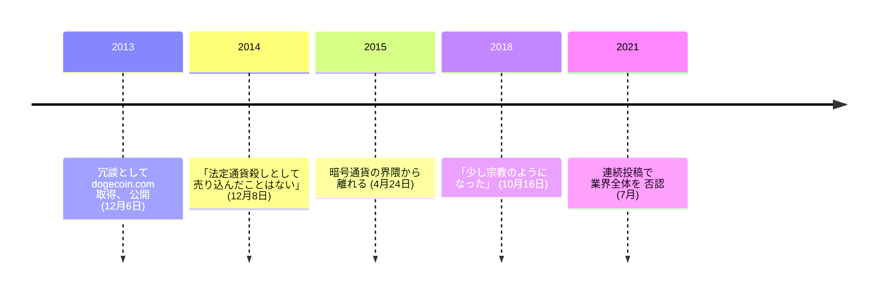

ジャクソン・パーマーはシドニーの Adobe で販売促進の仕事をしていた。2013 年に暗号通貨の数が増え続けるのを眺めながら、冗談として dogecoin.com を取得する。ビリー・マーカスがその冗談を見つけ、ライトコインを分岐させて動くものにした。[ドージコインは 2013 年 12 月 6 日に公開され](/BitcoinArchive/ja/entries/aftermath/2013-12-06-dogecoin-launch/)、十年以上たった今も時価総額では大きい部類に残っている。

パーマーについて重要なのは、公開そのものではない。公開後、界隈に入って一年目から 2021 年の範疇そのものの拒絶まで続いた一連の公の否認と、その七年のあいだ立場がほとんど動かなかったという事実にある。

## 冗談が向けられていたのはビットコインの模倣者だった

公開から一年後の取材で、パーマーは最初の投稿が何だったのかをそのまま説明している。

<!-- audit:quote-skip -->
> 当時のビットコインとアルトコインの界隈への当てこすりだ。

そして、自分がしなかった主張を、その言い回しを名指ししながら述べている。

<!-- audit:quote-skip -->
> ビットコインとその界隈が預言したがるような「法定通貨殺し」として、私はドージコインを売り込んだことが一度もない。

自分のチェーンが上位二十位に入っている 2014 年の時点で、創設者がアルトコインの定型の売り文句を記録に残る形で辞退している。ドージコインが何のためのものかについても、彼は明快だった。

<!-- audit:quote-skip -->
> ドージコインは本当に楽しくて馬鹿げた集まりで、人がインターネット上で小銭を投げ合うのに使う通貨だ。……ドージコインが金融の世界の土台を揺るがす日が来るか。来ない。そもそもそんな意図はなかった。

[ドージコイン](/BitcoinArchive/ja/entries/currency/2026-07-27-dogecoin-currency-overview/)の設計はこの但し書きと合っている。技術文書はなく、公式リポジトリは Bitcoin Core から改変したものだと書き、供給に上限はなく恒久的に増え続ける。この記録に並ぶ他のチェーンはどれも自分の設定値を弁護する。ドージコインの共同創設者は、設定値は論点ではないと述べた。同じ結論に、[十二チェーンの設計比較](/BitcoinArchive/ja/entries/analysis/2026-07-26-altcoin-count-and-design-comparison/)は十二の設計文書全体からも行き着いている。自分の通貨がより高い価値になると主張する設計文書は、そのどれにもない。

## 離脱

2015 年 4 月、パーマーは暗号通貨の界隈から離れる。それを伝えた取材にあったのは、漠然とした不満ではなく、具体的な商売の観察だった。

<!-- audit:quote-skip -->
> 顧客の商いから手数料を取るだけの取引所と決済代行を除いて、証明可能な事業模型 (つまり利益を生むもの) を持ったビットコイン企業が投資を受けたのを、私はまだ見たことがない。

十年後に読むと、この一文は当時より興味深い。この産業で持続性を証明した事業は、圧倒的に取引所と保管業者、つまり手数料を取る側である。

## 「宗教」

2018 年になると、批判の的は事業模型から文化へ移っている。

<!-- audit:quote-skip -->
> ビットコインは少し宗教のようになった。少し信者集団めいている。技術に対する接し方として良くないと思う。

同じ観察は、このアーカイブの中でまったく別の方向からも現れる。[チャールズ・ホスキンソン](/BitcoinArchive/ja/participants/charles-hoskinson/)は六年後、ほぼ同じ言い回しに到達している。しかも産業の外からではなく、競合するチェーンの側からだった。他に何ひとつ共通点のない二人が同じ語に行き着いたこと自体が、記録の一部である。

## 2021 年の連続投稿

2021 年 7 月、パーマーは産業全体への否認を公に投稿した。その中心にある一文。

<!-- audit:quote-skip -->
> 何年も研究した末に、私は暗号通貨が本質的に右派的で超資本主義的な技術であり、租税回避・規制監督の縮小・人為的に強制された希少性の組み合わせを通じて、主として推進者たちの富を増幅するために作られたものだと考えている。

このアーカイブはこの発言を記録し、その当否を裁定しない。ただし一節だけは政治の話ではなく、特定の設計判断についての主張である。「人為的に強制された希少性」とは 2,100 万枚の上限のことであり、パーマーは、固定供給が価値の毀損に対する防御ではなく富の集中の仕組みとして働いていると主張している。[固定供給と自動調整の比較](/BitcoinArchive/ja/entries/analysis/2008-10-31-fixed-supply-vs-adjustable-money/)は、同じ設定値についての二つの読みを両方並べており、そこでも問いを閉じていない。

同じ投稿の中で、彼は公の場で議論するのをやめた理由も述べている。批判は答えられるのではなく中傷されるから、というものだ。その性格づけを受け入れるかどうかにかかわらず、これは創設者が沈黙した理由として本人が述べたものであり、この界隈の内側がどういう場所だったかの記録に属する。

## ビットコインにおける意義

ここに並ぶ他の創設者はみな、ビットコインを改良したという信念のもとに何かを作った。パーマーが作ったのは、その信念**について**のものだった。そしてその後七年、信念のほうが問題だと言い続けた。自分のコインについても同じで、2014 年の取材では、金融の世界の土台を揺るがす意図はなかったと本人が述べている。ドージコインは[フォークと隣接通貨の系譜](/BitcoinArchive/ja/entries/analysis/2008-10-31-bitcoin-fork-and-altcoin-genealogy/)に、ネットワーク効果が共同体だけで運べることを証明したチェーンとして置かれている。その共同創設者の立場は、それは祝うべき発見ではない、というものである。
