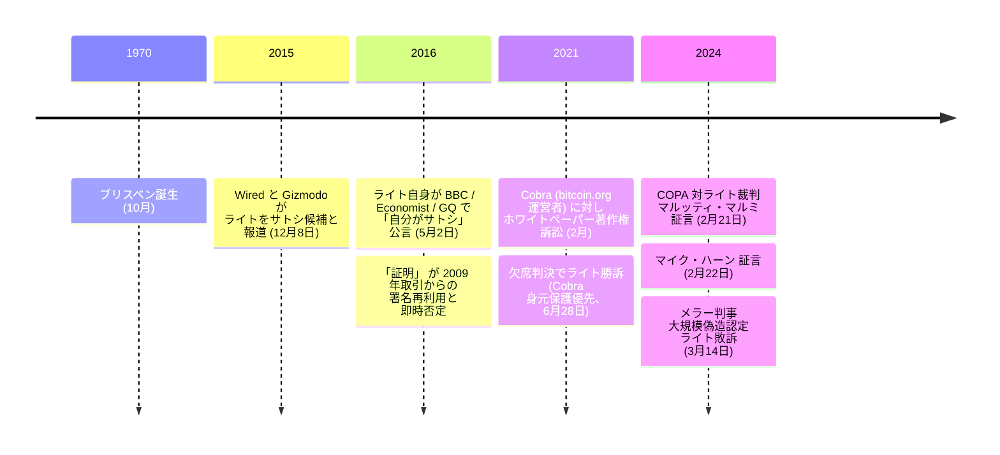

2016 年 5 月 2 日、クレイグ・ライトは [BBC、The Economist、GQ との連携インタビュー](/BitcoinArchive/ja/entries/aftermath/2016-05-02-craig-wright-bbc-economist-claim/)で、自らが[サトシ・ナカモト](/BitcoinArchive/ja/participants/satoshi-nakamoto/)であると公言した。暗号学的証明 —— 初期のビットコインブロックに関連する鍵で署名したメッセージ —— を提示した。数時間のうちに、セキュリティ研究者たちはこの「署名」 が新規生成ではなく 2009 年のビットコイン取引から既存の署名を再利用したものだったことを示した。

8 年後の 2024 年 3 月 14 日、英国高等法院のメラー判事は、暗号オープン特許アライアンス（COPA）が提起した訴訟で[判決を下した](/BitcoinArchive/ja/entries/aftermath/2024-03-14-copa-v-wright-ruling/):

> 1. ライト博士はビットコイン・ホワイトペーパーの著者ではない。
> 2. ライト博士は 2008〜2011 年の間にサトシ・ナカモトの仮名を採用または使用した人物ではない。
> 3. ライト博士はビットコインシステムを構築した人物ではない。
> 4. ライト博士はビットコインソフトウェアの初期バージョンを作成していない。

判事はライトを「極めてずるい証人」 と評し、サトシ・ナカモトを名乗る偽りの主張を裏付けるために「意図的かつ大規模な文書の偽造」 を行ったと結論づけた。

クレイグ・スティーブン・ライトは、1970 年 10 月にオーストラリア・ブリスベンで生まれたコンピューター科学者・実業家である。

### 撤回

2015 年 12 月の [Wired と Gizmodo の調査](/BitcoinArchive/ja/entries/aftermath/2015-12-08-wired-gizmodo-craig-wright-claims/)が 2016 年 5 月の宣言に先行していた —— ジャーナリストはライトをサトシ候補として最初に名指しした側であり、後に捏造されたと判明する資料を引用していた。2016 年 5 月の「証明」 が崩れた後、ライトはさらなる証拠を約束したが提示しなかった。代わりに次のように投稿した:

> 「匿名と隠遁の年月を後にできると信じていたのだ。しかし、できなかった」

### ホワイトペーパー訴訟
2021年2月、ライトは bitcoin.org の匿名運営者（[Cobra](/BitcoinArchive/ja/participants/cobra/)）をビットコインホワイトペーパーの著作権侵害で[提訴した](/BitcoinArchive/ja/entries/aftermath/2021-06-28-wright-v-cobra-whitepaper-lawsuit/)。2021年6月28日、裁判所はライトに有利な欠席判決を下した——主張に根拠があったからではなく、Cobra が身元を明かすよりも匿名性の保護を選んだためである。

