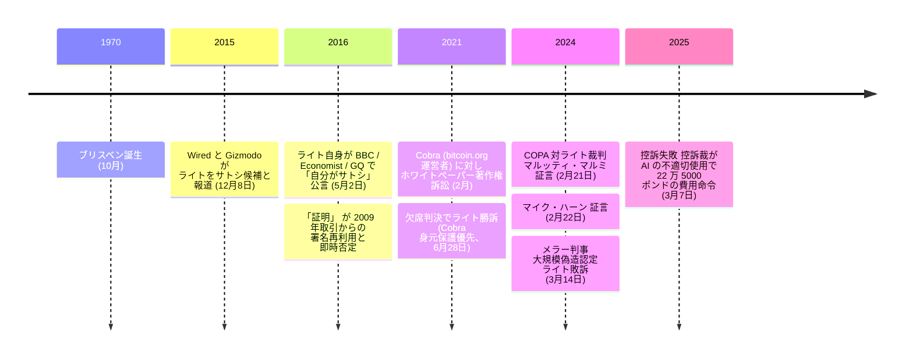

2016 年 5 月 2 日、クレイグ・ライトは [BBC、The Economist、GQ との連携インタビュー](/BitcoinArchive/ja/entries/aftermath/2016-05-02-craig-wright-bbc-economist-claim/)で、自らが[サトシ・ナカモト](/BitcoinArchive/ja/participants/satoshi-nakamoto/)であると公言した。暗号学的証明として、初期のビットコインブロックに関連する鍵で署名したメッセージを提示した。数時間のうちに、セキュリティ研究者たちはこの「署名」が新規生成ではなく 2009 年のビットコイン取引から既存の署名を再利用したものだったことを示した。

8 年後の 2024 年 3 月 14 日、英国高等法院のメラー判事は、暗号オープン特許アライアンス（COPA）が提起した訴訟で[判決を下した](/BitcoinArchive/ja/entries/aftermath/2024-03-14-copa-v-wright-ruling/):

<!-- quote: q1 -->
> 1. ライト博士はビットコインのホワイトペーパーの著者ではない。
> 2. ライト博士は 2008年から 2011年の期間にサトシ・ナカモトという偽名を採用または使用して活動した人物ではない。
> 3. ライト博士はビットコインシステムを創設した人物ではない。
> 4. ライト博士はビットコインソフトウェアの初期バージョンを開発した人物ではない。

判事はライトを極めて不誠実な証人と評し、サトシ・ナカモトを名乗る偽りの主張を裏付けるために、意図的かつ大規模な文書の偽造を行ったと結論づけた。この自称、それが依拠した論点、そして反証は、[クレイグ・ライトはサトシだったのか](/BitcoinArchive/ja/entries/analysis/2016-05-02-craig-wright-satoshi-identity-hypothesis/)にサトシ正体仮説として並べてある。

クレイグ・スティーブン・ライトは、1970 年 10 月にオーストラリア・ブリスベンで生まれたコンピューター科学者・実業家である。

```mermaid
timeline
    1970 : ブリスベン誕生 (10月)
    2015 : Wired と Gizmodo が ライトをサトシ候補と 報道 (12月8日)
    %% link: /BitcoinArchive/ja/entries/aftermath/2015-12-08-wired-gizmodo-craig-wright-claims/
    2016 : ライト自身が BBC / Economist / GQ で 「自分がサトシ」 公言 (5月2日)
    %% link: /BitcoinArchive/ja/entries/aftermath/2016-05-02-craig-wright-bbc-economist-claim/
         : 「証明」 が 2009 年取引からの 署名再利用と 即時否定
    2021 : Cobra (bitcoin.org 運営者) に対し ホワイトペーパー著作権 訴訟 (2月)
         : 欠席判決でライト勝訴 (Cobra 身元保護優先、 6月28日)
    %% link: /BitcoinArchive/ja/entries/aftermath/2021-06-28-wright-v-cobra-whitepaper-lawsuit/
    2024 : COPA 対ライト裁判 マルッティ・マルミ 証言 (2月21日)
    %% link: /BitcoinArchive/ja/entries/aftermath/2024-02-21-copa-trial-malmi-testimony/
         : マイク・ハーン 証言 (2月22日)
    %% link: /BitcoinArchive/ja/entries/aftermath/2024-02-22-mike-hearn-copa-trial-testimony/
         : メラー判事 大規模偽造認定 ライト敗訴 (3月14日)
    %% link: /BitcoinArchive/ja/entries/aftermath/2024-03-14-copa-v-wright-ruling/
    2025 : 控訴失敗 控訴裁が AI の不適切使用で 22 万 5000 ポンドの費用命令 (3月7日)
```

## 撤回

2015 年 12 月の [Wired と Gizmodo の調査](/BitcoinArchive/ja/entries/aftermath/2015-12-08-wired-gizmodo-craig-wright-claims/)が 2016 年 5 月の宣言に先行していた。ジャーナリストはライトをサトシ候補として最初に名指しした側であり、後に捏造されたと判明する資料を引用していた。2016 年 5 月の「証明」が崩れた後、ライトはさらなる証拠を約束したが提示しなかった。代わりに次のように投稿した:

> 「匿名と隠遁の年月を後にできると信じていたのだ。しかし、できなかった」

## ホワイトペーパー訴訟
2021年2月、ライトは bitcoin.org の匿名運営者（[Cobra](/BitcoinArchive/ja/participants/cobra/)）をビットコインホワイトペーパーの著作権侵害で[提訴した](/BitcoinArchive/ja/entries/aftermath/2021-06-28-wright-v-cobra-whitepaper-lawsuit/)。2021年6月28日、裁判所はライトに有利な欠席判決を下した。主張に根拠があったからではなく、Cobra が身元を明かすよりも匿名性の保護を選んだためである。数時間後、Cobra は[公に反論を投稿し](/BitcoinArchive/ja/entries/aftermath/2021-06-28-cobra-response-to-whitepaper-ruling/)、暗号学のルールは金で買える法廷のルールより優れていると宣言した。

ライトの正体主張は初期ブロック (1 ~ 9) の鍵による署名に依拠していたが、ジェネシスブロックのコインベース鍵には決して及ばなかった。[ジェネシスブロックハードコード分析](/BitcoinArchive/ja/entries/analysis/2009-01-03-genesis-block-hardcode-analysis/)が指摘するとおり、決定打となるその唯一の実演を、ライトを含め誰も行っていない。

## 控訴の失敗

ライトは COPA 判決への控訴を求めたが、認められなかった。2025 年 3 月 7 日、控訴裁判所はライトに 22 万 5000 ポンドの訴訟費用の支払いを命じた。内訳は COPA へ 10 万ポンド、ライトが同じく訴えていたビットコイン開発者側へ 12 万 5000 ポンド。AI ツールで作成した提出書面が、実在しない判例を引用し、一審の手続きについて虚偽の陳述を含んでおり、裁判所を著しく誤導する恐れがあったと認定したためである。英国の民事裁判所が訴訟当事者の AI 不適切使用を理由に費用負担を命じたのは、報道によれば初めてだという。

