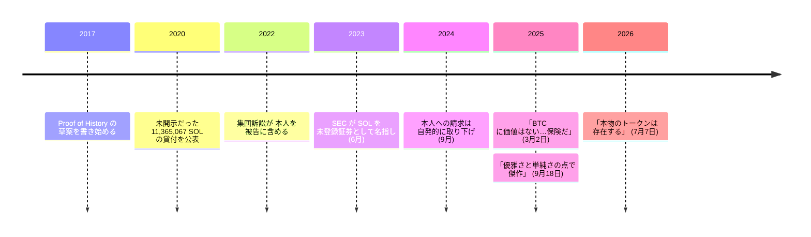

アナトリー・ヤコベンコは、Qualcomm で十年以上、無線通信系の仕組みを扱う技術者として働いた。その後 Mesosphere と Dropbox で分散システムを扱っている。2017 年、彼は Proof of History と名付けた着想の草案を書き始めた。[ソラナ](/BitcoinArchive/ja/entries/currency/2026-07-27-solana-currency-overview/)はそこから育ち、2020 年代半ばには時価総額で最大級のチェーンの一つになる。

ビットコインについての彼の発言は珍しい形をしている。賛辞も切り捨ても振り切れており、その二つは数か月しか離れていない。

## ソラナが直そうとしたもの

ソラナの技術文書は、解こうとした問題をはっきり書いている。ブロックチェーンには共有された検証可能な時間の概念がなく、だから参加者は自力でメッセージの順序を確認できない。

<!-- audit:quote-skip -->
> 現在公開されているブロックチェーンは時間に依拠しないか、参加者が時間を保つ能力について弱い仮定しか置いていない。[中略] 信頼できる時間源がないということは、メッセージの時刻印を採否の判断に使ったとき、ネットワークの他の参加者全員がまったく同じ判断を下す保証がないということである。

Proof of History はその答えにあたる。時間の経過そのものを台帳に暗号的に刻み込むことで、検証者が順序について合意するのにメッセージ交換を要らなくする仕組みである。狙いは処理量で、文書はどこを目指すかを明示している。

<!-- audit:quote-skip -->
> 本プロトコルは 1 ギガビット毎秒のネットワーク上で分析されており、本稿は現在の機材で毎秒 71 万件までの処理量が可能であることを示す。

ビットコインが攻撃の費用を設備投資で担保するのに対し、ソラナは没収されうる預け入れを使う。技術文書はその対応関係を直接書いている。

<!-- audit:quote-skip -->
> 預託はプルーフ・オブ・ワークにおける設備投資に相当する。マイナーは機材と電力を買い、それをプルーフ・オブ・ワークのチェーンの一本の分岐に投じる。預託とは、検証者が取引を検証している間、担保として差し出すコインである。

同じ文書は、自分が受け入れた代償も名指ししている。ここがこの文書の誠実な部分だ。

<!-- audit:quote-skip -->
> 分断を扱う CAP の体系は、一貫性か可用性のどちらかを選ばねばならない。我々の手法は最終的に可用性を選ぶ。ただし時間の客観的な尺度を持っているため、人間的な時間幅の待ちを許せば一貫性も選べる。

三つの軸があり、そのいずれについても、白書は自分が離れていくビットコインの立場を名指しで書いている。

| 設計の軸 | ビットコイン | ソラナ |
|---|---|---|
| 順序の決め方 | 共有された検証可能な時間の概念を持たない | プルーフ・オブ・ヒストリー — 台帳そのものに書き込まれた暗号的な時計 |
| 攻撃を割に合わなくするもの | 設備投資。機材と電力を一つの枝に投じる | 没収されうるステーク。検証している間、担保として預ける通貨 |
| ネットワークが分断されたとき | 分岐せずに停滞する | 生成を続け、人間の感覚で待てる時間のうちに整合を取り戻す |

このアーカイブが名前を与えているのは最後の行だ。分断されたときのビットコインの保守性は、欠点ではなく性質である。[デジタルゴールドの構造的特徴](/BitcoinArchive/ja/entries/analysis/2008-10-31-bitcoin-digital-gold-structural-features/)で詳しく扱う。

## 「傑作だ」

2025 年 9 月、All-In podcast でビットコインについて問われたヤコベンコは、留保なしに答えている。

<!-- audit:quote-skip -->
> この 20 年で書かれたもっとも格好いいソフトウェアは、私に言わせればビットコインの、あのナカモト実装だ。

プルーフ・オブ・ワークそのものと、それが持ちこたえてきた理由について。

<!-- audit:quote-skip -->
> プルーフ・オブ・ワークは……見事だ — 傑作だ。[中略] 優雅さと単純さの点で傑作なんだ。[中略] 破られていない理由は、それがあまりに単純だからだ。

最後の一節が実質的な主張であり、しかも彼自身の企画に不利に働く。ソラナの処理量は複雑さから来ている。彼自身、同じ対話の中で、極限の性能という目標は「ただただ難しい」と認めている。安全性の源としての単純さは、高性能なチェーンには買えないものだ。

彼はまた、ビットコインが自分の周辺組織を生き延びる性質も認めている。

<!-- audit:quote-skip -->
> ビットコインは、こうした組織が潰れても耐えられる。[中略] 人々が価値を置くビットコインの性質は、その移行を通しても残る。

そしてビットコインの役割は、争点ではなく確定したものとして扱っている。

<!-- audit:quote-skip -->
> ビットコインは、きわめて単純な決済層として設計されている。

## 「価値はない」

その半年前、2025 年 3 月の投稿は、上の発言と噛み合わせるのが難しい評価だった。

<!-- audit:quote-skip -->
> BTC に価値はない。もっとも好意的に見て、保険だ。[中略] 投資ではなく費用であり、機能する保証もない。[中略] もし機能するとしても、15 年前に起きた最初の革新を除けば、技術とはほとんど関係がない。

二つを同時に持つことはできる。ソフトウェアが傑作であることと、そこから発行される資産が、ある読み方では、末端の危険に備えて払う保険料であることは、両立しうる。実際に同時に持っているのかは記録が決めていない。言えるのは、二つが別のものを狙っているということだ。前者は装置を、後者は保有を見ている。その区別こそ[デジタルゴールドの分析](/BitcoinArchive/ja/entries/analysis/2008-10-31-bitcoin-digital-gold-structural-features/)が扱っている軸である。

2026 年 7 月、彼は同じ立場を言い直した。今度は「基盤があるのはビットコインだけだ」という主張に対してである。

<!-- audit:quote-skip -->
> 悪い株式や債務とは違う、本物のトークンは存在する。ネットワーク上の権利が強制できないのは、あなたのソフトウェアを動かす義務を誰も負っていないからだ。

この主張の射程はビットコインを含んでいる。どのトークンも強制力のある請求権を持たない、というのが彼の論である。

## 供給の開示

ソラナ自身が公表した初期の供給の経緯は、上の発言の隣に置くべきものだ。開示という問いは、ビットコインの立ち上がりにはそもそも生じないからである。

<!-- audit:quote-skip -->
> 問題はこうだ。我々はこの情報を、貸付の規模と性質も含めて、CoinList の入札とその後の Binance 上場の際に公衆へ開示していなかった。

貸付は 11,365,067 SOL、財団から値付け業者への貸し出しだった。ソラナは全量を流通供給から除外したと述べており、別の公表では、そのうち 3,365,067 枚が実際に業者から財団管理のウォレットへ返還されたと書いている。どちらの数字もソラナ自身の文章に出てくる。一つの数字にまとめず、並べて読むのが正しい。自分の貨幣哲学が試される前に創設者たちが供給を手にしていたという構図はソラナに限らない。同じパターンは[十二チェーンの設計比較](/BitcoinArchive/ja/entries/analysis/2026-07-26-altcoin-count-and-design-comparison/)にも見られる。

SEC は 2023 年 6 月の提訴で、未登録証券にあたると主張する資産に SOL を挙げた。財団はこれを否定し、当局はその後 Binance の件から SOL を外す申立てを行い、Coinbase の件は 2025 年 2 月に取り下げられた。ヤコベンコ個人を被告に含めた 2022 年の集団訴訟も、裁判所の命令によれば 2024 年に彼については不利益なく自発的に取り下げられている。訴訟自体は他の被告に対して続いた。

これらにビットコインの対応物はない。理由は評判ではなく構造にある。事前配分も財団も発行主体も持たないチェーンには、失敗しうる開示が存在しない。発行の側から見た同じ違いは[固定供給と自動調整の比較](/BitcoinArchive/ja/entries/analysis/2008-10-31-fixed-supply-vs-adjustable-money/)が記録している。

## ビットコインにおける意義

ヤコベンコは、ビットコインの資産としての根拠にもっとも技術的な資格を持って異を唱えつつ、工学としては誰よりも留保なく讃えている人物である。量子計算の論点では、ビットコインを変えるべきだと公に主張する側でもある。2025 年の同じ対話で、彼はビットコインが耐量子の署名方式へ移行すべきだと述べ、五年以内に突破が起きる確率をほぼ五分と見積もっている。ソラナは[フォークと隣接通貨の系譜](/BitcoinArchive/ja/entries/analysis/2008-10-31-bitcoin-fork-and-altcoin-genealogy/)がたどる技術的血統の外にある。Proof of History はビットコインのコードから派生していない。彼がビットコインについて語った記録は、その血統とは無関係に残る。
