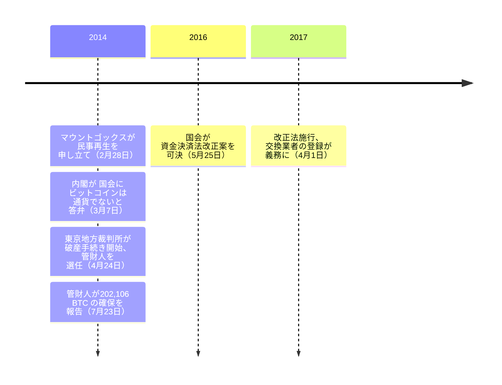

2014年3月7日、日本政府は国会に対し、ビットコインは通貨に当たらないとの答弁を閣議決定した。通貨の単位及び貨幣の発行等に関する法律にも、日本銀行法にも、民法にも、外国為替及び外国貿易法にも該当しないという答弁だった。それから 3年と 25日後、同じ政府が、国内で法定通貨との交換を扱う業者すべてに金融庁への登録を義務付けた。登録しなければ、営業はできない。

## 内閣、ビットコインは通貨ではないと答弁

マウントゴックスが東京地方裁判所に支払不能を告げてから、わずか 1 週間後のことだった。2014年3月7日、内閣は第 186回国会の質問主意書第 28 号に対する答弁書を閣議決定した。答弁はこう記す。

<!-- audit:quote-skip -->
> ビットコインは通貨に該当しない...ビットコイン自体の取引は、銀行法に規定する銀行業として行う行為には該当しない

同じ答弁は、通貨の単位及び貨幣の発行等に関する法律、日本銀行法、民法という三つの法律の名を挙げ、ビットコインをその外側に置いた。

## マウントゴックス、答弁が届かなかった破綻

当時世界最大のビットコイン取引所だったマウントゴックスが、東京地方裁判所に民事再生手続き開始を申し立てたのは 2014年2月28日のことだ。後に管財人として選任された小林信明弁護士は、その原因を裁判所への報告書にこう記している。

<!-- audit:quote-skip -->
> 破産者は...平成 26年2月28日、東京地方裁判所に対し、民事再生手続開始申立てを行った...BTC の基礎ソフトのシステムバグを悪用した不正アクセスによって破産者の管理する BTC が不正に引き出された可能性があること、破産者の預金も原因は不明であるが減少していたことなどの結果、民事再生手続開始申立時において支払不能、債務超過の状態にあること

民事再生手続きは持ちこたえなかった。東京地方裁判所は 2014年4月16日に申立てを棄却し、同日付けで保全管理命令を発令した。その 8日後の経緯を、報告書はこう記す。

<!-- audit:quote-skip -->
> 東京地方裁判所は、平成 26年4月16日、民事再生手続開始申立てを棄却し、同日、保全管理命令を発令し...東京地方裁判所は、平成 26年4月24日、破産者について、破産手続開始決定をなし、弁護士小林信明を破産管財人に選任した。

小林弁護士が 2014年7月23日に裁判所へ提出した報告書は、マウントゴックスの手元に残っていたものに数字を与えた。保全管理命令の効力が生じた時点で同社が管理していたアドレスに保管されていたのは 202,106.000721 BTC だった。自らの管理するアドレスへ移した後、手数料を差し引いた残高は 202,105.837821 BTC となった。

<!-- audit:quote-skip -->
> 当職は、保全管理命令発令後直ちに、破産者の保有する 202,106.000721BTC が管理されているアドレスの秘密鍵を確保したうえで...当職が管理するアドレスへの移動を行った（手数料控除後残高 202,105.837821BTC）。また、現在も、破産者のデータ上残存する BTC の有無を調査している。

報告書自体が、より大きな問いを未解決のまま残している。2014年7月23日の提出時点で、消えた残りの BTC がどこへ流れたのかという調査は、なお継続中だった。

## 閣議答弁から法律へ

国会は、2014年の答弁が描いた空白を埋めた。2016年5月25日、資金決済に関する法律を改正し、仮想通貨交換業者に対する法定の登録制度を創設する法律が可決された。同法は同年6月3日、平成 28年法律第 62 号として公布された。

<!-- audit:quote-skip -->
> 改正法は、2016年（平成 28年）5月25日に成立し...情報通信技術の進展等の環境変化に対応するための銀行法等の一部を改正する法律（平成 28年6月3日法律第 62 号）...2017年（平成 29年）4月1日に施行した。

## 2017年4月1日、登録が法律になる

改正法は 2017年4月1日に施行された。この日から、国内で仮想通貨を法定通貨と交換する業者は、金融庁への登録を受けなければならなくなった。受けなければ、営業はできない。金融庁自身の案内ページは、法律がまだ採用していなかった呼び方を先取りしてこう記す。

<!-- audit:quote-skip -->
> 平成 29年4月1日から、「暗号資産」に関する新しい制度が開始され、国内で暗号資産と法定通貨との交換サービスを行うには、暗号資産交換業の登録が必要となりました。

法律上「仮想通貨」が「暗号資産」に改められるのは 2019年のことだ。金融庁のこの案内は、当時の制度を後年の呼び方で振り返って説明している。

| | 2017年4月1日より前 | 2017年4月1日より後 |
|---|---|---|
| 交換業を営むこと | 仮想通貨に特化した免許は存在せず、内閣は銀行法の外側にあるとしていた | 法定通貨との交換を扱う業者すべてに金融庁への登録が必要 |
| 法律上の根拠 | 仮想通貨に特化した規定なし | 改正資金決済法（平成 28年法律第 62 号） |

改正法は、2014年の内閣答弁が示した「ビットコインは通貨ではない」という判断に手を触れていない。改正法が規制したのは、2014年の答弁が問われもしなかったことだ。つまり、ビットコインが何であるかではなく、それを交換する業を誰が営めるかである。

## 2017年以降、規制は一方向にしか動いていない

登録制度の施行から 1年も経たない 2018年1月、日本の交換業者の一つであるコインチェックが、約 5 億 2300 万 NEM（約 580 億円相当）をハッキングで失い、金融庁はその日のうちに報告命令を出した。その後に続いたのは後退ではない。国会は 2019年に「仮想通貨」の呼称を「暗号資産」へ改め、2022年にはステーブルコインのための「電子決済手段」という免許区分を新設し、2025年には JPYC を国内初の免許を受けた円建てステーブルコイン発行者として登録し、同年10月に発行を開始した。2026年4月10日には、内閣が暗号資産規制を資金決済法からより厳格な金融商品取引法へ移す法案を閣議決定した。[他の国々が同じ 10年のうちに暗号資産の規制を緩め、禁じ、また許すという振れ幅を見せてきた](/BitcoinArchive/ja/entries/analysis/2026-07-28-bitcoin-nation-state-policy-history/)一方で、日本の規制は 2017年4月1日以来、登録を減らす方向にではなく、増やす方向にのみ動いてきた。

## ビットコインにとっての意義

ビットコインそのものは、内閣の答弁にとっても、その後の法律にとっても、規制の対象ではなかった。どちらも規制したのは、それを交換する者であって、それを生み出すプロトコルではない。同じ区別は、マウントゴックスの破綻でも露わになった。免許を与える相手を持たないネットワークがある一方で、取引所には免許を与える相手がいた。その取引所が破綻したのである。日本の 2017年の登録制度は、その対のうち後半の空白を埋める。前半には、及ばない。
