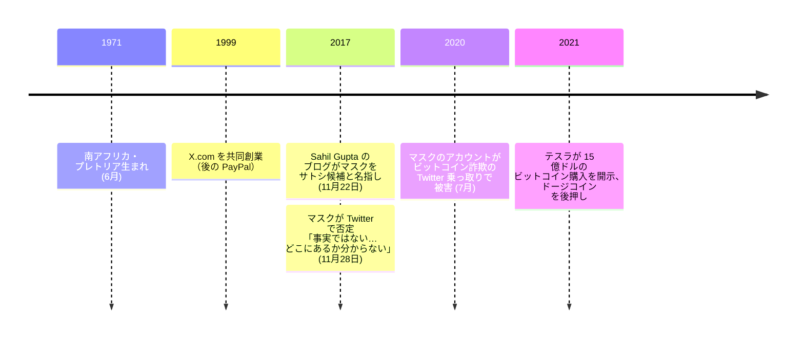

イーロン・マスク（1971 年 6 月 28 日、南アフリカ・プレトリア生まれ）は、テスラと SpaceX の創業者、後に PayPal となる決済会社の共同創業者である。ビットコイン史との繋がりは新しく、かつ外部的なもの —— 初期参加者ではなく、著名な投資家・論者としての繋がりだ。[2017 年、元 SpaceX インターンが彼をサトシ・ナカモトの可能性として名指した](/BitcoinArchive/ja/entries/analysis/2017-11-22-elon-musk-satoshi-identity-hypothesis/)が、マスクは一週間以内に否定した。

## ビットコイン関連の役割

マスクの記録されたビットコインとの関わりは、開発者や暗号学者ではなく、相場を動かす著名人としてのものである。2021 年、テスラは 15 億ドルのビットコイン購入を開示し、一時は車両の支払いにビットコインを受け付けたが、エネルギー消費への懸念から停止した。彼は SNS で[ドージコイン](/BitcoinArchive/ja/entries/aftermath/2013-12-06-dogecoin-launch/)を繰り返し後押ししてきた。2020 年 7 月には、彼のアカウントが[ビットコイン詐欺の Twitter 乗っ取りで侵害された著名アカウントの一つ](/BitcoinArchive/ja/entries/aftermath/2020-07-15-twitter-hack-bitcoin-scam/)となったが、これは主体ではなく被害者としてだった。いずれもビットコインの 2007〜2011 年の起源期に彼を置くものではない。

## サトシ候補としての位置

マスクのサトシ候補としての立ち位置は、物証を欠いた 2017 年のブログ投稿一本と、能力・物腰の類似だけに依拠する —— サイファーパンクの記録も、暗号学的な繋がりも、候補の各次元でのプロファイルの一致も無い。論とその反証は[イーロン・マスク＝サトシ仮説](/BitcoinArchive/ja/entries/analysis/2017-11-22-elon-musk-satoshi-identity-hypothesis/)に並べてある。[サトシ正体仮説の総覧](/BitcoinArchive/ja/entries/analysis/2008-10-31-satoshi-identity-hypotheses-overview/)は、印象だけで組み立てられた説の最も明瞭な例として、彼を固有名候補の中に位置づけている。
