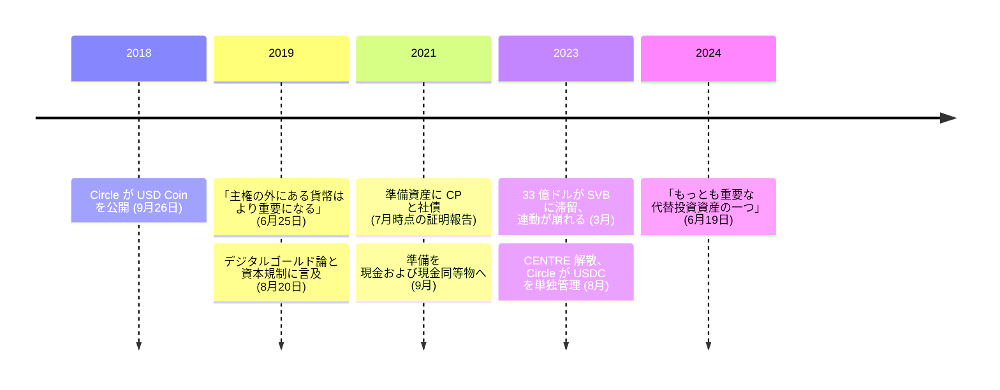

ジェレミー・アレールは、暗号資産に触れる前にすでに二度、インターネット企業の創業者だった。1995 年に弟の JJ アレールと Allaire Corporation を共同創業し、1999 年に株式公開、2001 年に Macromedia に買収されて同社の最高技術責任者になっている。その後 Brightcove を創業した。Circle はさらにその後で、2018 年 9 月 26 日に [USD Coin](/BitcoinArchive/ja/entries/currency/2026-07-27-usdc-currency-overview/) を公開した。

アレールは、ビットコインが持とうとしたほぼすべての性質を裏返した設計、すなわち規制下で最大のドル連動通貨を作りながら、ビットコインの重要性はまさに自分の製品が持たない性質にあると、繰り返し記録に残る形で述べてきた。

## 彼がビットコインについて語ったこと

2019 年 6 月、CNBC の取材で。

<!-- audit:quote-skip -->
> ビットコインの命題はまさに、主権の外にある貨幣が伸び続け、その重要性は下がるどころか上がっていくというものだ。

<!-- audit:quote-skip -->
> より多くの人が、ビットコインのような検閲耐性のある、極めて安全なデジタル資産の価値を理解するようになる。

二か月後、同じく CNBC で、その価値の所在を市場論ではなく特定の人々の側に置いている。

<!-- audit:quote-skip -->
> 明らかに、ビットコインのような主権の外にあるデジタル資産は、自分で管理できる場所に資本を移したい人々にとって魅力的だ。

<!-- audit:quote-skip -->
> それがデジタルゴールドの命題だ。ビットコインを積み上げる機関も個人も、とりわけ資本規制への強い懸念がある地域や環境にいる個人が、そう考えていると思う。

そして 2024 年。

<!-- audit:quote-skip -->
> ビットコインそのものが、地球上でもっとも大きく重要な代替投資資産の一つになった。

どれも渋々の評価ではない。そしてどれも、ビットコインの過去を讃えることで「もう役目は終わった」という主張を正当化する、というアルトコイン創設者の定型でもない。アレールの事業はビットコインの用途と競合していない。競合しているのは銀行送金である。

## USDC は意図的に逆を向いている

CENTRE の技術文書は、ドル連動通貨に取りうる四つの設計を挙げ、どれを選んだのかと、その代償を書いている。

<!-- audit:quote-skip -->
> CENTRE が提供しようとするのは第一の方式、すなわち法定通貨担保型である。トークン化された法定通貨 1 単位は、準備された法定通貨 1 単位に裏付けられる。他の方式に比べ、法定通貨担保型は伝統的な規制要件を確実に満たすことを要し、発行会員に伝統的な裏付け資産 (法定通貨の銀行取引関係など) についての強固で監査可能な準備能力を要し、分散の度合いは小さくなる。そして価格の安定という点では、現在もっとも堅牢な方式でもある。

これは、ビットコインの設計が拒んだ取引を明快に述べた一節である。ビットコインは、発行主体も準備資産も償還の約束も持たないことで検閲耐性を買っている。USDC はその三つをすべて持つことで価格の安定を買っている。技術文書はそれを取り繕ってもいない。

<!-- audit:quote-skip -->
> CENTRE は中央集権という代償に対し、トークンを発行する会員を複数持つネットワークを構想することで応える。単一の担保の窓口という単一障害点を示す代わりに、利用者に複数の準備資産と流動性の供給源を与えるのである。この手法は分かれてはいるが、完全に分散していると称するものでも、それを目指すものでもない。

「分かれてはいるが完全に分散していると称するものではない」は、ドル連動通貨をめぐる文書群の中では、もっとも誠実な一文の部類に入る。同時にこれは、[デジタルゴールドの構造的特徴](/BitcoinArchive/ja/entries/analysis/2008-10-31-bitcoin-digital-gold-structural-features/)がビットコインと「背後に貸借対照表があるもの」とを分ける、まさにその軸を名指ししている。

想定用途の一つはビットコインに直接関わるもので、これがドル連動通貨があれほど速く育った理由でもある。

<!-- audit:quote-skip -->
> ある投資家は、対応する取引所でビットコインを米ドルトークンに交換することで、ビットコインの価格変動から身を守り、その米ドルトークンの価値が動かないことを確信できる。

## 設計が試された場面

USDC の歴史には、この引き換えに負荷がかかった局面が三つある。三つとも Circle 自身が記録している。

| 局面 | 荷重がかかったところ | 起きたこと |
|---|---|---|
| 準備資産の中身 (2021 年) | 公開時に使われた「現金の準備に裏付けられる」という言葉が、現金を指していたのか | 7 月を対象とする証明報告は、現金および現金同等物 61%、外国銀行の米ドル建て譲渡性預金 13%、米国債 12%、コマーシャルペーパー 9%、社債 5% と報告。Circle は同年 9 月に現金および現金同等物 100% へ移した |
| シリコンバレー銀行 (2023 年 3 月) | 準備資産に手が届くのか | 破綻したばかりの同行に 33 億ドル（全体の約 8%）が置かれていた。預金が回収可能だと確認されるまで、USDC は 1 ドルを下回って取引された |
| CENTRE の解散 (2023 年 8 月) | 中央集権という異議に技術文書自身が用意した答えが、保つのか | Circle と Coinbase は共同事業体を解散し、Circle が USDC の統治とスマートコントラクトの鍵を単独で握った。規制の明確化により独立した統治体は不要になった、というのが表明された理由である |

上の二行について、ビットコインには対応する論点が存在しない。裏付けが何もないからである。この性質は、裏付けそのものが疑われる場面になるまでは弱点に見える。

シリコンバレー銀行の報道発表におけるアレール自身の言葉が、この局面で試された原則を述べている。

<!-- audit:quote-skip -->
> 流通するすべての USDC について、信頼・安全・1 対 1 の償還可能性が Circle にとって最重要である。

連動は約束としては保たれ、価格としては二日ほど壊れた。この二つのあいだの隙間が、取引相手の危険というものの中身のすべてであり、持参人払いの資産にはそれがない。そして三行目の理由をどう評価するにせよ、技術文書が示した構造上の緩和策はもう存在しない。設計は、技術文書が「そうならないようにする」と述べていた形そのものになっている。

## ビットコインにおける意義

USDC はビットコインのフォークでも、通常の意味でのアルトコインでも、競合する貨幣設計でもない。ブロックチェーンの接続口を持つドルであり、その発行量は一段隔てて米連邦準備制度の裁量に従う。[固定供給と自動調整の比較](/BitcoinArchive/ja/entries/analysis/2008-10-31-fixed-supply-vs-adjustable-money/)が法定通貨連動型を別の群として置くのは、まさにこの理由による。発行計画を選ぶのではなく、発行主体の裁量を受け継ぐからである。

アレールの記録を残す価値は、彼が矛盾なく両側を語っている点にある。[十二チェーンの設計比較](/BitcoinArchive/ja/entries/analysis/2026-07-26-altcoin-count-and-design-comparison/)は、この記録をここに並ぶ通貨群の中でもっとも明快に両側を語った例だと呼んでいる。主権の外にある貨幣は重要で、これからより重要になる。同時に、主権の内側にあることを正直に名乗るトークンこそ、現実の決済の大半が必要としているものだ。この二つが同居できるのは、別々の疑問に答えているからである。同じ区別は、ビットコイン自身の歴史の中で[電子現金とデジタルゴールド](/BitcoinArchive/ja/entries/analysis/2008-10-31-bitcoin-electronic-cash-vs-digital-gold/)が引いている線でもある。ドル連動通貨は、ビットコインが当初掲げた野心のうち決済の半分を取り出し、規制された発行主体に渡した。それを敗北と読むか分業と読むかは、アルトコインの記録全体が回り続けている論点である。
