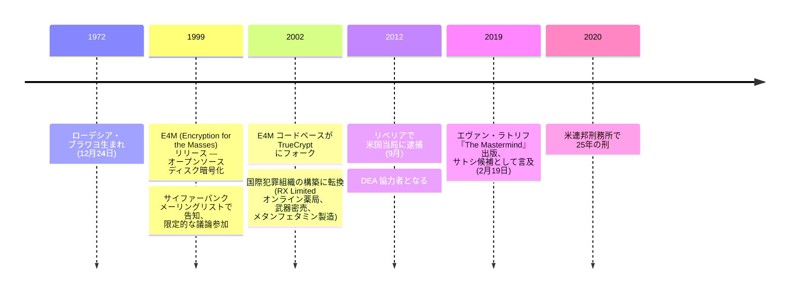

ポール・カルダー・ルルー（1972年12月24日、ローデシア・ブラワヨ — 現ジンバブエ生まれ）はプログラマー・有罪判決を受けた犯罪者である。暗号学界では1999年に *Encryption for the Masses*（E4M、ディスク暗号化のオープンソースパッケージ）の原作者として知られる。E4M のコードベースは2002年に *TrueCrypt* にフォークされた。2000年代初頭から暗号工学を離れ、ジャーナリストのエヴァン・ラトリフが2019年の著書『The Mastermind』 で詳述した大規模な国際犯罪組織の構築に転じた。2012年9月にリベリアで米国当局に逮捕され、以降米国麻薬取締局（DEA）に協力して服役中。

### E4M と TrueCrypt の系譜

1999年、ルルーは *Encryption for the Masses*（E4M）— 無料のオープンソースのディスク暗号化パッケージ — をオープンソースライセンス下でリリースした。プロジェクトはサイファーパンクメーリングリストで告知され、1999年中に限定的な暗号議論にも参加した。2002年、E4M のコードベースは *TrueCrypt* にフォークされ、2000年代から2010年代にかけて最も広く配布されたオープンソースのディスク暗号化パッケージの一つとなった。TrueCrypt プロジェクトの原開発者は匿名のままで、E4M からの系譜とルルーが TrueCrypt 自体の作者だった可能性については長年の憶測の対象となったが、公的には決着がついていない。

### 犯罪組織

2000年代初頭から、ルルーの活動の中心はオープンソース暗号工学から国際犯罪組織の構築へと移った。組織は複数の事業に跨った：RX Limited（合法性に争いのある処方薬を扱う米国オンライン薬局網）、武器密売、フィリピンでのメタンフェタミン製造、金の密輸、暴力の請負。全容はラトリフの『The Mastermind』（Random House、2019）と付随する *Atavist Magazine* 長尺ジャーナリズム連載で詳述されている。

### 逮捕と協力

2012年9月、ルルーはリベリアでおとり捜査により米国当局に逮捕された。彼は直ちに DEA 協力者となり、自身の組織のメンバーに対する広範な証拠を提供した。2020年に米連邦刑務所で25年の刑が下された — 当初の最大可能刑（終身刑）に対して、協力を反映した大幅な減刑である。サトシ正体問題を含め、服役中の公の発言は行っていない。

### サトシ正体問題との外部的な関連付け

ルルーとサトシ正体問題の関連は完全に外部からのものである — サトシ・ナカモトとの記録された接触はなく、ルルー自身による問題への言及もなく、公的記録上の彼によるビットコイン関連資料も存在しない。サトシ候補として挙げられたのは主にラトリフの2019年『The Mastermind』 と付随ジャーナリズムによるもので、能力 + 隠蔽性 + 動機の整合という議論に依拠している（E4M の暗号工学経験、2007〜2008年のビットコイン開発期に犯罪組織運営に伴う公的可視性の低さ、暗号学者としての過去を犯罪者としての現在から切り離す動機の可能性）。仮説の全議論 — 賛成論・反対論（限定的なサイファーパンク参加歴、貨幣設計業務の不在、E4M 以後のビットコイン v0.1 規模出荷不在、状況証拠のみ）— は[サトシ正体仮説総覧 §3](/BitcoinArchive/ja/entries/analysis/2008-10-31-satoshi-identity-hypotheses-overview/)に記載。[2026-05-03 ヴァン・ドルスト・コーパス再分析](/BitcoinArchive/ja/entries/analysis/2026-05-03-van-dorst-corpus-reanalysis-named-candidates/)はルルーを名指し候補集合から明示的に除外している（ドリアン・ナカモト、クレイグ・ライト、ピーター・トッド、金子勇とともに）— ルルーの暗号学活動が同コーパスの対象とする 1992〜2000 年の暗号学メーリングリスト期に該当しないためである。同分析からはサトシに対するルルーの文体距離は得られていない。

*[編者注：本アーカイブはルルーに関する一次資料のエントリ（E4M サイファーパンク告知、刑事訴訟関連文書、Mastermind 章抜粋）を保持していない。本バイオの具体的な日付・主張は外部ソース — 主にラトリフ（2019）、Atavist Magazine（2016）、Wikipedia — に基づいており、アーカイブ内検証済みではない。サトシ正体問題との関連付けは公的議論の記録のために含めたものであり、本バイオが仮説を支持するものではない。]*
