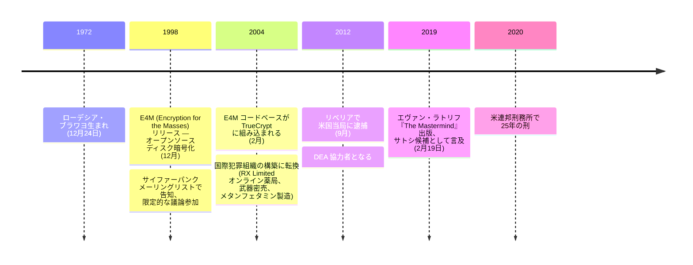

1998 年 12 月、ローデシア生まれのプログラマー、ポール・ルルーが **Encryption for the Masses**（E4M、ディスク暗号化のオープンソースパッケージ）を公開し、サイファーパンクメーリングリストで流通させた。そのコードベースは後に *TrueCrypt*（初版公開は 2004 年 2 月）に組み込まれた。2000 年代半ばまでにルルーは暗号工学を離れ、2000 年代最大級の国際犯罪組織の一つを構築していた。事業は RX Limited オンライン薬局、武器密輸、メタンフェタミン製造に及び、ジャーナリストのエヴァン・ラトリフが 2019 年の著書『The Mastermind』で詳述した。2012 年 9 月にリベリアで米国当局に逮捕、以降米国麻薬取締局（DEA）に協力して服役中。

ルルーは 1972 年 12 月 24 日、当時のローデシア（現ジンバブエ）のブラワヨに生まれた。その名は一部のサトシ正体仮説に挙がっている。根拠として引かれるのは、彼のサイファーパンク時代の暗号学的経歴と時期である。

```mermaid
timeline
    1972 : ローデシア・ ブラワヨ生まれ (12月24日)
    1998 : E4M (Encryption for the Masses) リリース — オープンソース ディスク暗号化 (12月)
         : サイファーパンク メーリングリストで 告知、 限定的な議論参加
    2004 : E4M コードベースが TrueCrypt に組み込まれる (2月)
         : 国際犯罪組織の構築に転換 (RX Limited オンライン薬局、 武器密売、 メタンフェタミン製造)
    2012 : リベリアで 米国当局に逮捕 (9月)
         : DEA 協力者となる
    2019 : エヴァン・ラトリフ 『The Mastermind』 出版、 サトシ候補として言及 (2月19日)
    %% link: /BitcoinArchive/ja/entries/analysis/2019-02-19-paul-le-roux-satoshi-identity-hypothesis/
    2020 : 米連邦刑務所で 25年の刑
```

## E4M と TrueCrypt の系譜

1998年12月、ルルーは無料のオープンソースのディスク暗号化パッケージ *Encryption for the Masses*（E4M）をオープンソースライセンス下でリリースした。プロジェクトはサイファーパンクメーリングリストで告知され、限定的な暗号議論にも参加した。2004年2月、E4M のコードベースは *TrueCrypt* に組み込まれ、2000年代から 2010年代にかけて最も広く配布されたオープンソースのディスク暗号化パッケージの一つとなった。TrueCrypt プロジェクトの原開発者は匿名のままで、E4M からの系譜とルルーが TrueCrypt 自体の作者だった可能性については長年の憶測の対象となったが、公的には決着がついていない。

## 犯罪組織

2000年代初頭から、ルルーの活動の中心はオープンソース暗号工学から国際犯罪組織の構築へと移った。組織は複数の事業に跨った：RX Limited（合法性に争いのある処方薬を扱う米国オンライン薬局網）、武器密売、フィリピンでのメタンフェタミン製造、金の密輸、暴力の請負。全容はラトリフの『The Mastermind』（Random House、2019）と付随する『Atavist Magazine』長尺ジャーナリズム連載で詳述されている。

## 逮捕と協力

2012年9月、ルルーはリベリアでおとり捜査により米国当局に逮捕された。彼は直ちに DEA 協力者となり、自身の組織のメンバーに対する広範な証拠を提供した。2020年に米連邦刑務所で 25年の刑が下された。これは当初の最大可能刑（終身刑）に対し、協力を反映して大幅に減刑されたものである。サトシ正体問題を含め、服役中の公の発言は行っていない。

## サトシ正体問題との外部的な関連付け

ルルーとサトシ正体問題の関連は完全に外部からのものである。サトシ・ナカモトとの記録された接触はなく、ルルー自身による問題への言及もなく、公的記録上の彼によるビットコイン関連資料も存在しない。サトシ候補として挙げられたのは主にラトリフの 2019 年『The Mastermind』と付随ジャーナリズムによるもので、能力 + 隠蔽性 + 動機の整合という議論に依拠している。賛否の論、および [2026-05-03 ヴァン・ドルスト・コーパス再分析](/BitcoinArchive/ja/entries/analysis/2026-05-03-van-dorst-corpus-reanalysis-named-candidates/)が彼を文体計量の候補集合から除外していることは、[ポール・ルルー＝サトシ仮説](/BitcoinArchive/ja/entries/analysis/2019-02-19-paul-le-roux-satoshi-identity-hypothesis/)に並べてある。他候補との比較は[サトシ正体仮説の総覧](/BitcoinArchive/ja/entries/analysis/2008-10-31-satoshi-identity-hypotheses-overview/)の §2.1 も参照。
