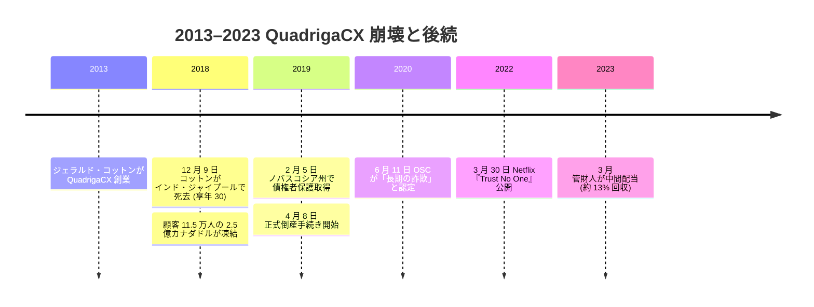

2013 年創業の QuadrigaCX は、最盛期にカナダ最大の暗号通貨取引所だった。 **2018 年 12 月 9 日**、創業者で CEO の **ジェラルド・コットン** がインド・**ジャイプール**のフォルティス病院で死去した。享年 30。死因は腸閉塞からの腹膜炎、そして敗血症性ショックと公表された。妻と一緒の旅行中で、同社は「慈善活動とハネムーンの記念旅行を兼ねていた」と説明した。

会社が死後に出した声明によれば、取引所の秘密鍵を保管していたのはコットン一人だけだったという。鍵が回収できないため、顧客約 11.5 万人が抱える BTC・ETH・その他暗号通貨・カナダドル法定通貨を合わせた約 **2.5 億カナダドル** (約 **1.9 億米ドル**) 相当が凍結された。

**崩壊と倒産。** **2019 年 2 月 5 日**、 QuadrigaCX はノバスコシア州最高裁判所から債権者保護を取得。 **2019 年 4 月 8 日**、カナダ倒産法に基づく正式な倒産手続きへ移行した。 **アーンスト・アンド・ヤング** が破産管財人として指名され、同社の調査員がコールドストレージのフォレンジクスに着手。後にこれが、同取引所の正体を暴くことになる。

**OSC の調査と詐欺認定。** **2020 年 6 月 11 日**、オンタリオ州証券委員会は 47 ページにわたる調査報告書『Quadriga: Inside The Crypto Exchange』を公表した。結論は明確だった。

<!-- audit:quote-skip -->
> Quadriga で起きていたことは、現代の技術で包装された昔ながらの詐欺だった。

OSC は、コットンが QuadrigaCX を長期にわたる詐欺として運営していたと認定した。取引所内部の残高は、コットンが架空アカウントを作って顧客と取引するという形で維持され、そこから生じる「見せかけの利益」を、実際に流入する BTC や ETH からコットンが引き出していた。顧客の暗号通貨は会社が広告していたような分離コールドストレージには保管されておらず、多くは他の取引所にあるコットン名義の口座に移されて売却されるか、別の顧客への引き出し原資として支払われていた。構造としては機能的に **ポンジ・スキーム**と同じものだ。 OSC の判定では、コットン死亡時点で同取引所はすでに長期にわたって支払い不能の状態にあった。

**陰謀論と遺体掘り起こし請願。** コットンの若さ、死去が国外だったこと、死の 12 日前に妻を唯一の受益者とする遺言を作成していたこと、後にポンジ構造が判明したことが重なり、「コットンは死を偽装した」という公的な憶測が長く残ることになった。王立カナダ騎馬警察は 2019 年に遺体掘り起こしの請願を受けたが、司法側は実行しなかった。公式の死亡証明書を覆す公開証拠は出ていない。

**Netflix ドキュメンタリー。** **2022 年 3 月 30 日**、 Netflix はルーク・スーウェル監督による長編ドキュメンタリー『Trust No One: The Hunt for the Crypto King』を公開した。焦点は QuadrigaCX 崩壊と、規制当局より先に独立に詐欺の構造を解いていった顧客出身の調査者たちのコミュニティ。これにより本件は、 OSC 報告書単独では到達できなかった広い一般読者に届くことになった。

**債権者への回収。** 破産管財人は 2023 年 3 月、認定請求 1 カナダドルあたり **0.13 カナダドル** の中間配当を実施した。総額は約 4,000 万カナダドルで、管財人が回収した資金のおよそ 87% に相当する。認定請求総額に比べれば遥かに小さい。被害顧客の大半が全額回収を受けることはなく、 QuadrigaCX は Mt. Gox に次ぐ、ドル建てで最大級の暗号通貨取引所損失かつ未回収の事案として記録されている。

**「失われたビットコイン」史における位置。** QuadrigaCX は、ビットコイン損失の **保管崩壊型** の代表例である。 [ステファン・トーマスの IronKey ロックアウト](/BitcoinArchive/ja/entries/aftermath/2021-01-12-stefan-thomas-7002-btc-ironkey-lockout/)のようなパスワード忘却型とも、 [ジェームズ・ハウエルズのニューポート埋立 HDD](/BitcoinArchive/ja/entries/aftermath/2024-12-03-james-howells-7500-btc-newport-landfill/) のような物理喪失型とも別物。 OSC が「単なる鍵喪失ではなく詐欺である」と認定した点で、 [Mt. Gox 倒産](/BitcoinArchive/ja/entries/aftermath/2014-02-28-mt-gox-bankruptcy/) (運用失敗とトランザクション展性の悪用による盗難) とも、後の [FTX 崩壊](/BitcoinArchive/ja/entries/aftermath/2022-11-11-ftx-collapse/) (大規模な不正流用) とも明確に区別される。 [失われたビットコイン横断ページ](/BitcoinArchive/ja/entries/analysis/2026-06-02-bitcoin-iconic-losses-overview/)では、本件を広い損失パターンの中に位置付けている。
